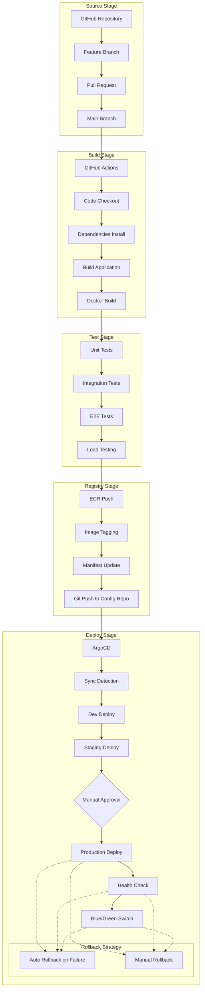

```mermaid
flowchart TB
  %% Tiketi CI/CD Pipeline (GitHub Actions + ArgoCD)

  subgraph S[Source Stage]
    direction TB
    S1[GitHub Repository]
    S2[Feature Branch]
    S3[Pull Request]
    S4[Main Branch]
    S1 --> S2 --> S3 --> S4
  end

  subgraph B[Build Stage]
    direction TB
    B0[GitHub Actions]
    B1[Code Checkout]
    B2[Dependencies Install]
    B3[Build Application]
    B4[Docker Build]
    B0 --> B1 --> B2 --> B3 --> B4
  end

  subgraph T[Test Stage]
    direction TB
    T1[Unit Tests]
    T2[Integration Tests]
    T3[E2E Tests]
    T4[Load Testing]
    T1 --> T2 --> T3 --> T4
  end

  subgraph R[Registry Stage]
    direction TB
    R1[ECR Push]
    R2[Image Tagging]
    R3[Manifest Update]
    R4[Git Push to Config Repo]
    R1 --> R2 --> R3 --> R4
  end

  subgraph D[Deploy Stage]
    direction TB
    D0[ArgoCD]
    D1[Sync Detection]
    D2[Dev Deploy]
    D3[Staging Deploy]
    D4{Manual Approval}
    D5[Production Deploy]
    D6[Health Check]
    D7[Blue/Green Switch]

    D0 --> D1 --> D2 --> D3 --> D4 --> D5 --> D6 --> D7

    subgraph RB[Rollback Strategy]
      direction TB
      RB1[Auto Rollback on Failure]
      RB2[Manual Rollback]
    end
  end

  %% Stage connections
  S4 --> B0
  B4 --> T1
  T4 --> R1
  R4 --> D0

  %% Rollback links (dotted)
  D5 -.-> RB1
  D5 -.-> RB2
  D6 -.-> RB1
  D6 -.-> RB2
  D7 -.-> RB1
  D7 -.-> RB2
```