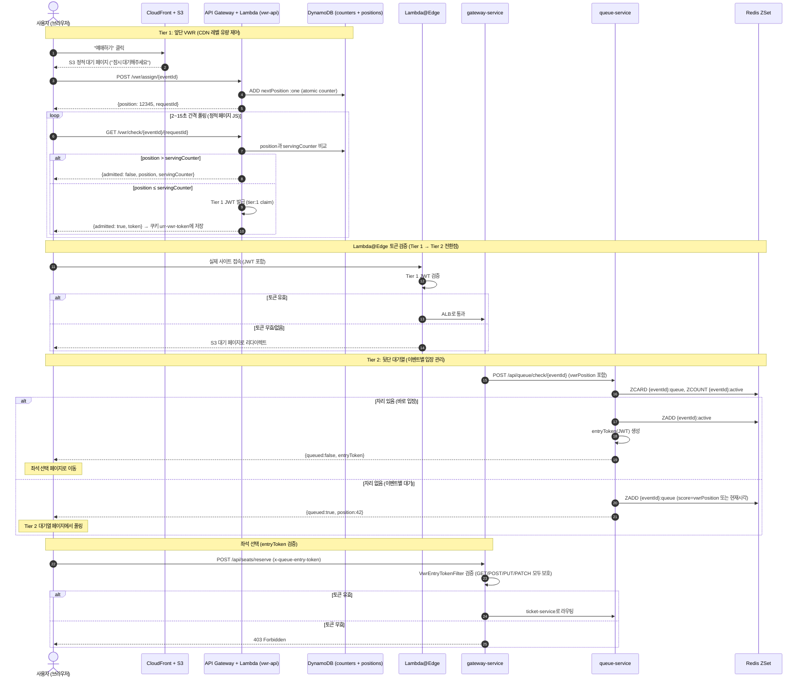
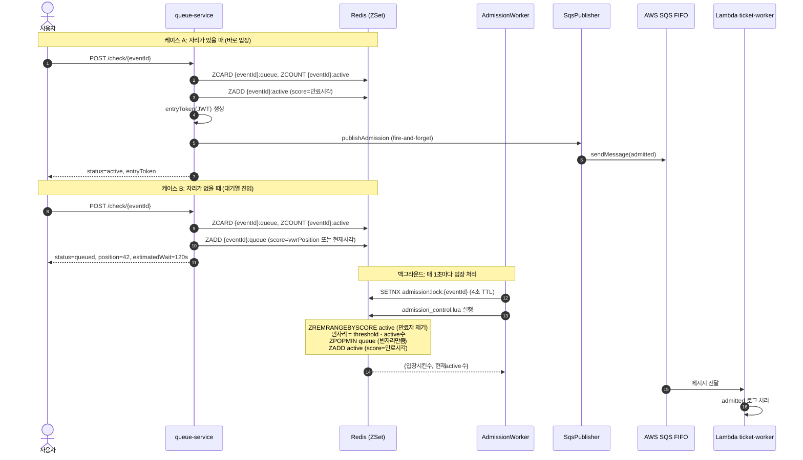
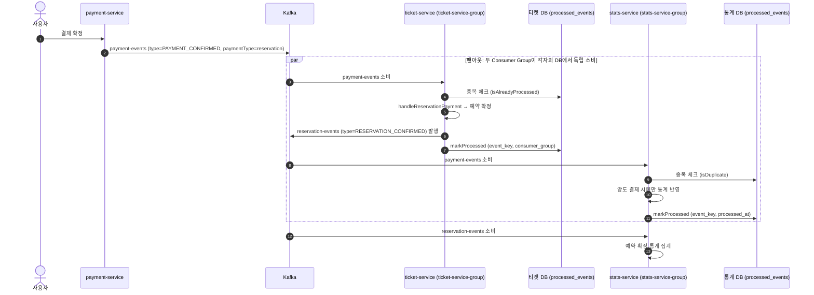
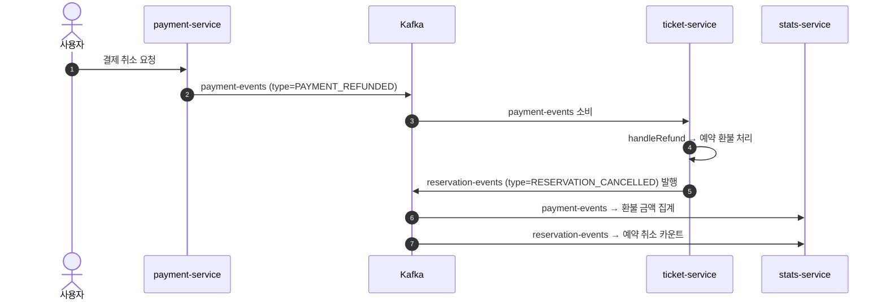
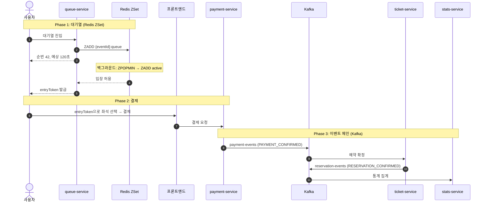

# Check8: Redis ZSet + SQS + Kafka — URR 메시징 아키텍처

## 0. 이 문서 목표
처음 접하는 사람도 이해할 수 있게 정리.

1. 메시징이 왜 필요한지
2. URR에서 쓰는 3가지 기술(Redis ZSet, SQS, Kafka)이 각각 무엇인지
3. 셋이 어떤 관계로 연결되어 있는지
4. VWR(Virtual Waiting Room)의 2단계 아키텍처: 앞단(CDN 유량 제어) + 뒷단(이벤트별 대기열)
5. 실제 코드에서 어떻게 구현되어 있는지

---

## 1. 동기 vs 비동기 — 메시징이 왜 필요한가

### 1.1 동기 처리
카운터에 줄 서서 내 차례가 올 때까지 기다리는 것.
서비스 A가 서비스 B를 HTTP로 직접 호출하면, B가 느리거나 죽었을 때 A도 같이 멈춘다.

### 1.2 비동기 처리
번호표를 뽑고, 나중에 호출하면 움직이는 방식.
요청을 "메시지"로 남겨두고, 실제 처리는 나중에 다른 쪽(Consumer)이 한다.

메시징을 쓰면:
1. 요청을 "메시지"로 남기고 빠르게 다음 작업으로 넘어갈 수 있다.
2. 소비자(Consumer)가 자기 속도로 처리한다.
3. 서비스끼리 느슨하게 연결되어 장애 전파가 줄어든다.

> **핵심**: "지금 바로 처리하지 않고, 일단 할 일 목록에 넣어두는 처리 방식이 있다." 그 할 일 목록이 바로 Queue / Topic / Sorted Set으로 구현되는 것.

---

## 2. 기초 용어

### 2.1 메시지와 이벤트

**메시지(message)** — "해야 할 일" 또는 "일어난 일"을 한 덩어리로 묶은 것.
- 예: `userId=123, eventId=ABC, action=admitted`
- 예: `예약번호 9999가 결제 확정됨`

**이벤트(event)** — "어떤 일이 일어났다"는 사실 자체.
- 예: 결제가 완료됐다, 좌석이 예약됐다, 티켓이 양도됐다

메시지/이벤트는 그냥 데이터 한 덩어리일 뿐이고, 이걸 잘 모아서 차례대로 또는 여러 곳에 뿌려주는 시스템이 Redis, SQS, Kafka 같은 것들이다.

### 2.2 Producer / Consumer / Broker

| 용어 | 쉬운 설명 | 비유 | URR 예시 |
|---|---|---|---|
| **Producer** | 메시지를 보내는 쪽 | 공지 올리는 사람 | 결제 서비스가 "결제 완료" 이벤트를 Kafka에 발행 |
| **Consumer** | 메시지를 읽어서 처리하는 쪽 | 공지를 읽고 실제 일을 하는 사람 | 티켓 서비스가 "결제 완료" 이벤트를 보고 예매를 확정 |
| **Broker** | 메시지를 보관/전달하는 시스템 | 우체국 | Redis, SQS, Kafka |

### 2.3 Queue vs Topic vs Sorted Set

| | Queue (SQS) | Topic (Kafka) | Sorted Set (Redis ZSet) |
|---|---|---|---|
| 목적 | "일감 분배" | "사건 공유" | "순서 있는 대기열" |
| 성격 | 한 메시지를 누군가 처리하면 삭제 | 같은 메시지를 여러 소비자 그룹이 각자 처리 | 점수(score) 기준으로 정렬된 집합 |
| 비유 | 고객센터 대기열 — 한 상담원이 한 건 처리하면 끝 | 사내 공지 채널 — 각 팀이 같은 공지를 읽고 각자 행동 | 번호표 기계 — 번호 순서대로 호출 |

### 2.4 오류/장애 관련 용어

| 용어 | 쉬운 설명 | 왜 필요한가 |
|---|---|---|
| **ACK** | "나 이 메시지 처리 다 했어"라는 확인 신호 | 없으면 브로커가 같은 메시지를 다시 보낸다 |
| **Retry** | 일시적 실패(DB 바쁨, 네트워크 문제) 시 재시도 | 일시 장애는 재시도로 복구 가능 |
| **DLQ** | 계속 실패하는 메시지를 따로 모으는 쓰레기통 큐 | 운영자가 "왜 이건 계속 실패하지?" 분석용 |
| **Idempotency** | 같은 메시지가 2번 와도 결과는 1번 처리한 것과 동일 | 예: "이 결제는 이미 처리됨"을 DB에 기록하고 두 번째 요청은 무시 |

> 네트워크와 분산 시스템에서는 중복/실패/지연이 "당연히" 일어난다. 그래서 재시도, 실패 모으기(DLQ), 중복 방어(멱등성) 개념이 필요하다.

---

## 3. URR 메시징 전체 구조 — 세 기술의 관계

URR 프로젝트는 메시징에 3가지 기술을 쓴다. 각각 역할이 다르다.

```
┌───────────────────────────────────────────────────────────────────────┐
│                        URR 메시징 아키텍처                              │
│                                                                       │
│  ┌─────────────────────────────────────────┐                         │
│  │  ① Redis ZSet — 대기열 핵심 엔진         │                         │
│  │  queue-service가 직접 Redis에 읽고 쓴다   │                         │
│  │  "누가 몇 번째인지, 입장 가능한지" 관리     │                         │
│  └──────────────┬──────────────────────────┘                         │
│                 │ 입장 허용 시                                         │
│                 ▼                                                      │
│  ┌─────────────────────────────────────────┐                         │
│  │  ② SQS FIFO — 입장 알림 보조 채널        │                         │
│  │  "이 사용자가 입장했다"는 알림을             │                         │
│  │  외부(Lambda)에 전달. 선택적, 없어도 동작   │                         │
│  └─────────────────────────────────────────┘                         │
│                                                                       │
│  ┌─────────────────────────────────────────┐                         │
│  │  ③ Kafka — 도메인 이벤트 메인 파이프라인   │                         │
│  │  결제 → 예매/양도/멤버십 → 통계            │                         │
│  │  서비스 간 이벤트를 비동기로 연결            │                         │
│  └─────────────────────────────────────────┘                         │
└───────────────────────────────────────────────────────────────────────┘
```

### 한눈에 비교

| 구분 | Redis ZSet | SQS FIFO | Kafka |
|---|---|---|---|
| **역할** | 대기열 순번/입장 관리 | 입장 알림 외부 전달 | 서비스 간 이벤트 전달 |
| **핵심도** | 대기열의 심장 | 보조 (없어도 동작) | 이벤트 파이프라인의 심장 |
| **사용 서비스** | queue-service | queue-service → Lambda | payment/ticket/stats |
| **데이터 모델** | ZSet (score=타임스탬프) | FIFO Queue (삭제 기반) | Topic + Partition (로그 기반) |
| **기본 활성화** | 항상 ON | `SQS_ENABLED=false` (기본 OFF) | 항상 ON |

### 관계 요약
- **Redis ZSet과 SQS**: Redis가 대기열을 관리하고, 입장 허용이 일어나면 SQS에 알림을 "추가로" 보낸다. SQS가 죽어도 Redis 대기열은 정상 동작한다.
- **Redis ZSet과 Kafka**: 직접적 연결 없음. Redis는 "입장 전" 단계, Kafka는 "입장 후 결제/예매" 단계를 담당한다.
- **SQS와 Kafka**: 직접적 연결 없음. 각자 다른 도메인의 메시징을 담당한다.

---

## 4. Redis ZSet — 대기열 핵심 엔진

### 4.1 Redis ZSet이란
Redis의 Sorted Set(정렬 집합). 각 멤버에 **score**(점수)가 붙어서 항상 점수 순서로 정렬된 상태를 유지한다.

쉽게 말하면:
- 일반 Set은 그냥 "누가 있는지"만 알 수 있다.
- ZSet은 "누가 있는지 + 각자의 순번(점수)"까지 알 수 있다.
- 그래서 "내가 몇 번째인지" 즉시 조회 가능하다 → 대기열에 딱 맞는 구조.

### 4.2 URR이 Redis ZSet을 쓰는 이유

티켓 예매 대기열에 필요한 것들:
1. "내가 몇 번째인지" 실시간 조회 → `ZRANK` (O(log N), 즉시 응답)
2. "가장 오래 기다린 사람부터 입장" → `ZPOPMIN` (가장 낮은 점수 = 가장 먼저 온 사람)
3. "동시에 수천 명이 접속해도 순서 꼬이지 않기" → Lua 스크립트로 원자적 처리
4. "입장한 사람의 유효 시간 관리" → score에 만료 시각 저장, `ZCOUNT`로 유효한 사람만 세기

SQS나 Kafka로는 "내가 몇 번째인지"를 실시간으로 알 수 없다. 이게 Redis ZSet을 쓰는 핵심 이유.

### 4.3 Redis 키 구조

queue-service는 이벤트(공연)마다 아래 키들을 만든다:

| 키 패턴 | Redis 타입 | score 의미 | 용도 |
|---|---|---|---|
| `{eventId}:queue` | ZSet | 대기열 진입 시각 (ms) 또는 VWR 순번 | 대기 순번 관리. score가 작을수록 먼저 온 사람 |
| `{eventId}:active` | ZSet | 만료 시각 (ms) | 입장 허용된 사용자. score > 현재시각이면 유효 |
| `{eventId}:seen` | ZSet | 마지막 하트비트 시각 (ms) | 대기 중인 사용자의 생존 확인 |
| `{eventId}:active-seen` | ZSet | 마지막 하트비트 시각 (ms) | 입장한 사용자의 생존 확인 |
| `{eventId}:threshold` | String | — | 이벤트별 동시 입장 한도 (미설정 시 기본값 사용) |
| `queue:active-events` | Set | — | 현재 대기열이 활성화된 이벤트 목록 |
| `admission:lock:{eventId}` | String | — | 분산 락 (TTL 4초). 여러 서버가 동시에 입장 처리하는 것 방지 |

> **해시 태그 `{eventId}`**: Redis Cluster에서 같은 이벤트의 키들이 동일 슬롯에 배치되도록 `{eventId}` 해시 태그를 사용한다. Lua 스크립트가 여러 키를 원자적으로 처리하려면 모든 키가 같은 슬롯에 있어야 하기 때문이다.

예시: 공연 ID가 `abc-123`이면
- `{abc-123}:queue` — 이 공연의 대기열 (ZSet)
- `{abc-123}:active` — 이 공연에 입장한 사용자들 (ZSet)
- `{abc-123}:threshold` — 이 공연의 동시 입장 한도 (선택적)

### 4.4 대기열 흐름 상세

#### 사용자가 대기열 확인 요청 (`POST /api/queue/check/{eventId}`)

```
사용자 요청
   ↓
1. 이미 대기 중인가? ({eventId}:queue에 있는지)
   ├─ YES → 하트비트 갱신, 현재 순번 반환
   └─ NO → 계속
   ↓
2. 이미 입장한 상태인가? ({eventId}:active에 있고 score > 현재시각)
   ├─ YES → 하트비트 갱신, entryToken 반환
   └─ NO → 계속
   ↓
3. 바로 입장 가능한가?
   조건: 대기열이 비었고(queue 크기=0) AND 현재 입장자 수 < threshold
   (이벤트별 {eventId}:threshold 키가 있으면 해당 값, 없으면 기본 1000명)
   ├─ YES → {eventId}:active에 추가 (score=현재+600초)
   │         entryToken(JWT) 발급
   │         SQS에 admitted 알림 (선택적)
   │         "active" 응답
   └─ NO  → {eventId}:queue에 추가
             score = vwrPosition(Tier 1 순번)이 있으면 해당 값, 없으면 현재시각(ms)
             "queued" 응답 (순번, 예상 대기시간 포함)
```

- 코드: `services-spring/queue-service/src/main/java/guru/urr/queueservice/service/QueueService.java:60`

#### 백그라운드 입장 처리 (매 1초마다)

대기열에 사람이 쌓여 있으면, 백그라운드 워커가 1초마다 빈 자리만큼 입장시킨다.

```
AdmissionWorkerService (매 1초)
   ↓
1. queue:active-events에서 활성 이벤트 목록 조회
   ↓
2. 각 이벤트마다:
   a. 분산 락 획득 시도 (admission:lock:{eventId}, 4초 TTL)
      ├─ 실패 → 다른 서버가 처리 중, 스킵
      └─ 성공 → 계속
   ↓
   b. admission_control.lua 실행 (원자적)
      - 만료된 active 사용자 제거 (score ≤ now)
      - 빈 자리 계산 = threshold - 현재 active 수
      - ZPOPMIN으로 대기열 앞에서 빈 자리만큼 꺼냄
      - {eventId}:active에 추가 (score = now + 600초)
      - 결과: {입장시킨 수, 현재 active 수}
   ↓
   c. 대기열과 active 모두 비었으면 이벤트를 active-events에서 제거
```

- 코드: `services-spring/queue-service/src/main/java/guru/urr/queueservice/service/AdmissionWorkerService.java:48`
- Lua: `services-spring/queue-service/src/main/resources/redis/admission_control.lua`

#### 하트비트와 좀비 정리

사용자가 브라우저를 닫거나 네트워크가 끊기면 하트비트가 멈춘다. 30초마다 돌아가는 정리 워커가 이런 "좀비"를 제거한다.

- 하트비트: 사용자가 `/heartbeat`, `/check`, `/status` 호출할 때마다 `seen` ZSet의 score를 현재 시각으로 갱신
- 좀비 판정: `seen` ZSet에서 score가 (현재 - 600초)보다 작은 사용자
- 정리: `stale_cleanup.lua`가 대기열과 seen에서 동시에 원자적으로 제거

- 코드: `services-spring/queue-service/src/main/java/guru/urr/queueservice/service/AdmissionWorkerService.java:121`
- Lua: `services-spring/queue-service/src/main/resources/redis/stale_cleanup.lua`

### 4.5 주요 설정값

| 설정 | 기본값 | 의미 |
|---|---|---|
| `QUEUE_THRESHOLD` | 1000 | 이벤트당 최대 동시 입장자 수 (이벤트별 Redis 키 `{eventId}:threshold`로 개별 설정 가능, 관리자 API: `PUT /api/queue/admin/threshold/{eventId}`) |
| `QUEUE_ACTIVE_TTL_SECONDS` | 600 | 입장 후 유효 시간 (10분) |
| `QUEUE_SEEN_TTL_SECONDS` | 600 | 하트비트 없으면 좀비로 판정하는 시간 |
| `QUEUE_ADMISSION_INTERVAL_MS` | 1000 | 백그라운드 입장 처리 주기 (1초) |
| `QUEUE_ADMISSION_BATCH_SIZE` | 100 | 한 번에 입장시키는 최대 인원 |
| `QUEUE_STALE_CLEANUP_INTERVAL_MS` | 30000 | 좀비 정리 주기 (30초) |

### 4.6 프로덕션 Redis 구성

- 로컬(kind): 단일 Redis (`localhost:6379`)
- 프로덕션: Redis Cluster 3노드
  - `redis-cluster-0.redis-cluster:6379`
  - `redis-cluster-1.redis-cluster:6379`
  - `redis-cluster-2.redis-cluster:6379`

- 설정: `services-spring/queue-service/src/main/resources/application.yml`

### 4.7 대기 시간 예측

사용자가 "나 언제 들어가?"를 물으면, 최근 1분간 실제 입장 속도를 기반으로 계산한다.

- 데이터가 부족하면(시작 직후): `Math.max(position / 50, 5)` — 약 50명/초 처리 가정, 최소 5초
- 데이터가 있으면: `내 순번 / (최근 1분 입장 수 / 60)` = 예상 초
- 폴링 간격도 순번에 따라 조절: 1000번 이내면 1초, 10000번 이후면 30초

- 코드: `QueueService.java:242` (estimateWait), `QueueService.java:231` (calculateNextPoll)

---

## 5. VWR — 2단계 대기열 아키텍처 (Virtual Waiting Room)

VWR은 "가상 대기실"이다. 콘서트 티켓 예매할 때, 수만 명이 동시에 접속하면 서버가 터진다. VWR은 사용자를 줄 세워서 순서대로 입장시키는 시스템이다.

URR의 VWR은 **2단계(2-Tier)** 구조다.

### 5.1 왜 2단계인가

문제 상황을 놀이공원으로 비유하자:

- **1단계만 있을 때**: 놀이공원 입구를 열면 수만 명이 한꺼번에 들어와서 놀이기구 앞이 아수라장. 놀이기구(서버)가 고장남.
- **2단계 구조**: 놀이공원 입구(Tier 1)에서 먼저 번호표를 나눠주고 천천히 입장시킴 → 놀이기구 앞(Tier 2)에서는 적정 인원만 대기.

| | Tier 1 — 앞단 VWR | Tier 2 — 뒷단 대기열 |
|---|---|---|
| **비유** | 놀이공원 입구 번호표 | 놀이기구 앞 대기줄 |
| **위치** | CDN (CloudFront) 앞단 | ALB 뒤 (queue-service) |
| **목적** | 서버 보호 + ASG 시간 확보 | 이벤트별 입장 순서 관리 |
| **트래픽** | 수백만 명 동시 → 서버리스로 흡수 | 수천~수만 명 → Redis로 순번 관리 |
| **핵심 기술** | 정적 페이지(S3) + 서버리스(Lambda+DynamoDB) | queue-service + Redis ZSet |
| **구현 상태** | **구현 완료 (미배포)** | **구현 완료 (배포 중)** |

### 5.2 전체 구조

```
┌─────────────────────────────────────────────────────────────────────────────────┐
│                     URR VWR 2단계 아키텍처                                         │
│                                                                                 │
│  ┌──────────────────────────────────────────┐                                  │
│  │  Tier 1: 앞단 VWR (CDN 레벨 유량 제어)     │                                  │
│  │                                          │                                  │
│  │  사용자 → CloudFront → S3 정적 페이지       │                                  │
│  │             ("잠시 대기해주세요")            │                                  │
│  │               │                          │                                  │
│  │               ▼                          │                                  │
│  │     CloudFront → API Gateway → Lambda     │                                  │
│  │               │                          │                                  │
│  │               ▼                          │                                  │
│  │           DynamoDB                       │                                  │
│  │       (순번 atomic counter               │                                  │
│  │        + servingCounter)                 │                                  │
│  │               │                          │                                  │
│  │               ▼                          │                                  │
│  │    순번 ≤ servingCounter → JWT 발급       │                                  │
│  └──────────────┬───────────────────────────┘                                  │
│                 │ 토큰 있는 사용자만 통과                                         │
│                 ▼                                                               │
│  ┌──────────────────────────────────────────┐                                  │
│  │  Lambda@Edge (토큰 검증)                   │                                  │
│  │  토큰 없음 → S3 대기 페이지로 리다이렉트     │                                  │
│  │  토큰 있음 → ALB로 통과                    │                                  │
│  └──────────────┬───────────────────────────┘                                  │
│                 │                                                               │
│                 ▼                                                               │
│  ┌──────────────────────────────────────────┐                                  │
│  │  Tier 2: 뒷단 대기열 (이벤트별 입장 관리)    │                                  │
│  │                                          │                                  │
│  │  ALB → gateway-service → queue-service   │                                  │
│  │                            │              │                                  │
│  │                         Redis ZSet        │                                  │
│  │                     (이벤트별 순번 관리)     │                                  │
│  │                     threshold=1000명       │                                  │
│  │                            │              │                                  │
│  │                   입장 허용 → entryToken    │                                  │
│  │                            │              │                                  │
│  │                   좌석 선택 / 예매 페이지    │                                  │
│  └──────────────────────────────────────────┘                                  │
└─────────────────────────────────────────────────────────────────────────────────┘
```

### 5.3 Tier 1 — 앞단 VWR (CDN 레벨 유량 제어)

> **구현 상태**: 구현 완료 (미배포). 코드 작성 완료, 프로덕션 배포 전.

#### 목적
- **서버 보호**: 수백만 동시 접속이 ALB/EKS까지 도달하지 못하게 막는다.
- **ASG 시간 확보**: 트래픽 급증 시 Auto Scaling Group이 서버를 늘리는 시간(수 분)을 번다.
- **공정한 순번**: 먼저 온 사람이 먼저 들어가는 FIFO 순서를 보장한다.

#### 전체 흐름

```
사용자 브라우저
   │
   ├─ 1) CloudFront → S3 정적 HTML ("잠시 대기해주세요")
   │     vanilla HTML/CSS/JS, 프레임워크 없음 (CDN 캐시 극대화)
   │     JavaScript가 API를 주기적으로 호출
   │
   ├─ 2) CloudFront → API Gateway → Lambda (순번 요청)
   │     POST /vwr/assign/{eventId}
   │     → DynamoDB atomic counter (ADD nextPosition :one)
   │     → 응답: "당신은 12,345번째입니다"
   │
   ├─ 3) CloudFront → API Gateway → Lambda (내 차례 확인)
   │     GET /vwr/check/{eventId}/{requestId}
   │     → DynamoDB에서 내 position과 servingCounter 비교
   │     → 내 순번 ≤ servingCounter이면 입장 가능
   │     → Tier 1 JWT 토큰 발급 (urr-vwr-token 쿠키)
   │
   └─ 4) 토큰으로 실제 사이트 접속
         → Lambda@Edge가 Tier 1 JWT 검증
         → 통과 시 ALB → Tier 2 대기열
```

> AWS 공식 "Virtual Waiting Room on AWS" 패턴(2025년 11월 deprecated, 전략적 이유이며 기술적 결함 아님)을 참고하되, SQS 파이프라인 대신 **DynamoDB atomic counter**를 직접 사용해 단순화했다.

#### 핵심 메커니즘

**순번 부여 (DynamoDB Atomic Counter)**
1. 사용자 접속 → S3 정적 페이지의 JS가 CloudFront를 통해 API Gateway 호출
2. Lambda가 DynamoDB `UpdateItem`으로 원자적 카운터 증가 (`ADD nextPosition :one`)
3. 같은 Lambda가 positions 테이블에 순번 기록 (TTL 24시간)
4. 결과: `position = 12345` (단조 증가, 중복 불가)

> SQS를 쓰지 않는 이유: DynamoDB atomic counter가 더 단순하고, 별도 소비자 Lambda가 필요 없다. hot partition 위험이 있지만 on-demand 모드의 adaptive capacity로 대응 가능하다.

**서빙 카운터 (Serving Counter)**
- DynamoDB counters 테이블에 `servingCounter` 값을 관리
- **Counter Advancer Lambda**가 EventBridge로 1분마다 트리거 → 내부에서 6회 반복(10초 간격)
- 한 번에 500명씩 카운터 증가 (배치 사이즈 조절 가능)
- 조건: `servingCounter < nextPosition`일 때만 증가 (과잉 입장 방지)
- 예: servingCounter=5000이면 1~5000번까지 입장 가능

**입장 판정**
- 내 순번(12345) ≤ servingCounter(15000) → 입장 가능 → Tier 1 JWT 발급
- 내 순번(12345) > servingCounter(5000) → 대기 계속 → 다음 폴링까지 대기

**유량 제어의 핵심**
- 서빙 카운터 증가 속도 = 유량 제어 속도
- 카운터를 천천히 올리면 → 적은 사람만 통과 (서버 보호)
- 카운터를 빠르게 올리면 → 많은 사람 통과 (ASG 완료 후)
- 관리자가 수동으로 `/api/admin/vwr/advance/{eventId}`로 카운터를 밀어올릴 수도 있다

#### Tier 1 컴포넌트와 파일 위치

| 컴포넌트 | 처리 방식 | 동시 처리 규모 | 파일 위치 |
|---|---|---|---|
| S3 정적 대기 페이지 | CDN 엣지 캐시 | 사실상 무제한 | `apps/vwr/index.html` |
| API Gateway | 관리형 서비스, 스로틀링 | 10,000 TPS (burst) | `terraform/modules/api-gateway-vwr/` |
| VWR API Lambda | 서버리스 (순번 발급/확인) | 100 동시 실행 (prod) | `lambda/vwr-api/` |
| Counter Advancer Lambda | 스케줄 기반 (1분 간격) | 1 동시 실행 | `lambda/vwr-counter-advancer/` |
| DynamoDB | 온디맨드 용량 | 수만 RPS | `terraform/modules/dynamodb-vwr/` |
| Lambda@Edge | viewer-request 훅 | CloudFront 비례 | `lambda/edge-queue-check/index.js` |
| CloudFront Function | `/vwr-api` prefix 제거 | CloudFront 비례 | `terraform/modules/cloudfront/main.tf` |

> 모든 컴포넌트가 서버리스이므로 서버가 터질 일이 없다. 그래서 "앞단을 얇게 유지"할 수 있다.

#### 관리자 API (VWR 제어)

queue-service에 관리자 전용 VWR 제어 엔드포인트가 있다.

파일: `services-spring/queue-service/.../controller/VwrAdminController.java`

| 엔드포인트 | 용도 |
|---|---|
| `POST /api/admin/vwr/activate/{eventId}` | VWR 활성화 (DynamoDB 초기화) |
| `POST /api/admin/vwr/deactivate/{eventId}` | VWR 비활성화 |
| `GET /api/admin/vwr/status/{eventId}` | 카운터 상태 조회 |
| `POST /api/admin/vwr/advance/{eventId}` | 수동 서빙 카운터 증가 |

> `vwr.dynamodb.enabled=true` 환경변수로 활성화. 기본값 false (DynamoDB 없이도 queue-service 정상 동작).

### 5.4 Tier 2 — 뒷단 대기열 (이벤트별 입장 관리)

> **구현 상태**: 구현 완료. 현재 동작 중.

Tier 1을 통과한 사용자가 도달하는 곳. 이벤트(공연)별로 동시 입장 인원을 관리한다. 기술 상세는 **섹션 4 (Redis ZSet)** 참고.

#### 목적
- **이벤트별 용량 관리**: 공연마다 threshold=1000명으로 동시 입장자 제한
- **공정한 순서**: Redis ZSet으로 대기 순번 관리 (ZADD → ZRANK)
- **비즈니스 로직**: 좌석 선택 시간 제한, 하트비트, 좀비 정리

#### Tier 1과의 차이

| | Tier 1 (앞단 VWR) | Tier 2 (뒷단 대기열) |
|---|---|---|
| **대상** | 전체 사이트 트래픽 | 특정 이벤트의 예매 트래픽 |
| **대기 이유** | 서버 과부하 방지 | 이벤트 좌석 수 제한 |
| **대기 시간** | 짧음 (ASG 완료까지, 수 분) | 길 수 있음 (순번에 따라 수십 분) |
| **스케일** | 수백만 명 | 수천~수만 명 |
| **대기 화면** | S3 정적 HTML ("잠시 대기해주세요") | Next.js 동적 페이지 (순번/예상시간) |

### 5.5 2단계 사용자 여정

```
① 접속                ② Tier 1 대기           ③ Tier 2 대기            ④ 좌석 선택           ⑤ 결제
   이벤트 상세            VWR 정적 페이지          대기열 페이지             /events/[id]/seats
   /events/[id]          (S3 + CloudFront)       /queue/[eventId]         /events/[id]/book

   ┌──────────┐        ┌───────────────┐       ┌──────────────┐        ┌──────────────┐     ┌──────────┐
   │ 예매하기  │──→     │ 잠시 대기해주세요│──→    │ 42번째 대기중  │──→     │ 좌석 선택     │──→  │ 결제 완료 │
   │  버튼    │        │ 12,345번째     │       │ 예상 2분 대기  │        │ 또는 바로예매  │     │          │
   └──────────┘        └───────────────┘       └──────────────┘        └──────────────┘     └──────────┘
                        서버리스 처리              Redis ZSet 관리
                        ASG 시간 확보              이벤트별 입장 제어
                             │                          │
                        순번 ≤ serving_counter      내 차례 → entryToken
                        → JWT로 Tier 2 진입         → 좌석 선택 자동 이동
```

**Tier 1 미배포 시 (Tier 2만 동작):**
1. 사용자가 "예매하기" 클릭 → `/queue/[eventId]`로 바로 이동
2. queue-service가 Redis ZSet으로 대기열 관리
3. 내 차례가 되면 entryToken 발급 → 좌석 선택 이동

**Tier 1 배포 후 (2단계 전체 동작):**
1. 사용자가 "예매하기" 클릭 → Lambda@Edge가 VWR 활성 여부 확인
2. VWR 활성 이벤트면 → S3 정적 대기 페이지(`/vwr/{eventId}`)로 리다이렉트
3. 정적 페이지 JS가 API Gateway를 통해 순번 발급 + 폴링
4. 내 순번 ≤ servingCounter → Tier 1 JWT(`urr-vwr-token` 쿠키) 발급
5. 자동으로 `/events/{eventId}`로 리다이렉트 → Lambda@Edge가 JWT 검증 → ALB 도달
6. Tier 2 대기열 (queue-service + Redis ZSet) → entryToken 발급 → 좌석 선택

### 5.6 구현 상태

| 컴포넌트 | 상태 | 위치 |
|---|---|---|
| **Tier 2** | | |
| queue-service | 구현 완료 (배포 중) | `services-spring/queue-service/` |
| Redis ZSet 대기열 | 구현 완료 (배포 중) | `QueueService.java`, `AdmissionWorkerService.java` |
| entryToken (JWT) | 구현 완료 (배포 중) | `QueueService.java:215` |
| VwrEntryTokenFilter | 구현 완료 (배포 중) | `gateway-service/.../VwrEntryTokenFilter.java` |
| 대기열 프론트엔드 | 구현 완료 (배포 중) | `apps/web/src/app/queue/[eventId]/page.tsx` |
| 폴링 훅 | 구현 완료 (배포 중) | `apps/web/src/hooks/use-queue-polling.ts` |
| **Tier 1** | | |
| S3 정적 대기 페이지 | 구현 완료 (미배포) | `apps/vwr/index.html` |
| API Gateway | 구현 완료 (미배포) | `terraform/modules/api-gateway-vwr/` |
| VWR API Lambda (순번/확인) | 구현 완료 (미배포) | `lambda/vwr-api/` |
| Counter Advancer Lambda | 구현 완료 (미배포) | `lambda/vwr-counter-advancer/` |
| DynamoDB 순번/카운터 | 구현 완료 (미배포) | `terraform/modules/dynamodb-vwr/` |
| Lambda@Edge 토큰 검증 | 구현 완료 (미배포) | `lambda/edge-queue-check/index.js` |
| CloudFront VWR 라우팅 | 구현 완료 (미배포) | `terraform/modules/cloudfront/main.tf` |
| 관리자 API | 구현 완료 (미배포) | `queue-service/.../VwrAdminController.java` |

### 5.7 Tier 2 상세 — 프론트엔드 대기열 페이지

> 아래는 현재 구현된 Tier 2의 프론트엔드 상세.

파일: `apps/web/src/app/queue/[eventId]/page.tsx`

#### 처음 로딩 시 (initial check)

```
페이지 로드
   ↓
queueApi.check(eventId) 호출  →  POST /api/queue/check/{eventId}
   ↓
응답 확인
   ├─ queued: false (바로 입장!)
   │   → entryToken을 쿠키에 저장
   │   → 좌석 선택 or 예매 페이지로 자동 이동
   │
   └─ queued: true (대기열 진입)
       → 폴링 시작
       → 순번, 예상 대기시간 표시
```

#### 화면에 표시되는 정보

```
┌─────────────────────────────────┐
│      콘서트 제목                 │
│      아티스트 이름               │
│                                 │
│      현재 42번째                 │
│                                 │
│  ┌─────┐  ┌─────┐  ┌─────────┐ │
│  │내 앞 │  │내 뒤 │  │예상 대기 │ │
│  │ 41명 │  │958명 │  │ 2분 6초 │ │
│  └─────┘  └─────┘  └─────────┘ │
│                                 │
│  현재 접속자: 987 / 1,000       │
│                                 │
│  이 페이지를 닫지 마세요!        │
│                                 │
│       [ 대기열 나가기 ]          │
└─────────────────────────────────┘
```

- `position`: 내 순번
- `peopleAhead`: 내 앞에 있는 사람 수 (position - 1)
- `peopleBehind`: 내 뒤에 있는 사람 수 (queueSize - position)
- `estimatedWait`: 예상 대기 시간 (초)
- `currentUsers / threshold`: 현재 입장자 / 최대 허용 인원

#### 폴링 (자동 새로고침)

WebSocket이 아니라 **HTTP 폴링**을 쓴다. 파일: `apps/web/src/hooks/use-queue-polling.ts`

| 내 순번 | 폴링 간격 | 이유 |
|---|---|---|
| 0 이하 (이미 입장) | 3초 | 빠른 확인 |
| 1~1,000 | 1초 | 곧 입장 |
| 1,001~5,000 | 5초 | 좀 기다려야 함 |
| 5,001~10,000 | 10초 | |
| 10,001~100,000 | 30초 | 서버 부하 줄이기 |
| 100,001 이상 | 60초 | 한참 걸림 |

> **왜 WebSocket 안 쓰고 폴링?**: 수만 명이 대기할 때 WebSocket 연결을 전부 유지하면 서버 리소스가 부족해진다. HTTP 폴링은 요청할 때만 연결하고 끊으므로 훨씬 가볍다.

### 5.8 Entry Token — 대기열 통과 증명서

Tier 2 대기열을 통과한 사용자에게 발급하는 JWT. "이 사람은 정상적으로 줄 서서 입장한 사람이다"를 증명한다.

#### 토큰 내용

```json
{
  "sub": "abc-123",          // 이벤트 ID (어떤 공연에 입장했는지)
  "uid": "user@example.com", // 사용자 ID (누가 입장했는지)
  "iat": 1707948000,         // 발급 시각
  "exp": 1707948600          // 만료 시각 (10분 후)
}
```

- 생성: `QueueService.java:215` — HMAC-SHA로 서명
- 서명 키: `QUEUE_ENTRY_TOKEN_SECRET` 환경변수

#### 토큰 흐름

```
queue-service                    브라우저                      gateway-service
──────────────                  ─────────                    ────────────────

entryToken 생성
   │
   └──→ 응답에 포함 ──→ 쿠키에 저장
                        이름: urr-entry-token
                        유효기간: 10분
                        SameSite: Strict
                              │
                              └──→ 이후 모든 API 요청에
                                   x-queue-entry-token 헤더로 자동 첨부
                                        │
                                        └──→ VwrEntryTokenFilter가 검증
                                             JWT 서명 확인
                                             userId 일치 확인
                                             만료 확인
                                             ├─ 유효 → 통과
                                             └─ 무효 → 403 Forbidden
```

- 쿠키 저장: `apps/web/src/app/queue/[eventId]/page.tsx:56`
- 헤더 첨부: `apps/web/src/lib/api-client.ts:70` — Axios 인터셉터가 자동 처리
- 서버 검증: `gateway-service/.../filter/VwrEntryTokenFilter.java`

> **Tier 1 vs Tier 2 토큰 구분**:
> | | Tier 1 VWR 토큰 | Tier 2 entryToken |
> |---|---|---|
> | **쿠키 이름** | `urr-vwr-token` | `urr-entry-token` |
> | **발급 주체** | VWR API Lambda | queue-service |
> | **역할** | Lambda@Edge → ALB 통과 허용 | 좌석 선택/예매 API 접근 허용 |
> | **JWT claim** | `tier: 1` | `sub: eventId, uid: userId` |
> | **유효 시간** | 10분 | 10분 |
> | **검증 위치** | Lambda@Edge (CDN) | VwrEntryTokenFilter (gateway-service) |

### 5.9 Gateway — 대기열 우회 방지

게이트웨이에 `VwrEntryTokenFilter`가 있다. 좌석 선택(`/api/seats/**`)과 예약(`/api/reservations/**`) API를 호출할 때, entryToken이 유효한지 검사한다.

파일: `services-spring/gateway-service/src/main/java/guru/urr/gatewayservice/filter/VwrEntryTokenFilter.java`

```
요청 들어옴
   ↓
보호 대상 경로인가? (/api/seats/**, /api/reservations/**)
   ├─ NO → 그냥 통과
   └─ YES → 계속
   ↓
x-queue-entry-token 헤더 있는가?
   ├─ NO → 403 Forbidden ({"error":"Queue entry token required","redirectTo":"/queue"})
   └─ YES → 계속
   ↓
JWT 서명 검증 (QUEUE_ENTRY_TOKEN_SECRET으로)
   ↓
토큰의 uid == 요청자의 userId 인가? (다른 사람 토큰 도용 방지)
   ├─ NO → 403 Forbidden
   └─ YES → 통과, 요청 처리 계속
```

> **CloudFront 바이패스**: 프로덕션에서 Lambda@Edge가 CDN 레벨에서 이미 토큰을 검증한 경우, `X-CloudFront-Verified` 헤더가 있으면 게이트웨이에서 재검증을 건너뛴다.

### 5.10 2단계 전체 시퀀스 다이어그램



**흐름 설명:**

1. **Tier 1 진입**: 사용자가 "예매하기"를 클릭하면 CloudFront가 S3 정적 대기 페이지를 보여준다. 이 페이지의 JS가 API Gateway를 통해 Lambda에 순번(position)을 요청한다.
2. **Tier 1 폴링**: 정적 페이지에서 2~15초 간격으로 "내 순번이 됐는지" 폴링한다. DynamoDB의 `servingCounter`가 내 position 이상이 되면 Tier 1 JWT를 발급받고 쿠키(`urr-vwr-token`)에 저장한다.
3. **Lambda@Edge 검증**: 실제 사이트에 접속할 때 Lambda@Edge가 Tier 1 JWT를 검증한다. 토큰이 유효하면 ALB로 통과, 무효하면 S3 대기 페이지로 리다이렉트한다. 여기가 **Tier 1 → Tier 2 전환점**이다.
4. **Tier 2 대기열 확인**: gateway-service가 queue-service에 `POST /check/{eventId}`를 호출한다. 이때 Tier 1에서 받은 `vwrPosition`(순번)을 함께 전달한다.
5. **바로 입장**: 대기열이 비었고 현재 입장자 수가 threshold(이벤트별 설정 가능, 기본 1000명) 미만이면, `{eventId}:active` ZSet에 바로 추가하고 entryToken(JWT)을 발급한다.
6. **대기열 진입**: 자리가 없으면 `{eventId}:queue` ZSet에 추가한다. score는 vwrPosition이 있으면 해당 값(Tier 1에서 일찍 온 사람이 우선), 없으면 현재 시각(ms)이다.
7. **좌석 선택**: entryToken을 받은 사용자가 좌석 선택/예매 API를 호출하면, VwrEntryTokenFilter가 `x-queue-entry-token` 헤더를 검증한다. GET/POST/PUT/PATCH 모든 메서드가 보호 대상이다.

### 5.11 VWR 보안 요약

| 보안 포인트 | 구현 방법 | 단계 | 방어 대상 |
|---|---|---|---|
| 최초 트래픽 흡수 | S3 + CloudFront (서버리스) | Tier 1 | 수백만 동시 접속으로 서버 다운 |
| CDN 레벨 유량 제어 | serving_counter 기반 입장 제한 | Tier 1 | ASG 완료 전 과부하 |
| CDN 토큰 검증 | Lambda@Edge JWT 검증 | Tier 1→2 | Tier 1 우회 시도 |
| 대기열 우회 방지 | entryToken(JWT) 필수 검증 | Tier 2 | URL 직접 입력으로 좌석 접근 |
| 토큰 도용 방지 | JWT의 uid와 요청자 비교 | Tier 2 | 다른 사람 토큰 복사 |
| 토큰 위조 방지 | HMAC-SHA 서명 검증 | Tier 2 | 가짜 토큰 생성 |
| 토큰 만료 | 10분 TTL | 공통 | 오래된 토큰 재사용 |
| CSRF 방지 | SameSite=Strict 쿠키 | Tier 2 | 외부 사이트에서 요청 위조 |
| 이중 검증 | 프론트엔드 큐 가드 + 게이트웨이 필터 | Tier 2 | 클라이언트/서버 양쪽 확인 |

---

## 6. SQS FIFO — 입장 알림 보조 채널

SQS는 AWS가 제공하는 관리형 큐 서비스다. URR에서는 대기열의 핵심이 아니라, **입장 허용 사실을 외부에 알리는 보조 채널**로 사용한다.

### 6.1 SQS 기본 개념

#### 메시지 흐름
1. Producer가 메시지를 큐에 넣는다.
2. Consumer가 메시지를 가져가 처리한다.
3. 성공하면 삭제한다.
4. 실패하면 일정 시간 뒤 다시 보이게 되어 재시도된다.

#### Standard vs FIFO
- `Standard`: 빨리빨리, 순서/중복 조금은 틀어져도 OK.
- `FIFO`: 순서 보장 + 중복 억제. URR은 이 모드 사용.

#### FIFO에서 중요한 필드
- `MessageGroupId`: 같은 그룹 내 순서를 보장하는 키.
- `MessageDeduplicationId`: 같은 메시지 중복 방지 키.

### 6.2 URR에서 SQS가 하는 일

queue-service가 사용자를 입장시킬 때, **"이 사용자가 입장했다"는 알림을 SQS FIFO에 발행**한다.

#### 발행 지점
- `QueueService.java:210` — active 응답을 만들 때 `sqsPublisher.publishAdmission()` 호출

#### 메시지 내용
```json
{
  "action": "admitted",
  "eventId": "abc-123",
  "userId": "user@example.com",
  "entryToken": "eyJhbG...",
  "timestamp": 1707948000000
}
```

#### FIFO 제어
- `messageGroupId = eventId` — 같은 공연의 입장 메시지끼리 순서 보장
- `messageDeduplicationId = userId:eventId` — 같은 사용자의 중복 입장 알림 방지 (5분 이내)

- 코드: `services-spring/queue-service/src/main/java/guru/urr/queueservice/service/SqsPublisher.java:38`

#### 실패 시 동작 (Fire-and-Forget)
SQS 전송 실패 시 예외를 올리지 않고 로그 후 계속 진행한다.
대기열 핵심 기능은 Redis 기반이므로, SQS가 죽어도 대기열은 정상 동작한다.
이 패턴을 쓰는 이유: 사용자 응답 지연 없이, SQS 장애가 대기열에 영향을 주지 않도록.

> **Fire-and-Forget은 앱 레벨 발행 전략**이다. SQS 자체는 at-least-once 전달을 지원하지만, 우리 앱에서 실패를 무시하고 Redis로 폴백하는 것.

- 코드: `SqsPublisher.java:65`

#### 소비 측
- Lambda 워커(`lambda/ticket-worker/index.js:85`)가 SQS를 소비
- `admitted` 액션은 현재 로그 처리만 수행

#### 환경 설정
- 로컬(kind): `SQS_ENABLED=false` — 기본 꺼져 있음
- 프로덕션: `SQS_ENABLED=true`

---

## 7. Kafka — 도메인 이벤트 메인 파이프라인

Kafka는 "분산 이벤트 로그"에 가깝다. URR에서는 **결제/예매/양도/멤버십/통계를 연결하는 핵심 이벤트 버스**로 사용한다.

### 7.1 Kafka 기본 개념

#### 메시지 구조
- **Topic** 아래에 여러 **Partition**이 있다.
- 비유: 토픽 = 카톡 "방 이름", 메시지 = 그 방에 올라오는 글, 컨슈머 = 그 방을 읽는 사람

#### Partition과 Offset
- 각 파티션의 메시지는 `Offset`(순번)으로 저장된다.
- Consumer는 Offset을 기준으로 어디까지 읽었는지 관리한다.

#### Consumer Group
- 같은 그룹 내부에서는 메시지를 나눠서 처리한다 (병렬).
- 그룹이 다르면 같은 메시지를 각 그룹이 독립적으로 소비한다 (팬아웃).

### 7.2 URR 토픽 정의

토픽은 `ticket-service`의 Kafka 설정에서 자동 생성된다.
- 코드: `services-spring/ticket-service/src/main/java/guru/urr/ticketservice/shared/config/KafkaConfig.java`

| 토픽 이름 | 파티션 수 | 복제 팩터 | 용도 |
|---|---|---|---|
| `payment-events` (line 17) | 3 | 설정값 (기본 1) | 결제 확정/환불 이벤트 |
| `reservation-events` (line 22) | 3 | 설정값 (기본 1) | 예약 생성/확정/취소 이벤트 |
| `transfer-events` (line 27) | 3 | 설정값 (기본 1) | 양도 완료 이벤트 |
| `membership-events` (line 32) | 3 | 설정값 (기본 1) | 멤버십 활성화 이벤트 |

> **파티션 3개 이유**: 같은 Consumer Group 내 최대 3개 인스턴스가 병렬 소비 가능. 파티션 키(reservationId 등)로 같은 엔티티의 이벤트는 같은 파티션에 들어가 순서가 보장된다.

### 7.3 이벤트 체인 — 누가 보내고 누가 받는가

```
payment-service                        ticket-service                stats-service
─────────────                         ──────────────               ──────────────
PaymentEventProducer                  PaymentEventConsumer          StatsEventConsumer
   │                                  (ticket-service-group)        (stats-service-group)
   │                                       │                             │
   ├─ payment-events ─────────────────────►├─ 예약결제 → 예약확정          │
   │   (PAYMENT_CONFIRMED)                 │   → reservation-events ─────►├─ 예약확정 통계
   │   (PAYMENT_REFUNDED)                  │                              │
   │                                       ├─ 양도결제 → 양도완료          │
   │                                       │   → transfer-events          │
   │                                       │                              │
   │                                       ├─ 멤버십결제 → 활성화          │
   │                                       │   → membership-events ──────►├─ 멤버십 통계
   │                                       │                              │
   │                                       └─ 환불 → 예약취소              │
   │                                           → reservation-events ─────►├─ 예약취소 통계
   │                                                                      │
   └─ payment-events ────────────────────────────────────────────────────►├─ 환불/양도 금액 통계
```

### 7.4 결제 서비스가 이벤트 발행

결제 확정/환불 이벤트를 `payment-events`로 발행한다.
- 코드: `services-spring/payment-service/src/main/java/guru/urr/paymentservice/messaging/PaymentEventProducer.java:14`
- 파티션 키: `orderId`

### 7.5 티켓 서비스가 결제 이벤트 소비

`payment-events`를 소비해서 `paymentType`에 따라 분기 처리한다.
- Consumer Group: `ticket-service-group`
- 코드: `services-spring/ticket-service/src/main/java/guru/urr/ticketservice/messaging/PaymentEventConsumer.java:49`

**이벤트 라우팅 (paymentType 기반):**

| paymentType | 처리 | 후속 이벤트 발행 |
|---|---|---|
| `reservation` (기본) | 예약 확정 | `reservation-events` (RESERVATION_CONFIRMED) |
| `transfer` | 양도 완료 | `transfer-events` (TRANSFER_COMPLETED) |
| `membership` | 멤버십 활성화 | `membership-events` (MEMBERSHIP_ACTIVATED) |
| (환불) | 예약 환불 처리 | `reservation-events` (RESERVATION_CANCELLED) |

> **이벤트 타입 판별**: `PaymentEvent` record 클래스로 타입 안전하게 역직렬화한다. `objectMapper.convertValue()`로 Map → `PaymentEvent` 변환 후 `type()`, `paymentType()` 등 접근자로 분기 처리한다.

### 7.6 티켓 서비스가 후속 이벤트 발행

결제 이벤트 처리 후 도메인별 후속 이벤트를 각각의 토픽으로 발행한다.
- 코드: `services-spring/ticket-service/src/main/java/guru/urr/ticketservice/messaging/TicketEventProducer.java`

| 메서드 | 토픽 | 파티션 키 |
|---|---|---|
| `publishReservationCreated()` (line 24) | `reservation-events` | reservationId |
| `publishReservationConfirmed()` (line 35) | `reservation-events` | reservationId |
| `publishReservationCancelled()` (line 46) | `reservation-events` | reservationId |
| `publishTransferCompleted()` (line 57) | `transfer-events` | transferId |
| `publishMembershipActivated()` (line 68) | `membership-events` | membershipId |

> 모든 publish는 `whenComplete()`로 성공/실패를 비동기 로깅. 실패 시 예외를 던지지 않는다.

### 7.7 통계 서비스가 여러 토픽 소비

- Consumer Group: `stats-service-group` (ticket-service와 다른 그룹이므로 같은 메시지를 독립 소비)
- 코드: `services-spring/stats-service/src/main/java/guru/urr/statsservice/messaging/StatsEventConsumer.java`

| 리스너 | 토픽 | 처리 내용 |
|---|---|---|
| `handlePaymentEvent()` (line 25) | `payment-events` | 환불 금액, 양도 금액 집계 |
| `handleReservationEvent()` (line 70) | `reservation-events` | 예약 생성/확정/취소 카운트 |
| `handleMembershipEvent()` (line 116) | `membership-events` | 멤버십 활성화 카운트 |
| `handleTransferEvent()` | `transfer-events` | 양도 완료/취소 카운트 |

> **Consumer Group 분리 핵심**: `payment-events` 토픽을 `ticket-service-group`(예약 확정)과 `stats-service-group`(통계 집계)이 각각 독립적으로 소비한다. Kafka의 다중 소비자 팬아웃이 여기서 동작한다.

---

## 8. 세 기술 비교 — 왜 이렇게 나눠 썼는가

### 8.1 기술별 강점

| | Redis ZSet | SQS FIFO | Kafka |
|---|---|---|---|
| **핵심 강점** | 실시간 순위 조회, 원자적 연산 | 관리형 큐, 순서/중복 제어 | 다중 소비자 팬아웃, 이벤트 재처리 |
| **약점** | 영속성 보장 약함 (메모리 기반) | 순위 조회 불가, 팬아웃 약함 | 순위 조회 불가, 운영 복잡 |

### 8.2 왜 대기열에 Redis ZSet인가 (SQS/Kafka가 아닌 이유)

대기열에 필요한 핵심 기능:

| 기능 | Redis ZSet | SQS | Kafka |
|---|---|---|---|
| "내가 몇 번째?" 실시간 조회 | `ZRANK` O(log N) | 불가능 | 불가능 |
| 앞에서부터 N명 꺼내기 | `ZPOPMIN` | 1건씩만 | offset 관리 직접 필요 |
| 현재 인원 세기 (만료 제외) | `ZCOUNT` (범위 조건) | 불가능 | 불가능 |
| 원자적 입장 처리 | Lua 스크립트 | 불가능 | 불가능 |
| 만료 시간 기반 자동 정리 | score에 만료시각 저장 | visibility timeout | 별도 구현 필요 |

> Redis ZSet은 "점수 기반 정렬 + 실시간 순위 조회"를 제공하는 유일한 선택지다.

### 8.3 왜 이벤트에 Kafka인가 (SQS/Redis가 아닌 이유)

서비스 간 이벤트에 필요한 핵심 기능:


| 기능 | Kafka | SQS | Redis Pub/Sub |
|---|---|---|---|
| 같은 이벤트를 여러 서비스가 독립 소비 | Consumer Group으로 자연스러움 | SNS+SQS 조합 필요 | 구독자가 놓치면 유실 |
| 소비자 추가 시 | Group만 추가 | 큐 + SNS 구독 추가 | 채널 추가 |
| 장애 후 재처리 | offset 되돌려서 replay | 불가능 (삭제됨) | 불가능 (메모리에서 사라짐) |
| 이벤트 히스토리 | retention 기간만큼 보관 | 소비 즉시 삭제 | 보관 안 됨 |

> Kafka는 "여러 서비스가 같은 이벤트를 각자 소비 + 재처리 가능"을 제공하는 최적 선택지다.

### 8.4 URR 퍼블리셔 전체 정리

| 기술 | 퍼블리셔 | 파일 | 발행 시점 | 비고 |
|---|---|---|---|---|
| Redis ZSet | `QueueService` | `queue-service/.../QueueService.java` | 사용자가 대기열 진입/입장 시 | 항상 활성 |
| SQS FIFO | `SqsPublisher` | `queue-service/.../SqsPublisher.java` | active 전환 시 admitted 알림 | 기본 OFF |
| Kafka | `PaymentEventProducer` | `payment-service/.../PaymentEventProducer.java` | 결제 확정/환불 시 | 결제 도메인 시작점 |
| Kafka | `TicketEventProducer` | `ticket-service/.../TicketEventProducer.java` | 결제 이벤트 처리 후 후속 발행 | 예매/양도/멤버십 확장 |

### 8.5 전체 퍼블리셔/컨슈머 매핑

| 기술 | 퍼블리셔(보냄) | 컨슈머(받아 처리) | 오가는 메시지 |
|---|---|---|---|
| Redis ZSet | `QueueService` | `AdmissionWorkerService` | 대기열 순번, 입장 처리 |
| SQS FIFO | `SqsPublisher` | `lambda/ticket-worker/index.js` | `admitted` |
| Kafka (`payment-events`) | `PaymentEventProducer` | `PaymentEventConsumer`(ticket), `StatsEventConsumer`(stats) | `PAYMENT_CONFIRMED`, `PAYMENT_REFUNDED` |
| Kafka (`reservation-events`) | `TicketEventProducer` | `StatsEventConsumer` | `RESERVATION_CREATED`, `RESERVATION_CONFIRMED`, `RESERVATION_CANCELLED` |
| Kafka (`membership-events`) | `TicketEventProducer` | `StatsEventConsumer` | 멤버십 활성화 이벤트 |
| Kafka (`transfer-events`) | `TicketEventProducer` | `StatsEventConsumer`(stats) | 양도 완료/취소 카운트 |

---

## 9. Kafka 멱등성(Idempotency) 구현

멱등성: 같은 요청/이벤트를 여러 번 처리해도 최종 결과가 1번 처리한 것과 같아야 하는 성질.

### 문제
Kafka는 at-least-once 전달을 보장한다. 즉, 네트워크 문제나 컨슈머 재시작 시 같은 메시지가 두 번 이상 올 수 있다. 결제 확정이 두 번 처리되면 예약이 이중 확정되는 심각한 문제가 발생한다.

### 해결: processed_events 테이블

두 컨슈머 모두 각자의 DB에서 중복 체크를 구현한다:

**1단계**: 메시지 수신 시 이벤트 키를 생성한다.
- ticket-service: `sagaId` 우선 사용, 없으면 `type` + (`reservationId` 또는 `referenceId`) 조합
- stats-service: `type:id:timestamp` 조합

**2단계**: 각 서비스의 DB에서 이미 처리했는지 확인한다. (조회 쿼리도 서비스별로 다르다)

ticket-service — consumer_group 조건 포함:
```sql
SELECT COUNT(*) FROM processed_events WHERE event_key = ? AND consumer_group = ?
```

stats-service — event_key만으로 조회:
```sql
SELECT COUNT(*) FROM processed_events WHERE event_key = ?
```

**3단계**: 처리 성공 후 해당 키를 각 서비스의 DB에 기록한다. (서비스별 스키마가 다르다)

ticket-service — consumer_group 컬럼으로 그룹 구분:
```sql
INSERT INTO processed_events (event_key, consumer_group) VALUES (?, ?)
```

stats-service — processed_at 타임스탬프만 기록, ON CONFLICT 무시:
```sql
INSERT INTO processed_events (event_key, processed_at) VALUES (?, NOW()) ON CONFLICT (event_key) DO NOTHING
```

**4단계**: 이미 처리된 메시지가 다시 오면 스킵한다.
```
"Skipping already-processed event: PAYMENT_CONFIRMED:abc-123"
```

### 관련 코드
- ticket-service: `PaymentEventConsumer.java:193-231` (buildEventKey, isAlreadyProcessed, markProcessed)
- stats-service: `StatsEventConsumer.java:138-170` (buildEventKey, isDuplicate, markProcessed)

---

## 10. 시퀀스 다이어그램

### 10.1 대기열 입장 — Redis ZSet + SQS



**흐름 설명:**
1. 사용자가 대기열 확인을 요청하면, queue-service는 **Redis ZSet**에서 현재 상태를 확인한다.
2. 자리가 있으면 `{eventId}:active` ZSet에 바로 추가하고 entryToken을 발급한다.
3. 자리가 없으면 `{eventId}:queue` ZSet에 추가하고 순번과 예상 대기시간을 반환한다. score는 vwrPosition(Tier 1 순번)이 있으면 해당 값, 없으면 현재 시각이다.
4. 백그라운드 워커가 매 1초마다 Lua 스크립트로 빈 자리만큼 대기열 앞에서 입장시킨다.
5. 입장 시 SQS에 알림을 보내지만, 이는 보조 채널이다. Redis가 핵심이다.

### 10.2 결제 이후 Kafka 체인 (예약 결제)



**흐름 설명:**
1. 사용자가 결제를 확정하면 `payment-service`가 `payment-events`로 이벤트를 발행한다.
2. Kafka가 같은 이벤트를 두 Consumer Group에 팬아웃한다.
3. `ticket-service-group`은 결제 이벤트를 소비해 예약을 확정하고, 후속으로 `reservation-events`를 다시 발행한다.
4. `stats-service-group`도 같은 `payment-events`를 독립 소비해 통계 처리를 수행한다.
5. 각 컨슈머는 각자의 DB의 `processed_events`로 멱등성을 보장한다.

### 10.3 환불 Kafka 체인



### 10.4 전체 흐름 — 대기열부터 예매까지



**한 줄 요약:**
- `Phase 1`은 **Redis ZSet**이 관리하는 대기열 단계다.
- `Phase 2`는 입장 후 결제 단계다.
- `Phase 3`은 **Kafka**가 연결하는 서비스 간 이벤트 처리 단계다.
- **SQS**는 Phase 1에서 입장 알림을 외부에 전달하는 보조 역할이다.

---

## 11. 결론

### URR 메시징 아키텍처 요약

| 기술 | 역할 | 핵심 한 줄 |
|---|---|---|
| **Redis ZSet** | 대기열 엔진 | 누가 몇 번째인지 관리하고, 빈 자리가 나면 앞에서부터 입장시킨다 |
| **SQS FIFO** | 입장 알림 보조 | 입장 사실을 외부에 알린다. 없어도 대기열은 동작한다 |
| **Kafka** | 이벤트 파이프라인 | 결제-예매-통계를 비동기 이벤트로 연결한다 |

### 핵심 설계 원칙 요약

| 원칙 | Redis ZSet (queue-service) | SQS (queue-service) | Kafka (payment/ticket/stats) |
|---|---|---|---|
| 전달 보장 | Lua 스크립트 원자성 | Fire-and-Forget (앱 레벨에서 실패 무시, Redis 폴백) | At-Least-Once (멱등성으로 중복 방어) |
| 순서 보장 | ZSet score (타임스탬프 순) | FIFO MessageGroupId (이벤트 단위) | Partition Key (엔티티 ID 단위) |
| 중복 방어 | ZADD는 같은 멤버면 score만 갱신 | FIFO MessageDeduplicationId (SQS 레벨) | processed_events 테이블 (애플리케이션 레벨) |
| 장애 격리 | Redis 장애 → 대기열 불가 (핵심 의존) | SQS 장애 → 대기열 정상 (보조 채널) | Consumer 장애 → 미소비 메시지 쌓임 → 재시작 시 재개 |
| 팬아웃 | 없음 (단일 서비스 사용) | 없음 (단일 Lambda 소비) | 있음 (ticket-service-group + stats-service-group 독립 소비) |
