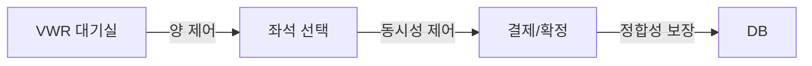

# 대규모 티케팅 시스템 아키텍처 설계 가이드

## 📋 목차

- [**전체 큰 그림**](https://www.perplexity.ai/search/init-flowchart-curve-linear-fl-xtnML9FbQuKpBzoozPb3DA#%EC%A0%84%EC%B2%B4-%ED%81%B0-%EA%B7%B8%EB%A6%BC)
- [**1. 백엔드 관점 정리**](https://www.perplexity.ai/search/init-flowchart-curve-linear-fl-xtnML9FbQuKpBzoozPb3DA#1-%EB%B0%B1%EC%97%94%EB%93%9C-%EA%B4%80%EC%A0%90-%EC%A0%95%EB%A6%AC)
- [**2. 인프라 관점 정리**](https://www.perplexity.ai/search/init-flowchart-curve-linear-fl-xtnML9FbQuKpBzoozPb3DA#2-%EC%9D%B8%ED%94%84%EB%9D%BC-%EA%B4%80%EC%A0%90-%EC%A0%95%EB%A6%AC)
- [**3. 최종 요약**](https://www.perplexity.ai/search/init-flowchart-curve-linear-fl-xtnML9FbQuKpBzoozPb3DA#3-%EC%B5%9C%EC%A2%85-%EC%9A%94%EC%95%BD)

---

## 전체 큰 그림

티켓팅은 결국 **한 지점(좌석/결제/DB)에 트래픽이 몰리는 구조**라서, 성공하는 설계는 공통적으로 이렇게 쪼갠다:

## 핵심 3단계 분해

1. *VWR(대기실/대기열)**로 "양(유입률)"을 제어해서 DB를 보호
2. *입장 후(좌석 선택/선점)**는 "핫스팟 리소스 동시성"을 별도 계층으로 방어
3. **최종 확정/결제 단계**는 DB가 정합성 최후 보루가 된다

> 💡 이 3단계 분해가 핵심! (대기열 저장 → 스케줄러 입장 → 예매 처리)
> 

---

## 1. 백엔드 관점 정리

## A. 대기열 관점: "상태를 보여줘야 해서 Redis ZSET"

## ❓ 왜 Kafka/MQ가 아니라 Redis ZSET인가?

대기열은 단순 FIFO 처리가 아니라 **"내가 몇 번째인지"를 계속 보여줘야** 해서, MQ처럼 파이프형 구조는 랜덤 조회/순번 조회가 본질적으로 맞지 않다.

## ✅ Redis ZSET을 쓰면 되는 것들

| **기능** | **설명** | **Redis 명령어** |
| --- | --- | --- |
| 순번 조회 | 내 위치 + 전체 대기 인원 즉시 조회 | `ZRANK`, `ZCOUNT` |
| 순번 유지 | 새로고침/재접속에도 동일 순번 유지 | 멱등성 (ZADD) |
| 이탈자 제거 | 중간 이탈 사용자 제거 같은 운영 기능 | `ZREM` |
| 트래픽 안정 | F5/중복 클릭에도 멱등성으로 안정 | `ZADD` (Score 동일) |

`text# 대기열 추가
ZADD queue:event123 1738468800 user:12345

# 내 순번 조회 (0-based)
ZRANK queue:event123 user:12345

# 전체 대기 인원
ZCOUNT queue:event123 -inf +inf

# 다음 N명 입장
ZRANGE queue:event123 0 99`

---

## B. 트래픽 견디는 관점: "숏 폴링 + 서버가 TTL로 주기 통제"

## 🔄 WebSocket vs 폴링 비교

| **구분** | **WebSocket** | **숏 폴링 (권장)** |
| --- | --- | --- |
| 연결 방식 | Stateful (커넥션 유지) | Stateless |
| 대규모 문제 | 메모리/max-connection/재접속 폭풍 ❌ | 수평 확장으로 해결 ✅ |
| 확장성 | 제한적 | 무제한 (API 서버 확장) |
| 복잡도 | 높음 (재연결 로직, 상태 동기화) | 낮음 |

## 💡 폴링이 많아도 괜찮은 이유

대기열 폴링이 **Redis에서 숫자만 읽는 초경량 요청**이기 때문

`javascript// 폴링 응답 예시
{
  "position": 12345,
  "estimatedWait": 600,  // 초
  "nextPoll": 30         // 다음 폴링까지 30초 ✅
}`

## 🎯 운영 포인트: 서버가 TTL로 주기 동적 제어

폴링을 클라이언트가 마음대로 하는 게 아니라, **서버가 응답으로 TTL(다음 호출까지 시간)을 내려서** 폴링 주기를 동적으로 컨트롤

`javascript// 순번별 폴링 주기 조절
if (position > 100000) {
    nextPoll = 60;  // 1분 (멀리 있으면 천천히)
} else if (position > 10000) {
    nextPoll = 30;  // 30초
} else if (position > 1000) {
    nextPoll = 5;   // 5초
} else {
    nextPoll = 1;   // 1초 (곧 입장이면 빠르게)
}`

---

## C. DB 관점: "Admission Control로 DB TPS에 맞춰 유입량을 고정"

## 🚨 문제: 7시에 수백만이 몰리면?

API가 DB로 보내는 순간 DB가 뻗음 → **DB로 안 보내고 Redis 대기열로 먼저 보낸다**가 핵심

## ✅ 해결: Admission Control

`text입장률 = DB 처리 용량 × 안전 계수

예시:
- DB 최대 TPS: 1,000
- 안전 계수: 0.7 (70%)
- 입장률: 700명/초`

## 🔄 스케줄러 동작

`javascript// 매 1초마다 실행
setInterval(async () => {
    // DB TPS 기준으로 N명만 입장
    const N = 700;  // DB가 100TPS면 60~80 정도로 제한
    
    // Redis 대기열에서 앞에서 N명 가져오기
    const admitted = await redis.zrange('queue:event123', 0, N-1);
    
    for (const userId of admitted) {
        // 입장 토큰 발급
        await allowEntry(userId);
        // 대기열에서 제거
        await redis.zrem('queue:event123', userId);
    }
}, 1000);`

**결과:**

- DB는 절대 1,000 TPS 넘지 않음 ✅
- 안정적 처리 (여유 30%) ✅
- 예측 가능한 대기 시간 ✅

---

## D. 이탈 사용자 처리: "정교한 생존 체크보다 TTL이 비용 효율"

## 💡 핵심 아이디어

수십/수백만 생존 체크 비용보다, **허수 몇 명을 그냥 Active로 올려두고 TTL로 제거하는 게 더 비용 효율적**

`javascript// Active User TTL 관리 (예: 3분)
await redis.zadd('active:event123', Date.now(), userId);

// 5분마다 오래된 사용자 제거
const fiveMinutesAgo = Date.now() - 300000;
await redis.zremrangebyscore('active:event123', '-inf', fiveMinutesAgo);

// 폴링 시 Active 체크
const isActive = await redis.zscore('active:event123', userId);
if (!isActive) {
    return { error: 'Session expired' };
}`

---

## E. 좌석 선택/선점: "VWR이 못 막는 핫스팟 동시성을 다층 방어로 해결"

## 🎯 핵심 결론

**RDB 락으로만 가면 DB가 부하를 받으니, Redis의 원자적 연산(Lua)으로 동시성을 제어**

## 🛡️ 다층 방어 (Defense in Depth)

| **계층** | **역할** | **기술** | **보호 대상** | **한계** |
| --- | --- | --- | --- | --- |
| **1. VWR** | 양 제어 | Redis ZSET | DB 과부하 방지 | 통과자들의 동시성은 제어 못함 ❌ |
| **2. Rate Limiting** | API 보호 | Token Bucket | 엔드포인트 TPS 제한 | 리소스 단위 경합은 못 막음 ❌ |
| **3. Redis 원자 처리** | 리소스 보호 | Lua Script | 좌석/재고 동시성 | 네트워크 지연 시 한계 ⚠️ |
| **4. DB Optimistic Lock** | 정합성 감지 | version 컬럼 | Redis-DB 불일치 감지 | 충돌 시 재시도 필요 ⚠️ |
| **5. DB Row Lock** | 최종 방어 | SELECT FOR UPDATE | 결제/확정 트랜잭션 | 성능 저하, 데드락 위험 ⚠️ |

---

## 📝 계층별 상세 설명

## 계층 1: VWR (양 제어)

`text목적: "몇 명을 들여보낼까?" (DB 보호)
한계: 통과자들이 같은 좌석을 동시에 누르는 핫스팟 동시성은 제어 못함`

## 계층 2: Rate Limiting (API 보호)

`text목적: 엔드포인트 TPS를 제한해 스파이크 방어
한계: '모든 요청이 A1 좌석이면?' 같은 리소스 단위 경합은 못 막음`

## 계층 3: Redis 원자 처리 (권장 ⭐)

**좌석 상태 전이를 원자적으로 처리:**

`AVAILABLE → HELD → CONFIRMED`

`lua-- seat_lock.lua (권장 방식)
local seatKey = KEYS[1]
local userId = ARGV[1]
local ttl = ARGV[2]

-- 1. 상태 확인
local status = redis.call('HGET', seatKey, 'status')
if status == 'HELD' or status == 'CONFIRMED' then
    return 0  -- 실패
end

-- 2. 원자적 상태 전이 (All or Nothing)
redis.call('HMSET', seatKey,
    'status', 'HELD',
    'userId', userId,
    'heldAt', redis.call('TIME')[1]
)
redis.call('EXPIRE', seatKey, ttl)

return 1  -- 성공`

`javascript// 사용 예시
const result = await redis.eval(
    luaScript, 
    1, 
    'seat:A1', 
    userId, 
    300
);

if (result === 1) {
    console.log('좌석 선점 성공 ✅');
} else {
    throw new ConflictException('이미 선택된 좌석');
}`

**왜 Lua가 Redis Lock보다 나은가?**

| **구분** | **Redis Lock (SET NX EX)** | **Lua Script (권장)** |
| --- | --- | --- |
| 원자성 | 여러 명령어 분리 ❌ | 단일 원자 연산 ✅ |
| Network | 3번 Round-trip | 1번 Round-trip ✅ |
| Race Condition | 명령어 사이 끼어들기 가능 ❌ | 원천 차단 ✅ |
| 복잡한 로직 | 어려움 | 가능 (검증+차감 동시) ✅ |

## 계층 4: DB Optimistic Lock

`sql-- version 컬럼으로 동시 수정 감지
UPDATE seats 
SET 
    status = 'LOCKED',
    user_id = ?,
    version = version + 1,
    locked_at = NOW()
WHERE 
    id = ? 
    AND status = 'AVAILABLE'
    AND version = ?  -- 현재 버전과 일치해야만 성공`

**목적:** Redis/애플리케이션에서 꼬여도 DB에서 충돌 감지

## 계층 5: DB Row Lock (제한적 사용)

`sql-- 결제/확정 같은 critical 트랜잭션만
BEGIN;

SELECT * FROM seats 
WHERE id = ? 
FOR UPDATE;  -- Row Lock 획득

-- 여기서부터 독점 접근
UPDATE seats SET status = 'BOOKED' WHERE id = ?;

COMMIT;`

**주의:** 좌석 탐색/선점 단계에서 남발하면 DB 병목/풀 고갈 위험 ⚠️

---

## 📊 요약

> **VWR은 '양', 좌석은 '동시성', DB는 '정합성 최종 보루'**로 역할이 분리되는 구조
> 

---

## 2. 인프라 관점 정리

## 🎯 아키텍처 의도

**"트래픽을 바깥에서부터 단계적으로 얇게 거르고, 안쪽은 수평 확장 가능한 stateless로 만들고, 가장 안쪽(DB)은 유입량을 고정해서 살린다"**

---

## 계층별 인프라 구성

`textInternet
   ↓
┌─────────────────────────────────────────────────┐
│ 계층 1: CloudFront + WAF + Lambda@Edge          │ ← Edge (양 제어)
│ - 봇/DDoS 차단                                  │
│ - 정적 파일 캐싱                                │
│ - VWR 토큰 검증/발급 (얇게 유지)                │
└─────────────────────────────────────────────────┘
   ↓
┌─────────────────────────────────────────────────┐
│ 계층 2: ALB → Ingress (NGINX)                   │ ← API 관문
│ - L7 라우팅                                     │
│ - Rate Limiting                                 │
│ - Burst 제어                                    │
└─────────────────────────────────────────────────┘
   ↓
┌─────────────────────────────────────────────────┐
│ 계층 3: EKS App Layer (Stateless)               │ ← 수평 확장
│ - Queue API (대기열 폴링)                        │
│ - Booking API (예매 처리)                        │
│ - Inventory API (재고 관리)                      │
│ - Auto Scaling (Karpenter/HPA)                  │
└─────────────────────────────────────────────────┘
   ↓                                    ↓
┌────────────────────────┐  ┌─────────────────────┐
│ 계층 4: Redis Cluster  │  │ 계층 5: RDS (Aurora)│
│ - 대기열 (ZSET)        │  │ - 최종 기록소       │
│ - Active 사용자        │  │ - Optimistic Lock   │
│ - 좌석 상태 (Lua)      │  │ - Row Lock (결제만) │
│ - Multi-AZ Replica     │  │ - RDS Proxy         │
└────────────────────────┘  └─────────────────────┘
                 ↓
      ┌──────────────────────┐
      │ MQ/SQS (비동기)       │
      │ - 알림 발송           │
      │ - 정산 처리           │
      │ - 로그/분석           │
      └──────────────────────┘`

---

## A. 계층 1: Edge/VWR (양 제어, 원 서버 보호)

## CloudFront + WAF

- 봇/비정상 차단
- 정적 파일 캐싱/흡수
- DDoS 방어

## Lambda@Edge (얇게 유지 ⭐)

**역할 제한 (문지기):**

- ✅ 리다이렉트
- ✅ 토큰 검증/부여
- ✅ 간단 룰
- ❌ 복잡한 대기열 로직 (Redis에서)
- ❌ 비즈니스 로직

`javascript// Lambda@Edge 예시 (얇게)
exports.handler = async (event) => {
    const request = event.Records[0].cf.request;
    const token = request.headers['x-queue-token'];
    
    // 간단한 토큰 검증만
    if (!token || !isValidToken(token)) {
        return {
            status: '302',
            headers: {
                'location': '/waiting'
            }
        };
    }
    
    // 통과
    return request;
};`

**중요:** Edge에 상태 로직을 과하게 넣으면 디버깅/일관성 관리가 어려워지므로 '문지기' 역할로 제한

---

## B. 계층 2: ALB → Ingress(NGINX)

## 역할

- L7 라우팅의 기준점
- 서비스 분기
- 헤더/쿠키 기반 라우팅

## Rate Limiting 예시

`text# nginx.conf
limit_req_zone $binary_remote_addr zone=booking:10m rate=10r/s;

location /api/booking {
    limit_req zone=booking burst=20 nodelay;
    proxy_pass http://booking-service;
}`

---

## C. 계층 3: EKS App Layer (수평 확장 전제)

## 마이크로서비스 분리

`text# Queue API (경량)
- 대기열 폴링 처리
- Redis ZRANK 조회만
- HPA: CPU 50% 기준 확장

# Booking API (무거움)
- 좌석 선점
- 결제 처리
- HPA: CPU 70% 기준 확장

# Inventory API
- 재고 관리
- Lua Script 실행`

## Auto Scaling

`textapiVersion: autoscaling/v2
kind: HorizontalPodAutoscaler
metadata:
  name: booking-api
spec:
  scaleTargetRef:
    apiVersion: apps/v1
    kind: Deployment
    name: booking-api
  minReplicas: 10
  maxReplicas: 100
  metrics:
  - type: Resource
    resource:
      name: cpu
      target:
        type: Utilization
        averageUtilization: 70`

---

## D. 계층 4: Redis Cluster (핫패스 엔진)

## 역할

1. 대기열 (ZSET)
2. Active 사용자 관리
3. 좌석/재고 원자 처리 (Lua)
4. 캐시

## 고가용성 구성

`textPrimary (us-east-1a)
  ↓ 실시간 복제
Replica 1 (us-east-1b)
  ↓ 실시간 복제
Replica 2 (us-east-1c)

장애 시: Primary 다운 → Replica 자동 승격 (30초)`

---

## E. 계층 5: RDS (최종 기록소)

## Admission Control 적용

**유입량이 제한된 상태에서만** DB 트랜잭션이 들어오도록 구성

`text스케줄러 → 초당 700명만 입장 → DB는 안전`

## RDS Proxy 활용

`text장점:
- Connection Pooling
- 장애 시 자동 Failover
- IAM 인증
- Query 캐싱`

---

## F. 비동기 후처리 (MQ/SQS)

> "Redis냐 sqs냐가 아니라 둘 다"
> 

## 역할 분담

| **구분** | **Redis** | **MQ/SQS** |
| --- | --- | --- |
| **용도** | 실시간 핫패스 | 비동기 후처리 |
| **예시** | 대기열, 좌석 상태 | 알림, 로그, 정산 |
| **지연** | 1~5ms | 수백ms~수초 |
| **보장** | 속도 우선 | 메시지 보장 |

## 실제 흐름

`javascript// 1. 결제 완료 (동기)
await db.transaction(async (trx) => {
    await trx.query('UPDATE seats SET status = "BOOKED"');
    await redis.del('seat:A1');
});

// 2. 이벤트 발행 (비동기)
await sqs.sendMessage({
    type: 'BOOKING_CONFIRMED',
    userId: user.id,
    seatId: 'A1',
    timestamp: Date.now()
});

// 3. Worker가 처리
// - 예매 확정 이메일
// - SMS 발송
// - 푸시 알림
// - 데이터 분석
// - 정산 처리`

---

## 3. 최종 요약

## 트래픽·대기열·DB를 한 번에 관통하는 원칙

## 🌊 트래픽 견디기

`text바깥(Edge)에서 얇게 필터링 
  ↓
안쪽(App)은 stateless로 수평 확장 
  ↓
Redis 초경량 조회로 폴링 감당`

## 📊 대기열 관점

- **"순번을 보여줘야"** 하므로 Redis ZSET이 적합
- 멱등/재접속/운영 기능까지 포함
- 폴링은 서버 TTL로 동적 제어

## 🗄️ DB 관점

- DB는 **절대 폭주시키지 말고** Admission Control로 TPS에 맞춰 유입률 고정
- 좌석/재고 동시성은 DB락 남발 대신 **Redis 원자 처리(Lua)**로 앞단에서 해결

## 🎯 좌석 선택(핫스팟) 관점

`textVWR (양 제어)
  ↓
Rate Limiting (API 보호)
  ↓
Redis Lua (동시성 제어) ⭐ 핵심
  ↓
DB Optimistic Lock (검증)
  ↓
DB Row Lock (최종, 결제만)`

---

## 📌 핵심 정리

## 세 가지 분리 원칙

| **계층** | **역할** | **기술** | **목적** |
| --- | --- | --- | --- |
| **VWR** | 양 제어 | Redis ZSET | DB 보호 |
| **좌석 선점** | 동시성 제어 | Redis Lua | Race Condition 방지 |
| **DB** | 정합성 보장 | Optimistic/Row Lock | 최종 방어선 |

## 기술 선택 이유

| **선택** | **이유** |
| --- | --- |
| **Redis ZSET** (not MQ) | 순번 조회 가능 |
| **숏 폴링** (not WebSocket) | Stateless 수평 확장 |
| **Lua Script** (not Redis Lock) | 원자적 상태 전이 |
| **Admission Control** | DB TPS 기반 유입 제어 |
| **TTL 이탈 처리** | 생존 체크보다 효율적 |
| **Redis + MQ 병용** | 실시간 + 비동기 분담 |

---

## 🎓 마무리

이 아키텍처는 단순히 "대기열"을 만드는 게 아니라:

1. **트래픽을 계층별로 분산**하고
2. **DB를 절대 폭주시키지 않으며**
3. **동시성을 다층으로 방어**하고
4. **사용자에게 투명한 대기 경험**을 제공하는

**종합 설계 원칙**입니다.