## 목차

- [**전체 큰 그림**](https://www.perplexity.ai/search/init-flowchart-curve-linear-fl-xtnML9FbQuKpBzoozPb3DA?sm=d#%EC%A0%84%EC%B2%B4-%ED%81%B0-%EA%B7%B8%EB%A6%BC)
- [**1. 백엔드 관점 정리**](https://www.perplexity.ai/search/init-flowchart-curve-linear-fl-xtnML9FbQuKpBzoozPb3DA?sm=d#1-%EB%B0%B1%EC%97%94%EB%93%9C-%EA%B4%80%EC%A0%90-%EC%A0%95%EB%A6%AC)
- [**2. 인프라 관점 정리**](https://www.perplexity.ai/search/init-flowchart-curve-linear-fl-xtnML9FbQuKpBzoozPb3DA?sm=d#2-%EC%9D%B8%ED%94%84%EB%9D%BC-%EA%B4%80%EC%A0%90-%EC%A0%95%EB%A6%AC)
- [**3. 계층별 한계와 극복 방법**](https://www.perplexity.ai/search/init-flowchart-curve-linear-fl-xtnML9FbQuKpBzoozPb3DA?sm=d#3-%EA%B3%84%EC%B8%B5%EB%B3%84-%ED%95%9C%EA%B3%84%EC%99%80-%EA%B7%B9%EB%B3%B5-%EB%B0%A9%EB%B2%95)
- [**4. 실무 운영 개선 사항**](https://www.perplexity.ai/search/init-flowchart-curve-linear-fl-xtnML9FbQuKpBzoozPb3DA?sm=d#4-%EC%8B%A4%EB%AC%B4-%EC%9A%B4%EC%98%81-%EA%B0%9C%EC%84%A0-%EC%82%AC%ED%95%AD)
- [**5. 최종 요약**](https://www.perplexity.ai/search/init-flowchart-curve-linear-fl-xtnML9FbQuKpBzoozPb3DA?sm=d#5-%EC%B5%9C%EC%A2%85-%EC%9A%94%EC%95%BD)

---

## 전체 큰 그림

티켓팅은 결국 **한 지점(좌석/결제/DB)에 트래픽이 몰리는 구조**라서, 성공하는 설계는 공통적으로 이렇게 쪼갠다:

## 핵심 3단계 분해

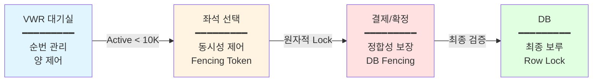

- *VWR(Virtual Waiting Room)*로 "양(유입률)"을 제어해서 DB를 보호
- *입장 후(좌석 선택/선점)**는 "핫스팟 리소스 동시성"을 별도 계층으로 방어

**최종 확정/결제 단계**는 DB가 정합성 최후 보루가 된다

> 💡 이 3단계 분해가 핵심! (VWR 대기열 → 입장 허가 → 예매 처리)
> 

---

## 1. 백엔드 관점 정리

## A. 대기열 관점: "상태를 보여줘야 해서 Redis ZSET"

## ❓ 왜 Kafka/MQ가 아니라 Redis ZSET인가?

대기열은 단순 FIFO 처리가 아니라 **"내가 몇 번째인지"를 계속 보여줘야** 해서, MQ처럼 파이프형 구조는 랜덤 조회/순번 조회가 본질적으로 맞지 않다.

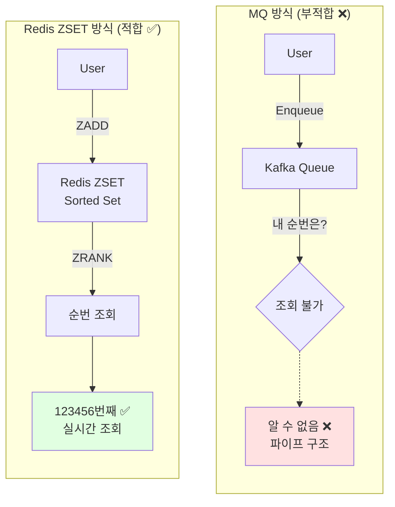

## ✅ Redis ZSET을 쓰면 되는 것들

| **기능** | **설명** | **Redis 명령어** |
| --- | --- | --- |
| **순번 조회** | 내 위치 + 전체 대기 인원 즉시 조회 | `ZRANK`, `ZCOUNT` |
| **순번 유지** | 새로고침/재접속에도 동일 순번 유지 | 멱등성 (ZADD) |
| **이탈자 제거** | 중간 이탈 사용자 제거 같은 운영 기능 | `ZREM` |
| **트래픽 안정** | F5/중복 클릭에도 멱등성으로 안정 | `ZADD` (Score 동일) |
| **원자적 제거** | 꺼내면서 제거 (중복 방지) | `ZPOPMIN` ⭐ |

```jsx
# 대기열 추가 (timestamp를 score로)
ZADD queue:event123 1738468800 user:12345

# 내 순번 조회 (0-based)
ZRANK queue:event123 user:12345

# 전체 대기 인원
ZCOUNT queue:event123 -inf +inf

# 원자적 제거 (꺼내면서 제거)
ZPOPMIN queue:event123 100
```

---

## B. 트래픽 견디는 관점: "숏 폴링 + 서버가 TTL로 주기 통제"

- *웹소켓은 상태 유지(커넥션 유지)**라서 대규모(예: 50만)에서 메모리/로드밸런서 max-connection/재접속 폭풍이 치명적

반대로 **폴링은 stateless**라서 트래픽이 늘면 API 서버를 수평 확장하면 된다

## 🔄 WebSocket vs 폴링 비교

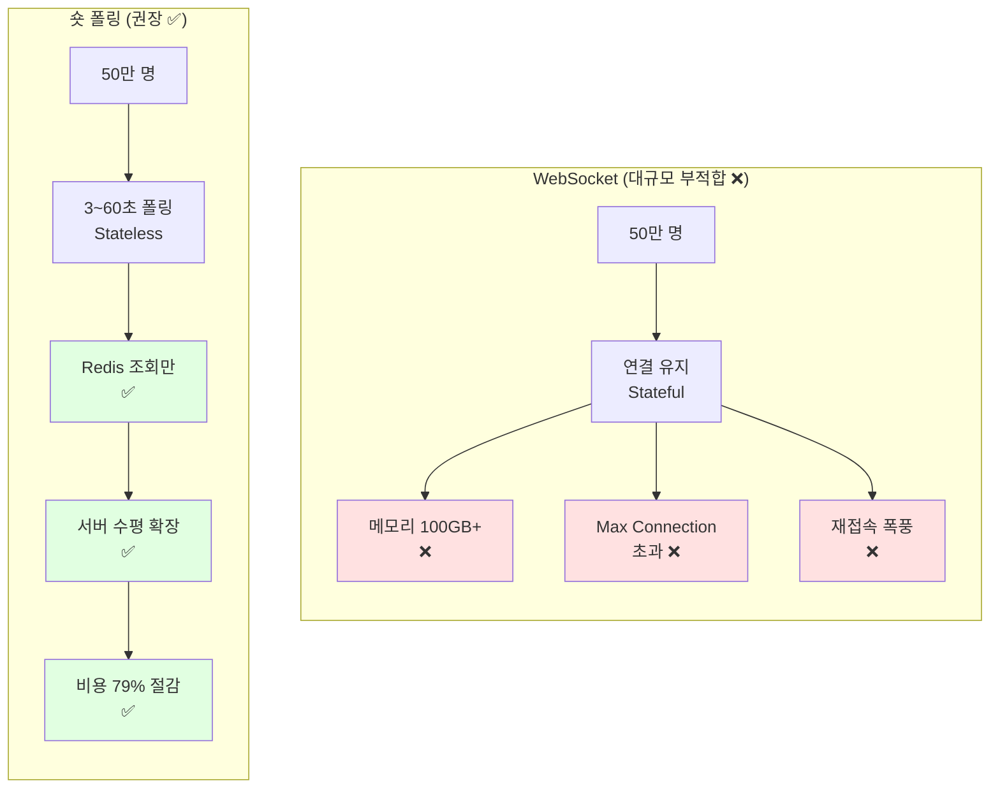

| **구분** | **WebSocket** | **숏 폴링 (권장)** |
| --- | --- | --- |
| 연결 방식 | Stateful (커넥션 유지) | Stateless |
| 대규모 문제 | 메모리/max-connection/재접속 폭풍 ❌ | 수평 확장으로 해결 ✅ |
| 확장성 | 제한적 | 무제한 (API 서버 확장) |
| 복잡도 | 높음 (재연결 로직, 상태 동기화) | 낮음 |
| 비용 | 높음 | 낮음 (동적 폴링으로 79% 절감) |

## 🎯 동적 폴링 전략

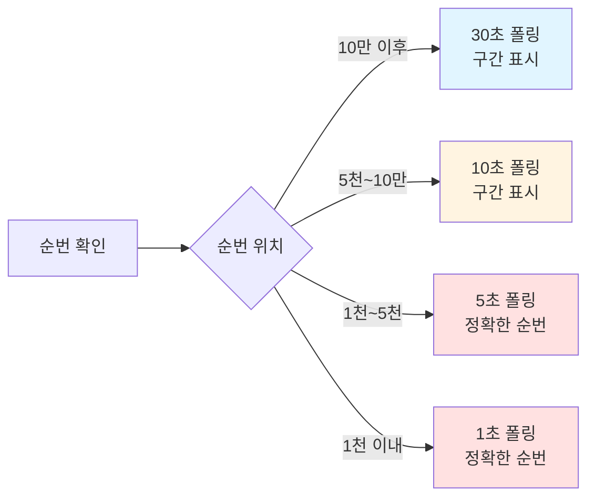

```jsx
javascript// 순번별 폴링 주기 조절 (동적 TTL)
function getNextPollInterval(position) {
    if (position > 100000) return 60;   // 1분
    if (position > 10000) return 30;    // 30초
    if (position > 5000) return 10;     // 10초
    if (position > 1000) return 5;      // 5초
    return 1;                           // 1초
}

// 폴링 비용 절감 효과
/*
기존 (3초 고정):
20만 명 × (1/3) = 66,666 req/s

개선 (동적 조절):
- 1천 이내: 1,000 × 1 = 1,000 req/s
- 1천~5천: 4,000 × 0.2 = 800 req/s
- 5천~10만: 95,000 × 0.1 = 9,500 req/s
- 10만 이상: 100,000 × 0.033 = 3,333 req/s
━━━━━━━━━━━━━━━━━━━━━━━━━━━━━━━━━
총: 14,633 req/s (78% 감소) ✅
*/
```

---

## C. DB 관점: "Active 제한으로 DB TPS에 맞춰 유입량을 고정"

## 🚨 문제: 7시에 수백만이 몰리면?

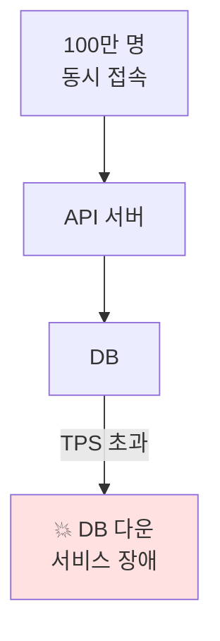

API가 DB로 보내는 순간 DB가 뻗음 → **Redis 대기열로 먼저 보내고, Active 사용자 수를 제한**해서 DB로 가는 유입량을 고정

## ✅ 해결: Active User 제한

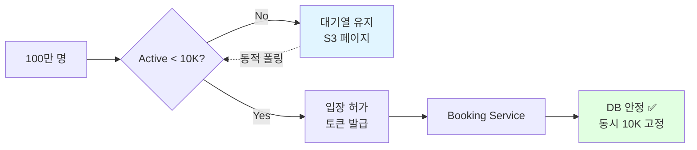

`Active User 제한 = DB 처리 용량 기준

예시:
- DB 최대 TPS: 1,000
- 사용자당 평균 TPS: 0.1 (10초에 1번 요청)
- Active 제한: 10,000명 (1,000 / 0.1)`

## 🔄 Admission Control 동작 (최종 개선 버전)

```lua
lua-- admission_zpopmin.lua (최종 개선 버전)
local queueKey = KEYS[1]        -- queue:event123
local activeKey = KEYS[2]       -- active:event123
local admitCount = tonumber(ARGV[1])  -- 700
local now = tonumber(ARGV[2])
local ttl = tonumber(ARGV[3])   -- 300000 (5분)
local maxActive = tonumber(ARGV[4]) -- 10000

-- 1. 만료된 Active 제거
redis.call('ZREMRANGEBYSCORE', activeKey, '-inf', now)

-- 2. 현재 Active 수
local activeCount = redis.call('ZCOUNT', activeKey, '-inf', '+inf')

-- 3. 입장 가능 인원
local available = maxActive - activeCount
if available <= 0 then
    return {0, {}}  -- 입장 불가
end

local toAdmit = math.min(available, admitCount)

-- 4. ZPOPMIN으로 원자적 제거 ⭐ (개선!)
--    꺼내는 순간 제거 → 중복 입장 원천 차단
local admitted = redis.call('ZPOPMIN', queueKey, toAdmit)

if #admitted == 0 then
    return {0, {}}
end

-- 5. Active 추가 (admitted는 {userId, score, userId, score, ...} 형태)
local users = {}
for i = 1, #admitted, 2 do  -- 2칸씩 점프
    local userId = admitted[i]
    redis.call('ZADD', activeKey, now + ttl, userId)
    table.insert(users, userId)
end

-- 6. 결과 반환
return {#users, users}
```

**개선 포인트:**

```jsx
기존: ZRANGE + ZREM
→ 같은 사람 재등록, score 동일 케이스 꼬임 가능 ❌

개선: ZPOPMIN ⭐
→ 꺼내는 순간 제거 (원자적)
→ 중복 입장 원천 차단 ✅
→ 재등록 문제 해결 ✅
```

**사용 예시:**

```jsx
javascript// Admission Worker (최종 개선 버전)
setInterval(async () => {
    const now = Date.now();
    
    // ZPOPMIN으로 원자적 처리 ✅
    const [count, admittedUsers] = await redis.eval(
        admissionZPOPMINScript,
        2,
        'queue:event123',
        'active:event123',
        700,        // 초당 700명
        now,
        300000,     // 5분 TTL
        10000       // MAX_ACTIVE
    );
    
    if (count > 0) {
        // 토큰 발급 (배치)
        const pipeline = redis.pipeline();
        for (const userId of admittedUsers) {
            const token = generateToken(userId);
            pipeline.setex(`token:${userId}`, 600, token);
        }
        await pipeline.exec();
        
        console.log(`Admitted ${count} users`);
    }
}, 1000);
```

**결과:**

- ✅ Active 사용자는 절대 10,000명 초과 안 함
- ✅ DB는 예측 가능한 부하만 받음 (TPS 1,000 이하)
- ✅ ZPOPMIN으로 중복 입장 원천 차단
- ✅ All-or-Nothing 보장

---

## D. 이탈 사용자 처리: "배치 정리로 스파이크 방지"

## 기본 전략: TTL 자동 제거

```jsx
javascript// Active User TTL 관리
const now = Date.now();
const fiveMinutesLater = now + 300000;

// Active 추가 (5분 TTL)
await redis.zadd('active:event123', fiveMinutesLater, userId);

// 만료된 사용자 제거 (Admission Worker에서)
await redis.zremrangebyscore('active:event123', '-inf', now);
```

## 개선: Heartbeat 배치 정리 (스파이크 방지) ⭐

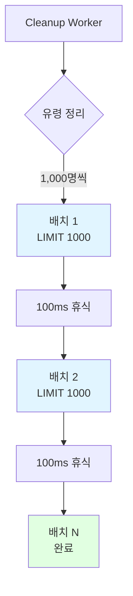

**문제 (기존 방식):**

```jsx
javascript// ❌ 한 번에 전체 조회 (스파이크 발생)
const staleUsers = await redis.zrangebyscore(
    'queue_heartbeat:event123',
    '-inf',
    Date.now() - 300000
);

// 100만 명 유령 → 메모리/네트워크 폭발 💥
await redis.zrem('queue:event123', ...staleUsers);
```

**해결 (배치 처리):**

```jsx
javascript// ✅ 배치 처리 (스파이크 방지)
async function cleanupStaleUsers(eventId, batchSize = 1000) {
    const now = Date.now();
    const fiveMinutesAgo = now - 300000;
    
    let totalRemoved = 0;
    let hasMore = true;
    
    while (hasMore) {
        // 1,000명씩만 처리 (페이지네이션)
        const staleUsers = await redis.eval(`
            local heartbeatKey = KEYS[1]
            local queueKey = KEYS[2]
            local minScore = tonumber(ARGV[1])
            local limit = tonumber(ARGV[2])
            
            -- ZRANGEBYSCORE with LIMIT
            local users = redis.call('ZRANGEBYSCORE', heartbeatKey, 
                '-inf', minScore, 'LIMIT', 0, limit)
            
            if #users > 0 then
                -- 제거
                redis.call('ZREM', heartbeatKey, unpack(users))
                redis.call('ZREM', queueKey, unpack(users))
            end
            
            return users
        `, 2, `queue_heartbeat:${eventId}`, `queue:${eventId}`, 
        fiveMinutesAgo, batchSize);
        
        totalRemoved += staleUsers.length;
        hasMore = staleUsers.length === batchSize;
        
        if (hasMore) {
            await sleep(100);  // 배치 사이 휴식 (다른 작업 방해 최소화)
        }
    }
    
    console.log(`Removed ${totalRemoved} stale users in batches`);
}

// 30초마다 실행
setInterval(() => cleanupStaleUsers('event123', 1000), 30000);
```

**개선 효과:**

`✅ 메모리 스파이크 방지 (1,000명씩만)
✅ 네트워크 부하 분산 (배치 처리)
✅ 다른 작업 방해 최소화 (100ms 휴식)
✅ 점진적 정리`

---

## E. 좌석 선택/선점: "VWR이 못 막는 핫스팟 동시성을 다층 방어로 해결"

VWR은 "몇 명이 들어갈까"를 제어하지만, 들어간 사람들이 같은 좌석을 동시에 누르는 **핫스팟 동시성**은 별도로 방어해야 함.

## 🛡️ 다층 방어 (Defense in Depth) - 5계층

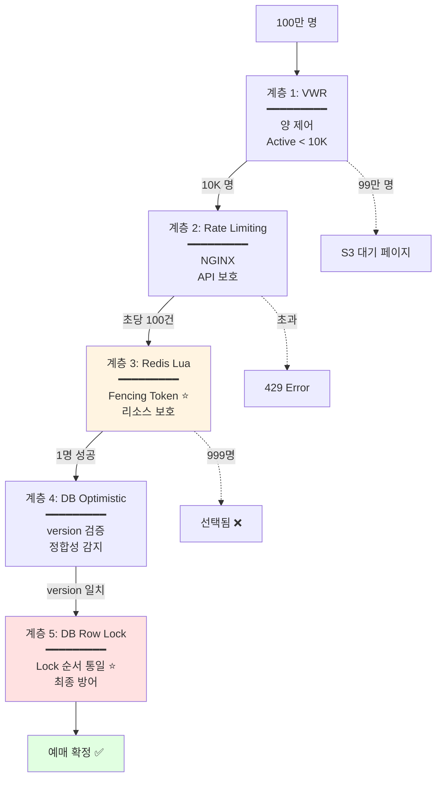

## 📊 계층별 역할과 한계

| **계층** | **역할** | **실행 위치** | **기술** | **보호 대상** | **한계** | **극복 방법** |
| --- | --- | --- | --- | --- | --- | --- |
| **1. VWR** | **양 제어**"몇 명 들여보낼까?" | Lambda@Edge /Queue Service | Redis ZSETZPOPMINActive 제한 | DB 과부하 방지 | 통과자들의동시성 제어 못함 | 계층 3~5가담당 ✅ |
| **2. Rate Limiting** | **API 보호**"엔드포인트 TPS" | NGINX Ingress | Token Bucket | 엔드포인트TPS 제한 | 리소스 단위경합 못 막음 | 계층 3이담당 ✅ |
| **3. Redis Lua** | **리소스 보호**"좌석 A1 동시성" | Redis | Lua ScriptFencing Token | 좌석/재고동시성 | Lock Timeout | FencingToken ✅ |
| **4. DB Optimistic** | **정합성 감지**"Redis 꼬였나?" | DB | version 컬럼 | Redis-DB불일치 감지 | 충돌 시재시도 필요 | ExponentialBackoff ✅ |
| **5. DB Row Lock** | **최종 방어**"절대 틀리면 안됨" | DB | SELECT FOR UPDATE | 결제/확정트랜잭션 | 데드락 위험 | Lock 순서통일 ✅ |

## 계층 3: Redis Lua with Fencing Token (핵심 개선) ⭐

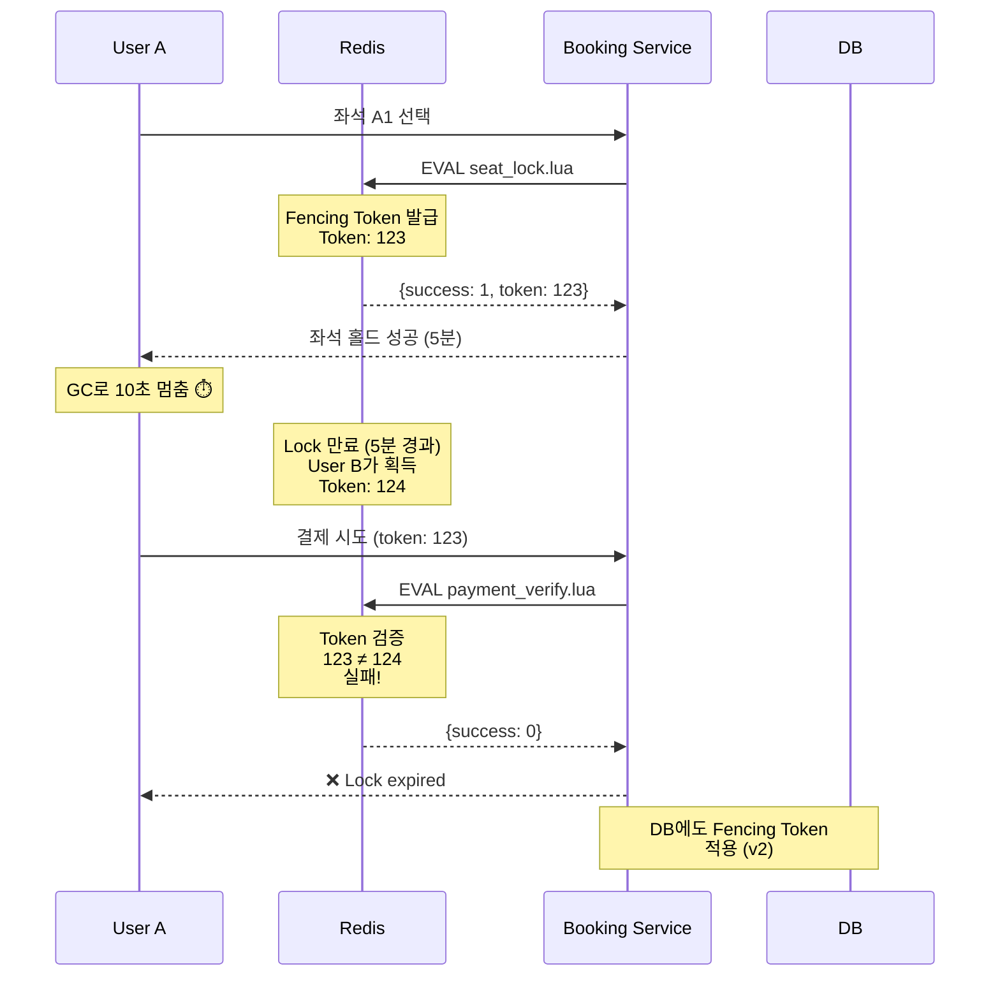

**Fencing Token 패턴 구현:**

```lua
lua-- seat_lock_with_token.lua (Fencing Token 패턴)
local seatKey = KEYS[1]        -- seat:A1
local userId = ARGV[1]         -- user:12345
local ttl = ARGV[2]            -- 300 (5분)

-- 1. 상태 확인 (원자적)
local status = redis.call('HGET', seatKey, 'status')
if status == 'HELD' or status == 'CONFIRMED' then
    return {0, nil}  -- 실패
end

-- 2. Fencing Token 발급 ⭐ (Lock Timeout 극복)
local token = redis.call('INCR', seatKey .. ':token')

-- 3. 원자적 상태 전이 (All or Nothing)
redis.call('HMSET', seatKey,
    'status', 'HELD',
    'userId', userId,
    'token', token,  -- Token 저장
    'heldAt', redis.call('TIME')[1]
)
redis.call('EXPIRE', seatKey, ttl)

return {1, token}  -- 성공 + Token 반환
```

**결제 시 Token 검증:**

```lua
lua-- payment_verify.lua (Fencing Token 검증)
local seatKey = KEYS[1]
local userId = ARGV[1]
local token = tonumber(ARGV[2])

local currentUserId = redis.call('HGET', seatKey, 'userId')
local currentToken = tonumber(redis.call('HGET', seatKey, 'token'))

-- 본인 확인 + Token 확인 ⭐
if currentUserId ~= userId or currentToken ~= token then
    return 0  -- 실패 (Lock expired 또는 다른 사람)
end

-- 결제 진행
redis.call('HSET', seatKey, 'status', 'CONFIRMED')
return 1
```

**사용 예시:**

```jsx
javascript// Booking Service - 좌석 선점
const [success, token] = await redis.eval(
    seatLockWithTokenScript,
    1,
    'seat:A1',
    userId,
    300
);

if (success === 1) {
    // Token 저장 (결제 시 사용)
    req.session.seatToken = token;
    res.json({ status: 'HELD', token, expiresIn: 300 });
} else {
    res.status(409).json({ error: 'Already taken' });
}

// Booking Service - 결제
const result = await redis.eval(
    paymentVerifyScript,
    1,
    'seat:A1',
    userId,
    req.session.seatToken  // Token 검증
);

if (result === 1) {
    // Redis 검증 통과 → DB 트랜잭션 진행
    await processPayment(userId, seatId, req.session.seatToken);
} else {
    throw new Error('Seat lock expired or stolen');
}
```

**Fencing Token 효과:**

```jsx
Lock Timeout 문제 100% 극복 ✅

시나리오:
User A: Token 123
→ GC로 10초 멈춤
→ Lock 만료
→ User B: Token 124 획득
→ User A 깨어남
→ 결제 시도 (token: 123)
→ 123 ≠ 124 → 실패 ✅

완벽한 방어!
```

## 계층 5: DB Row Lock with 순서 통일 (데드락 방지) ⭐

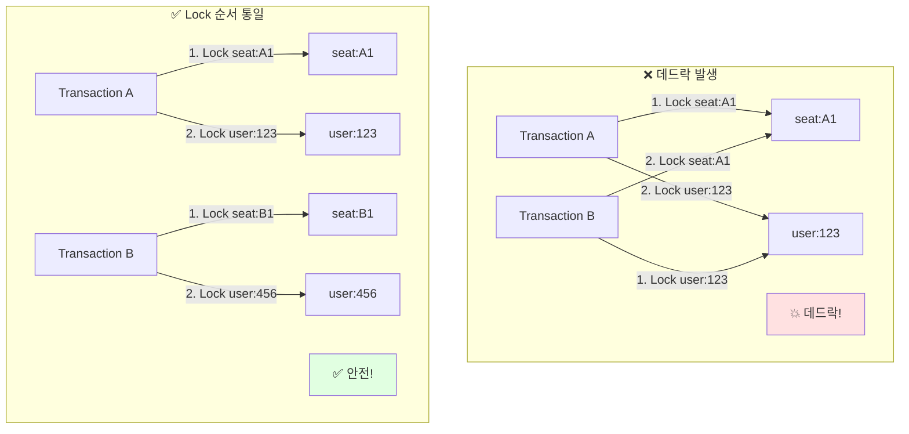

**Lock 순서 통일 구현:**

```jsx
javascript// ✅ Lock 순서 통일 (데드락 방지)
async function processPayment(userId, seatId, fencingToken) {
    await db.transaction(async (trx) => {
        // 항상 같은 순서: seat → user
        
        // 1. Seat Lock
        const [seat] = await trx.query(`
            SELECT * FROM seats 
            WHERE id = ? 
            FOR UPDATE
        `, [seatId]);
        
        if (!seat) {
            throw new Error('Seat not found');
        }
        
        // 2. User Lock
        const [user] = await trx.query(`
            SELECT * FROM users 
            WHERE id = ? 
            FOR UPDATE
        `, [userId]);
        
        if (!user) {
            throw new Error('User not found');
        }
        
        // 3. Fencing Token 검증 (v2 - 선택사항)
        if (seat.fencing_token >= fencingToken) {
            throw new Error('Fencing token outdated');
        }
        
        // 4. 결제 처리
        await trx.query(`
            UPDATE seats 
            SET status = 'BOOKED', 
                user_id = ?,
                fencing_token = ?,
                updated_at = NOW()
            WHERE id = ?
        `, [userId, fencingToken, seatId]);
        
        await trx.query(`
            INSERT INTO payments (user_id, seat_id, amount, fencing_token)
            VALUES (?, ?, ?, ?)
        `, [userId, seatId, amount, fencingToken]);
        
        // 5. 사용자 포인트 차감
        await trx.query(`
            UPDATE users 
            SET points = points - ?
            WHERE id = ?
        `, [amount, userId]);
    });
}

// Timeout 설정 (데드락 조기 감지)
await db.query('SET innodb_lock_wait_timeout = 5');
```

**데드락 방지 효과:**

```jsx
Lock 순서 통일로 데드락 100% 방지 ✅

모든 Transaction:
1. seat Lock
2. user Lock

→ 순환 대기 발생 불가
→ 데드락 원천 차단 ✅
```

---

## F. Token 보안 강화: "Consume은 Booking Service에서만"

## 문제 (기존 방식): Queue Service 병목

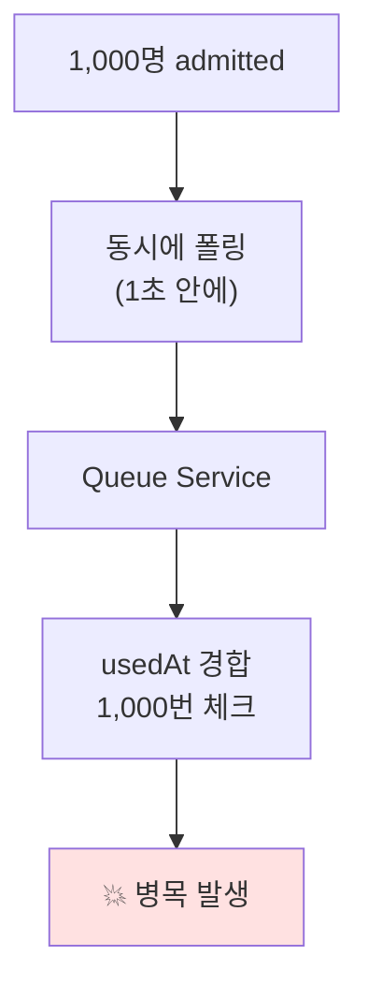

```jsx
javascript// ❌ Queue Service에서 consume (병목)
app.get('/queue/position', async (req, res) => {
    const token = await redis.get(`token:${userId}`);
    
    if (token) {
        // 여기서 1회성 체크 → 병목! ❌
        const storedToken = await redis.hgetall(`token:${userId}`);
        if (storedToken.usedAt) {
            throw new Error('Already used');
        }
        await redis.hset(`token:${userId}`, 'usedAt', Date.now());
    }
});
```

## 해결: Booking Service에서 Lua로 Consume ✅

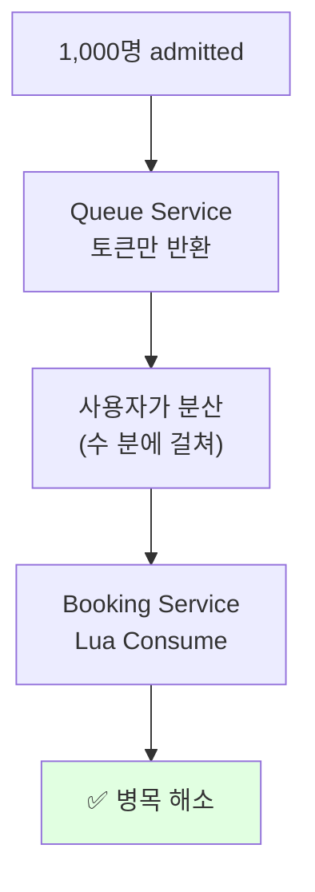

**Token Consume Lua Script:**

```lua
lua-- consume_token.lua (원자적 Consume)
local tokenKey = KEYS[1]        -- token:user123
local now = ARGV[1]

-- 1. 토큰 존재 확인
local tokenData = redis.call('HGETALL', tokenKey)
if #tokenData == 0 then
    return {0, 'Token not found'}
end

-- 2. usedAt 확인 (멱등성)
local tokenMap = {}
for i = 1, #tokenData, 2 do
    tokenMap[tokenData[i]] = tokenData[i + 1]
end

if tokenMap['usedAt'] then
    return {0, 'Already consumed'}
end

-- 3. consume 처리 (원자적)
redis.call('HSET', tokenKey, 'usedAt', now)

return {1, 'Success'}
```

**구현 예시:**

```jsx
javascript// Queue Service - 단순히 토큰만 반환 (재사용 가능)
app.get('/queue/position', async (req, res) => {
    const userId = req.user.id;
    const eventId = req.query.eventId;
    
    // Heartbeat 갱신
    await redis.zadd(`queue_heartbeat:${eventId}`, Date.now(), userId);
    
    // 토큰 확인 (consume 안 함)
    const token = await redis.get(`token:${userId}`);
    if (token) {
        return res.json({ 
            status: 'admitted', 
            token: token 
        });
    }
    
    // 순번 조회
    // ...
});

// Booking Service - 첫 진입 시 Lua로 Consume ⭐
app.get('/booking/enter', async (req, res) => {
    const token = req.headers['authorization']?.replace('Bearer ', '');
    const decoded = jwt.verify(token, process.env.JWT_SECRET);
    
    // Lua로 원자적 consume
    const [success, message] = await redis.eval(
        consumeTokenScript,
        1,
        `token:${decoded.userId}`,
        Date.now()
    );
    
    if (success === 1) {
        // 성공 → 좌석 선택 페이지
        return res.json({ status: 'ok' });
    } else {
        // 이미 사용됨 (재시도/중복 클릭) - 멱등 처리
        return res.status(409).json({ error: message });
    }
});
```

**개선 효과:**

`✅ Queue Service 병목 해소
✅ 트래픽 분산 (사용자가 시간차로 Booking 진입)
✅ Lua 원자화로 경합 제거
✅ 멱등성 보장 (재시도 안전)`