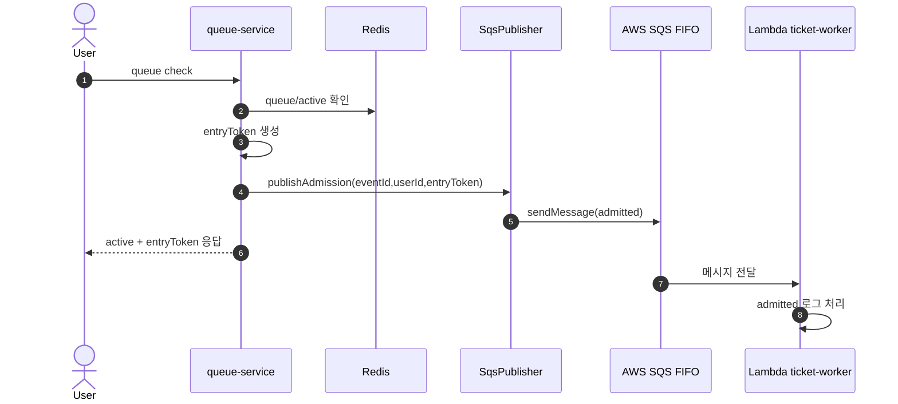
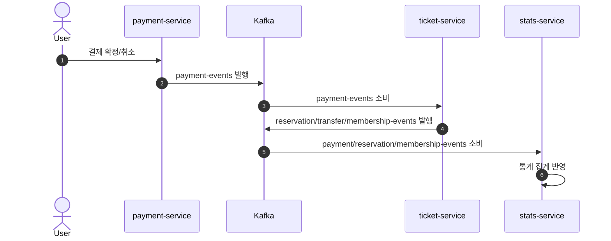

# Check8: SQS vs Kafka 완전 기초 + URR 프로젝트 적용 정리

## 0. 이 문서 목표
이 문서는 다음을 처음 접하는 사람도 이해할 수 있게 정리한다.

1. `Queue`가 무엇인지
2. `Topic`이 무엇인지
3. `SQS`와 `Kafka`가 어떻게 다른지
4. URR 프로젝트에서 각각 정확히 어디에 쓰이는지

---

## 1. 메시징이 왜 필요한가
서비스 A가 서비스 B를 HTTP로 직접 호출하는 동기 방식만 쓰면, B가 느리거나 죽었을 때 A도 같이 영향을 받는다.

메시징을 쓰면:

1. 요청을 "메시지"로 남기고 빠르게 다음 작업으로 넘어갈 수 있다.
2. 소비자(consumer)가 자기 속도로 처리한다.
3. 서비스끼리 느슨하게 연결되어 장애 전파가 줄어든다.

---

## 2. 완전 기초 용어

| 용어 | 쉬운 설명 | 핵심 포인트 |
|---|---|---|
| Producer | 메시지 보내는 쪽 | 예: 결제 완료 이벤트 발행 |
| Consumer | 메시지 읽어서 처리하는 쪽 | 예: 통계 집계 서비스 |
| Broker | 메시지를 보관/전달하는 시스템 | SQS, Kafka |
| Queue | 메시지를 "작업 대기열"로 처리 | 보통 한 메시지는 한 소비자가 처리 |
| Topic | 메시지를 "이벤트 게시판"처럼 처리 | 여러 소비자 그룹이 각각 소비 가능 |
| ACK | 처리 성공 신호 | 성공 시 재처리 방지 |
| Retry | 실패 시 재시도 | 일시 장애 복구에 중요 |
| DLQ | 계속 실패한 메시지 보관소 | 운영 시 원인 분석용 |
| Idempotency | 같은 메시지가 여러 번 와도 결과 1번만 반영 | 중복 처리 방어 |

---

## 3. Queue와 Topic 차이

### Queue
- 목적: "일감 분배"
- 성격: 한 메시지를 누군가 처리하면 끝
- 비유: 고객센터 대기열

### Topic
- 목적: "사건 공유"
- 성격: 같은 메시지를 여러 소비자 그룹이 각자 처리 가능
- 비유: 사내 공지 채널 (각 팀이 같은 공지를 읽고 각자 행동)

---

## 4. SQS 기초
SQS는 AWS가 제공하는 관리형 큐 서비스다.

### SQS 메시지 흐름
1. Producer가 메시지를 큐에 넣는다.
2. Consumer가 메시지를 가져가 처리한다.
3. 성공하면 삭제한다.
4. 실패하면 일정 시간 뒤 다시 보이게 되어 재시도된다.
5. 계속 실패하면 DLQ로 보낼 수 있다.

### Standard vs FIFO
- `Standard`: 매우 높은 처리량, 순서/중복 보장이 느슨함
- `FIFO`: 순서 보장 + 중복 억제

### FIFO에서 중요한 필드
- `MessageGroupId`: 같은 그룹 내 순서를 보장하는 키
- `MessageDeduplicationId`: 중복 메시지 억제 키

---

## 5. Kafka 기초
Kafka는 "분산 이벤트 로그"에 가깝다.

### Kafka 메시지 구조
- `Topic` 아래에 여러 `Partition`이 있다.
- 각 파티션 메시지는 `Offset`(순번)으로 저장된다.
- Consumer는 Offset을 기준으로 어디까지 읽었는지 관리한다.

### Consumer Group
- 같은 그룹 내부에서는 메시지를 나눠서 처리한다.
- 그룹이 다르면 같은 메시지를 각 그룹이 독립적으로 소비한다.

### Kafka가 강한 지점
- 다중 소비자 팬아웃
- 재처리(replay) 및 이벤트 히스토리 활용
- 서비스 간 비동기 이벤트 체인

---

## 6. SQS와 Kafka 한 번에 비교

| 구분 | SQS | Kafka |
|---|---|---|
| 기본 철학 | 작업 큐 | 이벤트 스트림 |
| 주 사용처 | 워커 처리, 비동기 작업 | 서비스 간 이벤트 파이프라인 |
| 순서 | FIFO 사용 시 group 단위 보장 | partition 단위 보장 |
| 다중 소비 | 가능하지만 큐 모델 중심 | consumer group 모델로 매우 자연스러움 |
| 재처리 모델 | 재수신/재시도 중심 | offset 기반 replay 가능 |
| 운영 난이도 | 상대적으로 단순 | 설계/운영 포인트 더 많음 |

---

## 7. URR 프로젝트에서 SQS가 하는 역할
핵심: `queue-service`가 "입장 허용(admitted)" 이벤트를 SQS FIFO로 발행한다.

### 발행 지점
- `queue-service`에서 active 응답을 만들 때 발행
- 코드: `services-spring/queue-service/src/main/java/guru/urr/queueservice/service/QueueService.java:210`

### 발행 구현
- 코드: `services-spring/queue-service/src/main/java/guru/urr/queueservice/service/SqsPublisher.java:38`
- 메시지 핵심 필드:
  - `action=admitted`
  - `eventId`
  - `userId`
  - `entryToken`
- FIFO 제어:
  - `messageGroupId=eventId`
  - `messageDeduplicationId=userId:eventId`

### 실패 시 동작
- SQS 전송 실패 시 예외를 올리지 않고 로그 후 계속 진행
- 즉, 대기열 핵심 기능은 Redis 기반으로 계속 동작
- 코드: `services-spring/queue-service/src/main/java/guru/urr/queueservice/service/SqsPublisher.java:65`

### 소비 측
- Lambda 워커가 SQS를 소비
- `admitted` 액션은 현재 로그 처리만 수행
- 코드: `lambda/ticket-worker/index.js:85`

### 환경 설정
- 로컬(kind): `SQS_ENABLED=false`
  - `k8s/spring/overlays/kind/config.env:16`
- 프로덕션: `SQS_ENABLED=true`
  - `k8s/spring/overlays/prod/config.env:18`

---

## 8. URR 프로젝트에서 Kafka가 하는 역할
핵심: 결제/예매/통계를 연결하는 메인 이벤트 버스다.

### 1) 결제 서비스가 이벤트 발행
- 결제 확정/환불 이벤트를 `payment-events`로 발행
- 코드:
  - `services-spring/payment-service/src/main/java/guru/urr/paymentservice/service/PaymentService.java:373`
  - `services-spring/payment-service/src/main/java/guru/urr/paymentservice/service/PaymentService.java:223`
  - `services-spring/payment-service/src/main/java/guru/urr/paymentservice/messaging/PaymentEventProducer.java:14`

### 2) 티켓 서비스가 결제 이벤트 소비
- `payment-events`를 소비해서 예약 확정/양도 완료/멤버십 활성화 처리
- 코드:
  - `services-spring/ticket-service/src/main/java/guru/urr/ticketservice/messaging/PaymentEventConsumer.java:49`

### 3) 티켓 서비스가 후속 이벤트 발행
- `reservation-events`, `transfer-events`, `membership-events` 발행
- 코드:
  - `services-spring/ticket-service/src/main/java/guru/urr/ticketservice/messaging/TicketEventProducer.java:25`

### 4) 통계 서비스가 여러 토픽 소비
- `payment-events`, `reservation-events`, `membership-events` 소비 후 통계 반영
- 코드:
  - `services-spring/stats-service/src/main/java/guru/urr/statsservice/messaging/StatsEventConsumer.java:25`

### 5) 토픽 정의
- 토픽은 `ticket-service`의 Kafka 설정에서 생성
- 코드:
  - `services-spring/ticket-service/src/main/java/guru/urr/ticketservice/shared/config/KafkaConfig.java:17`

---

## 9. 시퀀스 다이어그램

### 9.1 대기열 입장과 SQS

### 9.2 결제 이후 Kafka 체인

---

## 10. 결론
이 프로젝트 기준으로 보면:

1. `SQS FIFO`는 대기열 입장 이벤트의 외부 전달 채널(보조)
2. `Kafka`는 결제-티켓-통계를 잇는 도메인 이벤트 메인 파이프라인

즉, 둘 다 메시징이지만 "역할 레이어"가 다르다.
