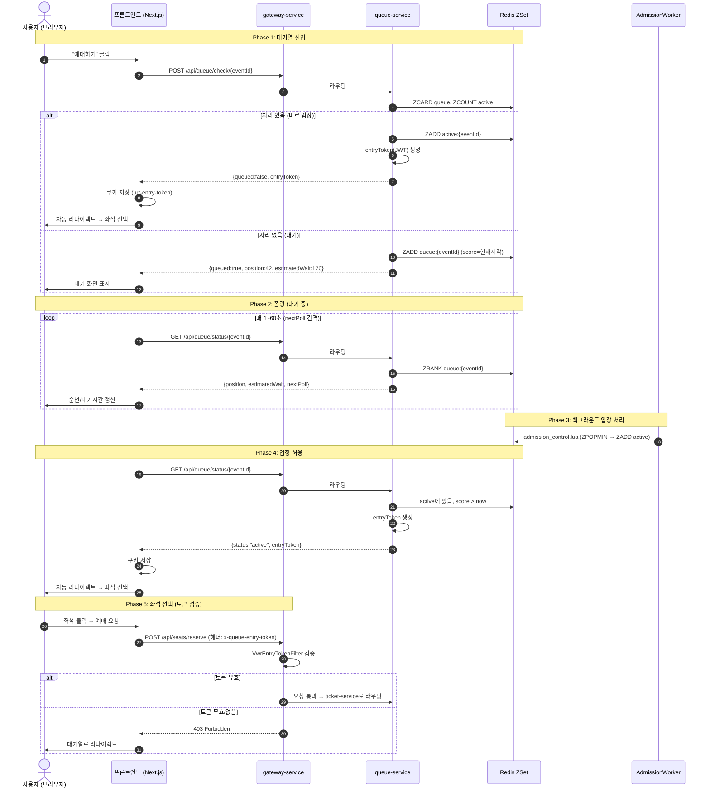
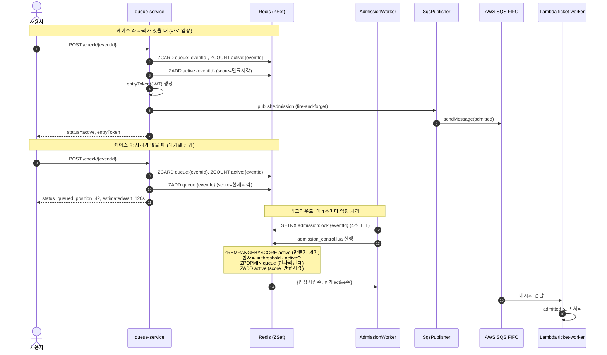
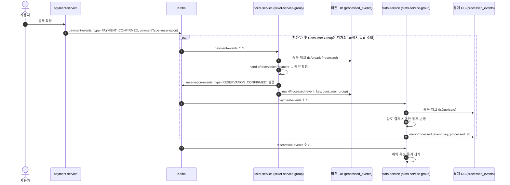
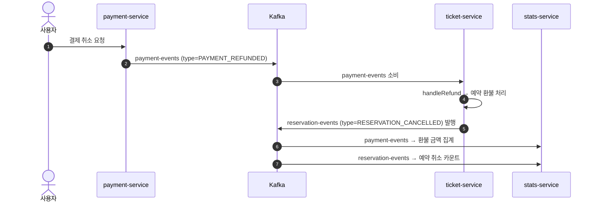
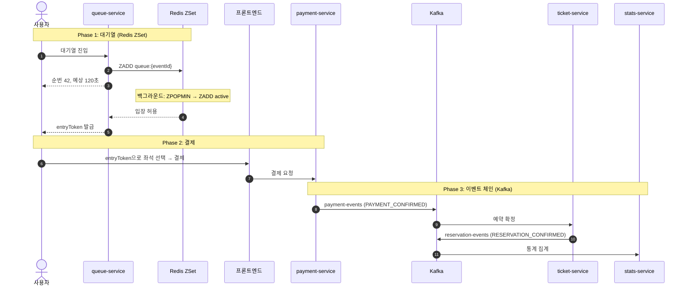

# Check8: Redis ZSet + SQS + Kafka — URR 메시징 아키텍처

## 0. 이 문서 목표
처음 접하는 사람도 이해할 수 있게 정리.

1. 메시징이 왜 필요한지
2. URR에서 쓰는 3가지 기술(Redis ZSet, SQS, Kafka)이 각각 무엇인지
3. 셋이 어떤 관계로 연결되어 있는지
4. VWR(Virtual Waiting Room)이 프론트엔드부터 백엔드까지 어떻게 동작하는지
5. 실제 코드에서 어떻게 구현되어 있는지

---

## 1. 동기 vs 비동기 — 메시징이 왜 필요한가

### 1.1 동기 처리
카운터에 줄 서서 내 차례가 올 때까지 기다리는 것.
서비스 A가 서비스 B를 HTTP로 직접 호출하면, B가 느리거나 죽었을 때 A도 같이 멈춘다.

### 1.2 비동기 처리
번호표를 뽑고, 나중에 호출하면 움직이는 방식.
요청을 "메시지"로 남겨두고, 실제 처리는 나중에 다른 쪽(Consumer)이 한다.

메시징을 쓰면:
1. 요청을 "메시지"로 남기고 빠르게 다음 작업으로 넘어갈 수 있다.
2. 소비자(Consumer)가 자기 속도로 처리한다.
3. 서비스끼리 느슨하게 연결되어 장애 전파가 줄어든다.

> **핵심**: "지금 바로 처리하지 않고, 일단 할 일 목록에 넣어두는 처리 방식이 있다." 그 할 일 목록이 바로 Queue / Topic / Sorted Set으로 구현되는 것.

---

## 2. 기초 용어

### 2.1 메시지와 이벤트

**메시지(message)** — "해야 할 일" 또는 "일어난 일"을 한 덩어리로 묶은 것.
- 예: `userId=123, eventId=ABC, action=admitted`
- 예: `예약번호 9999가 결제 확정됨`

**이벤트(event)** — "어떤 일이 일어났다"는 사실 자체.
- 예: 결제가 완료됐다, 좌석이 예약됐다, 티켓이 양도됐다

메시지/이벤트는 그냥 데이터 한 덩어리일 뿐이고, 이걸 잘 모아서 차례대로 또는 여러 곳에 뿌려주는 시스템이 Redis, SQS, Kafka 같은 것들이다.

### 2.2 Producer / Consumer / Broker

| 용어 | 쉬운 설명 | 비유 | URR 예시 |
|---|---|---|---|
| **Producer** | 메시지를 보내는 쪽 | 공지 올리는 사람 | 결제 서비스가 "결제 완료" 이벤트를 Kafka에 발행 |
| **Consumer** | 메시지를 읽어서 처리하는 쪽 | 공지를 읽고 실제 일을 하는 사람 | 티켓 서비스가 "결제 완료" 이벤트를 보고 예매를 확정 |
| **Broker** | 메시지를 보관/전달하는 시스템 | 우체국 | Redis, SQS, Kafka |

### 2.3 Queue vs Topic vs Sorted Set

| | Queue (SQS) | Topic (Kafka) | Sorted Set (Redis ZSet) |
|---|---|---|---|
| 목적 | "일감 분배" | "사건 공유" | "순서 있는 대기열" |
| 성격 | 한 메시지를 누군가 처리하면 삭제 | 같은 메시지를 여러 소비자 그룹이 각자 처리 | 점수(score) 기준으로 정렬된 집합 |
| 비유 | 고객센터 대기열 — 한 상담원이 한 건 처리하면 끝 | 사내 공지 채널 — 각 팀이 같은 공지를 읽고 각자 행동 | 번호표 기계 — 번호 순서대로 호출 |

### 2.4 오류/장애 관련 용어

| 용어 | 쉬운 설명 | 왜 필요한가 |
|---|---|---|
| **ACK** | "나 이 메시지 처리 다 했어"라는 확인 신호 | 없으면 브로커가 같은 메시지를 다시 보낸다 |
| **Retry** | 일시적 실패(DB 바쁨, 네트워크 문제) 시 재시도 | 일시 장애는 재시도로 복구 가능 |
| **DLQ** | 계속 실패하는 메시지를 따로 모으는 쓰레기통 큐 | 운영자가 "왜 이건 계속 실패하지?" 분석용 |
| **Idempotency** | 같은 메시지가 2번 와도 결과는 1번 처리한 것과 동일 | 예: "이 결제는 이미 처리됨"을 DB에 기록하고 두 번째 요청은 무시 |

> 네트워크와 분산 시스템에서는 중복/실패/지연이 "당연히" 일어난다. 그래서 재시도, 실패 모으기(DLQ), 중복 방어(멱등성) 개념이 필요하다.

---

## 3. URR 메시징 전체 구조 — 세 기술의 관계

URR 프로젝트는 메시징에 3가지 기술을 쓴다. 각각 역할이 다르다.

```
┌───────────────────────────────────────────────────────────────────────┐
│                        URR 메시징 아키텍처                              │
│                                                                       │
│  ┌─────────────────────────────────────────┐                         │
│  │  ① Redis ZSet — 대기열 핵심 엔진         │                         │
│  │  queue-service가 직접 Redis에 읽고 쓴다   │                         │
│  │  "누가 몇 번째인지, 입장 가능한지" 관리     │                         │
│  └──────────────┬──────────────────────────┘                         │
│                 │ 입장 허용 시                                         │
│                 ▼                                                      │
│  ┌─────────────────────────────────────────┐                         │
│  │  ② SQS FIFO — 입장 알림 보조 채널        │                         │
│  │  "이 사용자가 입장했다"는 알림을             │                         │
│  │  외부(Lambda)에 전달. 선택적, 없어도 동작   │                         │
│  └─────────────────────────────────────────┘                         │
│                                                                       │
│  ┌─────────────────────────────────────────┐                         │
│  │  ③ Kafka — 도메인 이벤트 메인 파이프라인   │                         │
│  │  결제 → 예매/양도/멤버십 → 통계            │                         │
│  │  서비스 간 이벤트를 비동기로 연결            │                         │
│  └─────────────────────────────────────────┘                         │
└───────────────────────────────────────────────────────────────────────┘
```

### 한눈에 비교

| 구분 | Redis ZSet | SQS FIFO | Kafka |
|---|---|---|---|
| **역할** | 대기열 순번/입장 관리 | 입장 알림 외부 전달 | 서비스 간 이벤트 전달 |
| **핵심도** | 대기열의 심장 | 보조 (없어도 동작) | 이벤트 파이프라인의 심장 |
| **사용 서비스** | queue-service | queue-service → Lambda | payment/ticket/stats |
| **데이터 모델** | ZSet (score=타임스탬프) | FIFO Queue (삭제 기반) | Topic + Partition (로그 기반) |
| **기본 활성화** | 항상 ON | `SQS_ENABLED=false` (기본 OFF) | 항상 ON |

### 관계 요약
- **Redis ZSet과 SQS**: Redis가 대기열을 관리하고, 입장 허용이 일어나면 SQS에 알림을 "추가로" 보낸다. SQS가 죽어도 Redis 대기열은 정상 동작한다.
- **Redis ZSet과 Kafka**: 직접적 연결 없음. Redis는 "입장 전" 단계, Kafka는 "입장 후 결제/예매" 단계를 담당한다.
- **SQS와 Kafka**: 직접적 연결 없음. 각자 다른 도메인의 메시징을 담당한다.

---

## 4. Redis ZSet — 대기열 핵심 엔진

### 4.1 Redis ZSet이란
Redis의 Sorted Set(정렬 집합). 각 멤버에 **score**(점수)가 붙어서 항상 점수 순서로 정렬된 상태를 유지한다.

쉽게 말하면:
- 일반 Set은 그냥 "누가 있는지"만 알 수 있다.
- ZSet은 "누가 있는지 + 각자의 순번(점수)"까지 알 수 있다.
- 그래서 "내가 몇 번째인지" 즉시 조회 가능하다 → 대기열에 딱 맞는 구조.

### 4.2 URR이 Redis ZSet을 쓰는 이유

티켓 예매 대기열에 필요한 것들:
1. "내가 몇 번째인지" 실시간 조회 → `ZRANK` (O(log N), 즉시 응답)
2. "가장 오래 기다린 사람부터 입장" → `ZPOPMIN` (가장 낮은 점수 = 가장 먼저 온 사람)
3. "동시에 수천 명이 접속해도 순서 꼬이지 않기" → Lua 스크립트로 원자적 처리
4. "입장한 사람의 유효 시간 관리" → score에 만료 시각 저장, `ZCOUNT`로 유효한 사람만 세기

SQS나 Kafka로는 "내가 몇 번째인지"를 실시간으로 알 수 없다. 이게 Redis ZSet을 쓰는 핵심 이유.

### 4.3 Redis 키 구조

queue-service는 이벤트(공연)마다 아래 키들을 만든다:

| 키 패턴 | Redis 타입 | score 의미 | 용도 |
|---|---|---|---|
| `queue:{eventId}` | ZSet | 대기열 진입 시각 (ms) | 대기 순번 관리. score가 작을수록 먼저 온 사람 |
| `active:{eventId}` | ZSet | 만료 시각 (ms) | 입장 허용된 사용자. score > 현재시각이면 유효 |
| `queue:seen:{eventId}` | ZSet | 마지막 하트비트 시각 (ms) | 대기 중인 사용자의 생존 확인 |
| `active:seen:{eventId}` | ZSet | 마지막 하트비트 시각 (ms) | 입장한 사용자의 생존 확인 |
| `queue:active-events` | Set | — | 현재 대기열이 활성화된 이벤트 목록 |
| `admission:lock:{eventId}` | String | — | 분산 락 (TTL 4초). 여러 서버가 동시에 입장 처리하는 것 방지 |

예시: 공연 ID가 `abc-123`이면
- `queue:abc-123` — 이 공연의 대기열 (ZSet)
- `active:abc-123` — 이 공연에 입장한 사용자들 (ZSet)

### 4.4 대기열 흐름 상세

#### 사용자가 대기열 확인 요청 (`POST /api/queue/check/{eventId}`)

```
사용자 요청
   ↓
1. 이미 대기 중인가? (queue:{eventId}에 있는지)
   ├─ YES → 하트비트 갱신, 현재 순번 반환
   └─ NO → 계속
   ↓
2. 이미 입장한 상태인가? (active:{eventId}에 있고 score > 현재시각)
   ├─ YES → 하트비트 갱신, entryToken 반환
   └─ NO → 계속
   ↓
3. 바로 입장 가능한가?
   조건: 대기열이 비었고(queue 크기=0) AND 현재 입장자 수 < threshold(기본 1000명)
   ├─ YES → active:{eventId}에 추가 (score=현재+600초)
   │         entryToken(JWT) 발급
   │         SQS에 admitted 알림 (선택적)
   │         "active" 응답
   └─ NO  → queue:{eventId}에 추가 (score=현재시각)
             "queued" 응답 (순번, 예상 대기시간 포함)
```

- 코드: `services-spring/queue-service/src/main/java/guru/urr/queueservice/service/QueueService.java:60`

#### 백그라운드 입장 처리 (매 1초마다)

대기열에 사람이 쌓여 있으면, 백그라운드 워커가 1초마다 빈 자리만큼 입장시킨다.

```
AdmissionWorkerService (매 1초)
   ↓
1. queue:active-events에서 활성 이벤트 목록 조회
   ↓
2. 각 이벤트마다:
   a. 분산 락 획득 시도 (admission:lock:{eventId}, 4초 TTL)
      ├─ 실패 → 다른 서버가 처리 중, 스킵
      └─ 성공 → 계속
   ↓
   b. admission_control.lua 실행 (원자적)
      - 만료된 active 사용자 제거 (score ≤ now)
      - 빈 자리 계산 = threshold - 현재 active 수
      - ZPOPMIN으로 대기열 앞에서 빈 자리만큼 꺼냄
      - active:{eventId}에 추가 (score = now + 600초)
      - 결과: {입장시킨 수, 현재 active 수}
   ↓
   c. 대기열과 active 모두 비었으면 이벤트를 active-events에서 제거
```

- 코드: `services-spring/queue-service/src/main/java/guru/urr/queueservice/service/AdmissionWorkerService.java:48`
- Lua: `services-spring/queue-service/src/main/resources/redis/admission_control.lua`

#### 하트비트와 좀비 정리

사용자가 브라우저를 닫거나 네트워크가 끊기면 하트비트가 멈춘다. 30초마다 돌아가는 정리 워커가 이런 "좀비"를 제거한다.

- 하트비트: 사용자가 `/heartbeat`, `/check`, `/status` 호출할 때마다 `seen` ZSet의 score를 현재 시각으로 갱신
- 좀비 판정: `seen` ZSet에서 score가 (현재 - 600초)보다 작은 사용자
- 정리: `stale_cleanup.lua`가 대기열과 seen에서 동시에 원자적으로 제거

- 코드: `services-spring/queue-service/src/main/java/guru/urr/queueservice/service/AdmissionWorkerService.java:121`
- Lua: `services-spring/queue-service/src/main/resources/redis/stale_cleanup.lua`

### 4.5 주요 설정값

| 설정 | 기본값 | 의미 |
|---|---|---|
| `QUEUE_THRESHOLD` | 1000 | 이벤트당 최대 동시 입장자 수 |
| `QUEUE_ACTIVE_TTL_SECONDS` | 600 | 입장 후 유효 시간 (10분) |
| `QUEUE_SEEN_TTL_SECONDS` | 600 | 하트비트 없으면 좀비로 판정하는 시간 |
| `QUEUE_ADMISSION_INTERVAL_MS` | 1000 | 백그라운드 입장 처리 주기 (1초) |
| `QUEUE_ADMISSION_BATCH_SIZE` | 100 | 한 번에 입장시키는 최대 인원 |
| `QUEUE_STALE_CLEANUP_INTERVAL_MS` | 30000 | 좀비 정리 주기 (30초) |

### 4.6 프로덕션 Redis 구성

- 로컬(kind): 단일 Redis (`localhost:6379`)
- 프로덕션: Redis Cluster 3노드
  - `redis-cluster-0.redis-cluster:6379`
  - `redis-cluster-1.redis-cluster:6379`
  - `redis-cluster-2.redis-cluster:6379`

- 설정: `services-spring/queue-service/src/main/resources/application.yml`

### 4.7 대기 시간 예측

사용자가 "나 언제 들어가?"를 물으면, 최근 1분간 실제 입장 속도를 기반으로 계산한다.

- 데이터가 부족하면(시작 직후): 1명당 30초로 추정
- 데이터가 있으면: `내 순번 / (최근 1분 입장 수 / 60)` = 예상 초
- 폴링 간격도 순번에 따라 조절: 1000번 이내면 1초, 10000번 이후면 30초

- 코드: `QueueService.java:242` (estimateWait), `QueueService.java:231` (calculateNextPoll)

---

## 5. VWR — 사용자가 경험하는 대기열 (Virtual Waiting Room)

VWR은 "가상 대기실"이다. 콘서트 티켓 예매할 때, 수만 명이 동시에 접속하면 서버가 터진다. VWR은 사용자를 줄 세워서 순서대로 입장시키는 시스템이다.

쉽게 말하면:
- 놀이공원 인기 놀이기구 앞에 줄을 선다.
- 화면에 "현재 42번째, 예상 2분"이 보인다.
- 내 차례가 오면 자동으로 좌석 선택 페이지로 넘어간다.

앞에서 설명한 Redis ZSet이 이 VWR의 핵심 엔진이고, 여기서는 **사용자 화면부터 서버까지 전체 흐름**을 설명한다.

### 5.1 전체 사용자 여정

```
① 이벤트 상세 페이지        ② 대기열 페이지           ③ 좌석 선택/예매          ④ 결제
   /events/[id]             /queue/[eventId]          /events/[id]/seats        /payment/[id]
                                                      /events/[id]/book
   ┌──────────┐            ┌──────────────┐          ┌──────────────┐         ┌──────────┐
   │ 예매하기  │──클릭──→   │ 42번째 대기중  │──차례──→  │ 좌석 선택     │──결제──→ │ 결제 완료 │
   │  버튼    │            │ 예상 2분 대기  │          │ 또는 바로예매  │         │          │
   └──────────┘            └──────────────┘          └──────────────┘         └──────────┘
                                  │
                           이 페이지를 닫지 마세요!
```

1. 사용자가 이벤트 상세에서 "예매하기" 클릭 → `/queue/[eventId]`로 이동
2. 대기열 페이지에서 자동으로 queue-service에 입장 요청
3. 자리가 있으면 바로 통과, 없으면 대기열에 줄 서기
4. 내 차례가 오면 자동으로 좌석 선택(지정석) 또는 예매(비지정석) 페이지로 이동
5. entryToken(입장권)이 쿠키에 저장되어, 이후 API 요청에 자동 첨부

### 5.2 프론트엔드 — 대기열 페이지

파일: `apps/web/src/app/queue/[eventId]/page.tsx`

#### 처음 로딩 시 (initial check)

```
페이지 로드
   ↓
queueApi.check(eventId) 호출  →  POST /api/queue/check/{eventId}
   ↓
응답 확인
   ├─ queued: false (바로 입장!)
   │   → entryToken을 쿠키에 저장
   │   → 좌석 선택 or 예매 페이지로 자동 이동
   │
   └─ queued: true (대기열 진입)
       → 폴링 시작
       → 순번, 예상 대기시간 표시
```

#### 화면에 표시되는 정보

```
┌─────────────────────────────────┐
│      🎵 콘서트 제목              │
│      아티스트 이름               │
│                                 │
│      현재 42번째                 │
│                                 │
│  ┌─────┐  ┌─────┐  ┌─────────┐ │
│  │내 앞 │  │내 뒤 │  │예상 대기 │ │
│  │ 41명 │  │958명 │  │ 2분 6초 │ │
│  └─────┘  └─────┘  └─────────┘ │
│                                 │
│  현재 접속자: 987 / 1,000       │
│                                 │
│  ⚠️ 이 페이지를 닫지 마세요!     │
│                                 │
│       [ 대기열 나가기 ]          │
└─────────────────────────────────┘
```

- `position`: 내 순번
- `peopleAhead`: 내 앞에 있는 사람 수 (position - 1)
- `peopleBehind`: 내 뒤에 있는 사람 수 (queueSize - position)
- `estimatedWait`: 예상 대기 시간 (초)
- `currentUsers / threshold`: 현재 입장자 / 최대 허용 인원

### 5.3 프론트엔드 — 폴링 (자동 새로고침)

WebSocket(실시간 연결)이 아니라 **HTTP 폴링**(주기적으로 서버에 물어보기)을 쓴다.

파일: `apps/web/src/hooks/use-queue-polling.ts`

```
폴링 루프:
   ↓
queueApi.status(eventId) 호출  →  GET /api/queue/status/{eventId}
   ↓
응답에서 nextPoll(다음 폴링 간격) 추출
   ↓
setTimeout(nextPoll초 후 다시 호출)
   ↓
status가 "active"로 바뀌면 → 자동 리다이렉트
```

**폴링 간격은 서버가 정한다** (순번에 따라 다름):

| 내 순번 | 폴링 간격 | 이유 |
|---|---|---|
| 0 이하 (이미 입장) | 3초 | 빠른 확인 |
| 1~1,000 | 1초 | 곧 들어가니까 자주 확인 |
| 1,001~5,000 | 5초 | 좀 기다려야 함 |
| 5,001~10,000 | 10초 | |
| 10,001~100,000 | 30초 | 서버 부하 줄이기 |
| 100,001 이상 | 60초 | 한참 걸림 |

> **왜 WebSocket 안 쓰고 폴링?**: 수만 명이 대기할 때 WebSocket 연결을 전부 유지하면 서버 리소스가 부족해진다. HTTP 폴링은 요청할 때만 연결하고 끊으므로 훨씬 가볍다. CDN/프록시도 쉽게 통과한다.

### 5.4 Entry Token — 대기열 통과 증명서

대기열을 통과한 사용자에게 발급하는 JWT(JSON Web Token)이다. "이 사람은 정상적으로 줄 서서 입장한 사람이다"를 증명한다.

#### 왜 필요한가
entryToken이 없으면, 누구나 대기열을 건너뛰고 `/events/[id]/seats` URL을 직접 입력해서 좌석 선택 페이지에 접근할 수 있다. entryToken은 이걸 막는다.

#### 토큰 내용

```json
{
  "sub": "abc-123",          // 이벤트 ID (어떤 공연에 입장했는지)
  "uid": "user@example.com", // 사용자 ID (누가 입장했는지)
  "iat": 1707948000,         // 발급 시각
  "exp": 1707948600          // 만료 시각 (10분 후)
}
```

- 생성: `QueueService.java:215` — HMAC-SHA로 서명
- 서명 키: `QUEUE_ENTRY_TOKEN_SECRET` 환경변수

#### 토큰 흐름

```
queue-service                    브라우저                      gateway-service
──────────────                  ─────────                    ────────────────

entryToken 생성
   │
   └──→ 응답에 포함 ──→ 쿠키에 저장
                        이름: urr-entry-token
                        유효기간: 10분
                        SameSite: Strict
                              │
                              └──→ 이후 모든 API 요청에
                                   x-queue-entry-token 헤더로 자동 첨부
                                        │
                                        └──→ VwrEntryTokenFilter가 검증
                                             JWT 서명 확인
                                             userId 일치 확인
                                             만료 확인
                                             ├─ 유효 → 통과
                                             └─ 무효 → 403 Forbidden
```

- 쿠키 저장: `apps/web/src/app/queue/[eventId]/page.tsx:56`
- 헤더 첨부: `apps/web/src/lib/api-client.ts:70` — Axios 인터셉터가 자동 처리
- 서버 검증: `gateway-service/.../filter/VwrEntryTokenFilter.java`

### 5.5 Gateway — 대기열 우회 방지

게이트웨이에 `VwrEntryTokenFilter`가 있다. 좌석 선택(`/api/seats/**`)과 예약(`/api/reservations/**`) API를 호출할 때, entryToken이 유효한지 검사한다.

파일: `services-spring/gateway-service/src/main/java/guru/urr/gatewayservice/filter/VwrEntryTokenFilter.java`

```
요청 들어옴
   ↓
보호 대상 경로인가? (/api/seats/**, /api/reservations/**)
   ├─ NO → 그냥 통과
   └─ YES → 계속
   ↓
x-queue-entry-token 헤더 있는가?
   ├─ NO → 403 Forbidden ({"error":"Queue entry token required","redirectTo":"/queue"})
   └─ YES → 계속
   ↓
JWT 서명 검증 (QUEUE_ENTRY_TOKEN_SECRET으로)
   ↓
토큰의 uid == 요청자의 userId 인가? (다른 사람 토큰 도용 방지)
   ├─ NO → 403 Forbidden
   └─ YES → 통과, 요청 처리 계속
```

> **CloudFront 바이패스**: 프로덕션에서 Lambda@Edge가 CDN 레벨에서 이미 토큰을 검증한 경우, `X-CloudFront-Verified` 헤더가 있으면 게이트웨이에서 재검증을 건너뛴다.

### 5.6 좌석 선택 페이지의 이중 검증

좌석 선택 페이지(`/events/[id]/seats`)에도 프론트엔드 레벨 큐 가드가 있다.

파일: `apps/web/src/app/events/[id]/seats/page.tsx:81`

```javascript
// 페이지 로드 시 queue status 한 번 확인
if (queueStatus.queued || queueStatus.status === "queued") {
  // 아직 대기 중이면 → 대기열 페이지로 강제 이동
  router.replace(`/queue/${eventId}`);
} else {
  // 입장 완료 → 폴링 중지, 좌석 선택 허용
  setQueueChecked(true);
}
```

즉, **서버(gateway)와 클라이언트(seats page) 양쪽에서 이중으로** 대기열 통과 여부를 검증한다.

### 5.7 VWR 전체 시퀀스 다이어그램



### 5.8 VWR 보안 요약

| 보안 포인트 | 구현 방법 | 방어 대상 |
|---|---|---|
| 대기열 우회 방지 | entryToken(JWT) 필수 검증 | URL 직접 입력으로 좌석 선택 접근 |
| 토큰 도용 방지 | JWT의 uid와 요청자 userId 비교 | 다른 사람의 토큰 복사해서 사용 |
| 토큰 위조 방지 | HMAC-SHA 서명 검증 | 가짜 토큰 생성 |
| 토큰 만료 | 10분 TTL (쿠키 + JWT 모두) | 오래된 토큰 재사용 |
| CSRF 방지 | SameSite=Strict 쿠키 | 외부 사이트에서 요청 위조 |
| CDN 레벨 검증 | Lambda@Edge (프로덕션) | 서버 도달 전 차단 |
| 이중 검증 | 프론트엔드 큐 가드 + 게이트웨이 필터 | 클라이언트/서버 양쪽에서 확인 |

---

## 6. SQS FIFO — 입장 알림 보조 채널

SQS는 AWS가 제공하는 관리형 큐 서비스다. URR에서는 대기열의 핵심이 아니라, **입장 허용 사실을 외부에 알리는 보조 채널**로 사용한다.

### 6.1 SQS 기본 개념

#### 메시지 흐름
1. Producer가 메시지를 큐에 넣는다.
2. Consumer가 메시지를 가져가 처리한다.
3. 성공하면 삭제한다.
4. 실패하면 일정 시간 뒤 다시 보이게 되어 재시도된다.

#### Standard vs FIFO
- `Standard`: 빨리빨리, 순서/중복 조금은 틀어져도 OK.
- `FIFO`: 순서 보장 + 중복 억제. URR은 이 모드 사용.

#### FIFO에서 중요한 필드
- `MessageGroupId`: 같은 그룹 내 순서를 보장하는 키.
- `MessageDeduplicationId`: 같은 메시지 중복 방지 키.

### 6.2 URR에서 SQS가 하는 일

queue-service가 사용자를 입장시킬 때, **"이 사용자가 입장했다"는 알림을 SQS FIFO에 발행**한다.

#### 발행 지점
- `QueueService.java:210` — active 응답을 만들 때 `sqsPublisher.publishAdmission()` 호출

#### 메시지 내용
```json
{
  "action": "admitted",
  "eventId": "abc-123",
  "userId": "user@example.com",
  "entryToken": "eyJhbG...",
  "timestamp": 1707948000000
}
```

#### FIFO 제어
- `messageGroupId = eventId` — 같은 공연의 입장 메시지끼리 순서 보장
- `messageDeduplicationId = userId:eventId` — 같은 사용자의 중복 입장 알림 방지 (5분 이내)

- 코드: `services-spring/queue-service/src/main/java/guru/urr/queueservice/service/SqsPublisher.java:38`

#### 실패 시 동작 (Fire-and-Forget)
SQS 전송 실패 시 예외를 올리지 않고 로그 후 계속 진행한다.
대기열 핵심 기능은 Redis 기반이므로, SQS가 죽어도 대기열은 정상 동작한다.
이 패턴을 쓰는 이유: 사용자 응답 지연 없이, SQS 장애가 대기열에 영향을 주지 않도록.

> **Fire-and-Forget은 앱 레벨 발행 전략**이다. SQS 자체는 at-least-once 전달을 지원하지만, 우리 앱에서 실패를 무시하고 Redis로 폴백하는 것.

- 코드: `SqsPublisher.java:65`

#### 소비 측
- Lambda 워커(`lambda/ticket-worker/index.js:85`)가 SQS를 소비
- `admitted` 액션은 현재 로그 처리만 수행

#### 환경 설정
- 로컬(kind): `SQS_ENABLED=false` — 기본 꺼져 있음
- 프로덕션: `SQS_ENABLED=true`

---

## 7. Kafka — 도메인 이벤트 메인 파이프라인

Kafka는 "분산 이벤트 로그"에 가깝다. URR에서는 **결제/예매/양도/멤버십/통계를 연결하는 핵심 이벤트 버스**로 사용한다.

### 7.1 Kafka 기본 개념

#### 메시지 구조
- **Topic** 아래에 여러 **Partition**이 있다.
- 비유: 토픽 = 카톡 "방 이름", 메시지 = 그 방에 올라오는 글, 컨슈머 = 그 방을 읽는 사람

#### Partition과 Offset
- 각 파티션의 메시지는 `Offset`(순번)으로 저장된다.
- Consumer는 Offset을 기준으로 어디까지 읽었는지 관리한다.

#### Consumer Group
- 같은 그룹 내부에서는 메시지를 나눠서 처리한다 (병렬).
- 그룹이 다르면 같은 메시지를 각 그룹이 독립적으로 소비한다 (팬아웃).

### 7.2 URR 토픽 정의

토픽은 `ticket-service`의 Kafka 설정에서 자동 생성된다.
- 코드: `services-spring/ticket-service/src/main/java/guru/urr/ticketservice/shared/config/KafkaConfig.java`

| 토픽 이름 | 파티션 수 | 복제 팩터 | 용도 |
|---|---|---|---|
| `payment-events` (line 17) | 3 | 설정값 (기본 1) | 결제 확정/환불 이벤트 |
| `reservation-events` (line 22) | 3 | 설정값 (기본 1) | 예약 생성/확정/취소 이벤트 |
| `transfer-events` (line 27) | 3 | 설정값 (기본 1) | 양도 완료 이벤트 |
| `membership-events` (line 32) | 3 | 설정값 (기본 1) | 멤버십 활성화 이벤트 |

> **파티션 3개 이유**: 같은 Consumer Group 내 최대 3개 인스턴스가 병렬 소비 가능. 파티션 키(reservationId 등)로 같은 엔티티의 이벤트는 같은 파티션에 들어가 순서가 보장된다.

### 7.3 이벤트 체인 — 누가 보내고 누가 받는가

```
payment-service                        ticket-service                stats-service
─────────────                         ──────────────               ──────────────
PaymentEventProducer                  PaymentEventConsumer          StatsEventConsumer
   │                                  (ticket-service-group)        (stats-service-group)
   │                                       │                             │
   ├─ payment-events ─────────────────────►├─ 예약결제 → 예약확정          │
   │   (PAYMENT_CONFIRMED)                 │   → reservation-events ─────►├─ 예약확정 통계
   │   (PAYMENT_REFUNDED)                  │                              │
   │                                       ├─ 양도결제 → 양도완료          │
   │                                       │   → transfer-events          │
   │                                       │                              │
   │                                       ├─ 멤버십결제 → 활성화          │
   │                                       │   → membership-events ──────►├─ 멤버십 통계
   │                                       │                              │
   │                                       └─ 환불 → 예약취소              │
   │                                           → reservation-events ─────►├─ 예약취소 통계
   │                                                                      │
   └─ payment-events ────────────────────────────────────────────────────►├─ 환불/양도 금액 통계
```

### 7.4 결제 서비스가 이벤트 발행

결제 확정/환불 이벤트를 `payment-events`로 발행한다.
- 코드: `services-spring/payment-service/src/main/java/guru/urr/paymentservice/messaging/PaymentEventProducer.java:14`
- 파티션 키: `orderId`

### 7.5 티켓 서비스가 결제 이벤트 소비

`payment-events`를 소비해서 `paymentType`에 따라 분기 처리한다.
- Consumer Group: `ticket-service-group`
- 코드: `services-spring/ticket-service/src/main/java/guru/urr/ticketservice/messaging/PaymentEventConsumer.java:49`

**이벤트 라우팅 (paymentType 기반):**

| paymentType | 처리 | 후속 이벤트 발행 |
|---|---|---|
| `reservation` (기본) | 예약 확정 | `reservation-events` (RESERVATION_CONFIRMED) |
| `transfer` | 양도 완료 | `transfer-events` (TRANSFER_COMPLETED) |
| `membership` | 멤버십 활성화 | `membership-events` (MEMBERSHIP_ACTIVATED) |
| (환불) | 예약 환불 처리 | `reservation-events` (RESERVATION_CANCELLED) |

> **이벤트 타입 판별**: 먼저 명시적 `type` 필드 확인 (`PAYMENT_CONFIRMED`/`PAYMENT_REFUNDED`), 없으면 duck-typing으로 폴백 (하위 호환성)

### 7.6 티켓 서비스가 후속 이벤트 발행

결제 이벤트 처리 후 도메인별 후속 이벤트를 각각의 토픽으로 발행한다.
- 코드: `services-spring/ticket-service/src/main/java/guru/urr/ticketservice/messaging/TicketEventProducer.java`

| 메서드 | 토픽 | 파티션 키 |
|---|---|---|
| `publishReservationCreated()` (line 24) | `reservation-events` | reservationId |
| `publishReservationConfirmed()` (line 35) | `reservation-events` | reservationId |
| `publishReservationCancelled()` (line 46) | `reservation-events` | reservationId |
| `publishTransferCompleted()` (line 57) | `transfer-events` | transferId |
| `publishMembershipActivated()` (line 68) | `membership-events` | membershipId |

> 모든 publish는 `whenComplete()`로 성공/실패를 비동기 로깅. 실패 시 예외를 던지지 않는다.

### 7.7 통계 서비스가 여러 토픽 소비

- Consumer Group: `stats-service-group` (ticket-service와 다른 그룹이므로 같은 메시지를 독립 소비)
- 코드: `services-spring/stats-service/src/main/java/guru/urr/statsservice/messaging/StatsEventConsumer.java`

| 리스너 | 토픽 | 처리 내용 |
|---|---|---|
| `handlePaymentEvent()` (line 25) | `payment-events` | 환불 금액, 양도 금액 집계 |
| `handleReservationEvent()` (line 70) | `reservation-events` | 예약 생성/확정/취소 카운트 |
| `handleMembershipEvent()` (line 116) | `membership-events` | 멤버십 활성화 카운트 |

> **Consumer Group 분리 핵심**: `payment-events` 토픽을 `ticket-service-group`(예약 확정)과 `stats-service-group`(통계 집계)이 각각 독립적으로 소비한다. Kafka의 다중 소비자 팬아웃이 여기서 동작한다.

---

## 8. 세 기술 비교 — 왜 이렇게 나눠 썼는가

### 8.1 기술별 강점

| | Redis ZSet | SQS FIFO | Kafka |
|---|---|---|---|
| **핵심 강점** | 실시간 순위 조회, 원자적 연산 | 관리형 큐, 순서/중복 제어 | 다중 소비자 팬아웃, 이벤트 재처리 |
| **약점** | 영속성 보장 약함 (메모리 기반) | 순위 조회 불가, 팬아웃 약함 | 순위 조회 불가, 운영 복잡 |

### 8.2 왜 대기열에 Redis ZSet인가 (SQS/Kafka가 아닌 이유)

대기열에 필요한 핵심 기능:

| 기능 | Redis ZSet | SQS | Kafka |
|---|---|---|---|
| "내가 몇 번째?" 실시간 조회 | `ZRANK` O(log N) | 불가능 | 불가능 |
| 앞에서부터 N명 꺼내기 | `ZPOPMIN` | 1건씩만 | offset 관리 직접 필요 |
| 현재 인원 세기 (만료 제외) | `ZCOUNT` (범위 조건) | 불가능 | 불가능 |
| 원자적 입장 처리 | Lua 스크립트 | 불가능 | 불가능 |
| 만료 시간 기반 자동 정리 | score에 만료시각 저장 | visibility timeout | 별도 구현 필요 |

> Redis ZSet은 "점수 기반 정렬 + 실시간 순위 조회"를 제공하는 유일한 선택지다.

### 8.3 왜 이벤트에 Kafka인가 (SQS/Redis가 아닌 이유)

서비스 간 이벤트에 필요한 핵심 기능:


| 기능 | Kafka | SQS | Redis Pub/Sub |
|---|---|---|---|
| 같은 이벤트를 여러 서비스가 독립 소비 | Consumer Group으로 자연스러움 | SNS+SQS 조합 필요 | 구독자가 놓치면 유실 |
| 소비자 추가 시 | Group만 추가 | 큐 + SNS 구독 추가 | 채널 추가 |
| 장애 후 재처리 | offset 되돌려서 replay | 불가능 (삭제됨) | 불가능 (메모리에서 사라짐) |
| 이벤트 히스토리 | retention 기간만큼 보관 | 소비 즉시 삭제 | 보관 안 됨 |

> Kafka는 "여러 서비스가 같은 이벤트를 각자 소비 + 재처리 가능"을 제공하는 최적 선택지다.

### 8.4 URR 퍼블리셔 전체 정리

| 기술 | 퍼블리셔 | 파일 | 발행 시점 | 비고 |
|---|---|---|---|---|
| Redis ZSet | `QueueService` | `queue-service/.../QueueService.java` | 사용자가 대기열 진입/입장 시 | 항상 활성 |
| SQS FIFO | `SqsPublisher` | `queue-service/.../SqsPublisher.java` | active 전환 시 admitted 알림 | 기본 OFF |
| Kafka | `PaymentEventProducer` | `payment-service/.../PaymentEventProducer.java` | 결제 확정/환불 시 | 결제 도메인 시작점 |
| Kafka | `TicketEventProducer` | `ticket-service/.../TicketEventProducer.java` | 결제 이벤트 처리 후 후속 발행 | 예매/양도/멤버십 확장 |

### 8.5 전체 퍼블리셔/컨슈머 매핑

| 기술 | 퍼블리셔(보냄) | 컨슈머(받아 처리) | 오가는 메시지 |
|---|---|---|---|
| Redis ZSet | `QueueService` | `AdmissionWorkerService` | 대기열 순번, 입장 처리 |
| SQS FIFO | `SqsPublisher` | `lambda/ticket-worker/index.js` | `admitted` |
| Kafka (`payment-events`) | `PaymentEventProducer` | `PaymentEventConsumer`(ticket), `StatsEventConsumer`(stats) | `PAYMENT_CONFIRMED`, `PAYMENT_REFUNDED` |
| Kafka (`reservation-events`) | `TicketEventProducer` | `StatsEventConsumer` | `RESERVATION_CREATED`, `RESERVATION_CONFIRMED`, `RESERVATION_CANCELLED` |
| Kafka (`membership-events`) | `TicketEventProducer` | `StatsEventConsumer` | 멤버십 활성화 이벤트 |
| Kafka (`transfer-events`) | `TicketEventProducer` | 현재 명시적 컨슈머 없음 | 양도 완료 이벤트 |

---

## 9. Kafka 멱등성(Idempotency) 구현

멱등성: 같은 요청/이벤트를 여러 번 처리해도 최종 결과가 1번 처리한 것과 같아야 하는 성질.

### 문제
Kafka는 at-least-once 전달을 보장한다. 즉, 네트워크 문제나 컨슈머 재시작 시 같은 메시지가 두 번 이상 올 수 있다. 결제 확정이 두 번 처리되면 예약이 이중 확정되는 심각한 문제가 발생한다.

### 해결: processed_events 테이블

두 컨슈머 모두 각자의 DB에서 중복 체크를 구현한다:

**1단계**: 메시지 수신 시 이벤트 키를 생성한다.
- ticket-service: `sagaId` 우선 사용, 없으면 `type` + (`reservationId` 또는 `referenceId`) 조합
- stats-service: `type:id:timestamp` 조합

**2단계**: 각 서비스의 DB에서 이미 처리했는지 확인한다. (조회 쿼리도 서비스별로 다르다)

ticket-service — consumer_group 조건 포함:
```sql
SELECT COUNT(*) FROM processed_events WHERE event_key = ? AND consumer_group = ?
```

stats-service — event_key만으로 조회:
```sql
SELECT COUNT(*) FROM processed_events WHERE event_key = ?
```

**3단계**: 처리 성공 후 해당 키를 각 서비스의 DB에 기록한다. (서비스별 스키마가 다르다)

ticket-service — consumer_group 컬럼으로 그룹 구분:
```sql
INSERT INTO processed_events (event_key, consumer_group) VALUES (?, ?)
```

stats-service — processed_at 타임스탬프만 기록, ON CONFLICT 무시:
```sql
INSERT INTO processed_events (event_key, processed_at) VALUES (?, NOW()) ON CONFLICT (event_key) DO NOTHING
```

**4단계**: 이미 처리된 메시지가 다시 오면 스킵한다.
```
"Skipping already-processed event: PAYMENT_CONFIRMED:abc-123"
```

### 관련 코드
- ticket-service: `PaymentEventConsumer.java:193-231` (buildEventKey, isAlreadyProcessed, markProcessed)
- stats-service: `StatsEventConsumer.java:138-170` (buildEventKey, isDuplicate, markProcessed)

---

## 10. 시퀀스 다이어그램

### 10.1 대기열 입장 — Redis ZSet + SQS



**흐름 설명:**
1. 사용자가 대기열 확인을 요청하면, queue-service는 **Redis ZSet**에서 현재 상태를 확인한다.
2. 자리가 있으면 `active:{eventId}` ZSet에 바로 추가하고 entryToken을 발급한다.
3. 자리가 없으면 `queue:{eventId}` ZSet에 추가하고 순번과 예상 대기시간을 반환한다.
4. 백그라운드 워커가 매 1초마다 Lua 스크립트로 빈 자리만큼 대기열 앞에서 입장시킨다.
5. 입장 시 SQS에 알림을 보내지만, 이는 보조 채널이다. Redis가 핵심이다.

### 10.2 결제 이후 Kafka 체인 (예약 결제)



**흐름 설명:**
1. 사용자가 결제를 확정하면 `payment-service`가 `payment-events`로 이벤트를 발행한다.
2. Kafka가 같은 이벤트를 두 Consumer Group에 팬아웃한다.
3. `ticket-service-group`은 결제 이벤트를 소비해 예약을 확정하고, 후속으로 `reservation-events`를 다시 발행한다.
4. `stats-service-group`도 같은 `payment-events`를 독립 소비해 통계 처리를 수행한다.
5. 각 컨슈머는 각자의 DB의 `processed_events`로 멱등성을 보장한다.

### 10.3 환불 Kafka 체인



### 10.4 전체 흐름 — 대기열부터 예매까지



**한 줄 요약:**
- `Phase 1`은 **Redis ZSet**이 관리하는 대기열 단계다.
- `Phase 2`는 입장 후 결제 단계다.
- `Phase 3`은 **Kafka**가 연결하는 서비스 간 이벤트 처리 단계다.
- **SQS**는 Phase 1에서 입장 알림을 외부에 전달하는 보조 역할이다.

---

## 11. 결론

### URR 메시징 아키텍처 요약

| 기술 | 역할 | 핵심 한 줄 |
|---|---|---|
| **Redis ZSet** | 대기열 엔진 | 누가 몇 번째인지 관리하고, 빈 자리가 나면 앞에서부터 입장시킨다 |
| **SQS FIFO** | 입장 알림 보조 | 입장 사실을 외부에 알린다. 없어도 대기열은 동작한다 |
| **Kafka** | 이벤트 파이프라인 | 결제-예매-통계를 비동기 이벤트로 연결한다 |

### 핵심 설계 원칙 요약

| 원칙 | Redis ZSet (queue-service) | SQS (queue-service) | Kafka (payment/ticket/stats) |
|---|---|---|---|
| 전달 보장 | Lua 스크립트 원자성 | Fire-and-Forget (앱 레벨에서 실패 무시, Redis 폴백) | At-Least-Once (멱등성으로 중복 방어) |
| 순서 보장 | ZSet score (타임스탬프 순) | FIFO MessageGroupId (이벤트 단위) | Partition Key (엔티티 ID 단위) |
| 중복 방어 | ZADD는 같은 멤버면 score만 갱신 | FIFO MessageDeduplicationId (SQS 레벨) | processed_events 테이블 (애플리케이션 레벨) |
| 장애 격리 | Redis 장애 → 대기열 불가 (핵심 의존) | SQS 장애 → 대기열 정상 (보조 채널) | Consumer 장애 → 미소비 메시지 쌓임 → 재시작 시 재개 |
| 팬아웃 | 없음 (단일 서비스 사용) | 없음 (단일 Lambda 소비) | 있음 (ticket-service-group + stats-service-group 독립 소비) |
