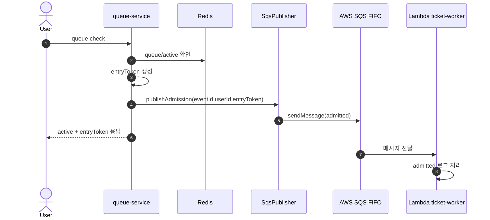
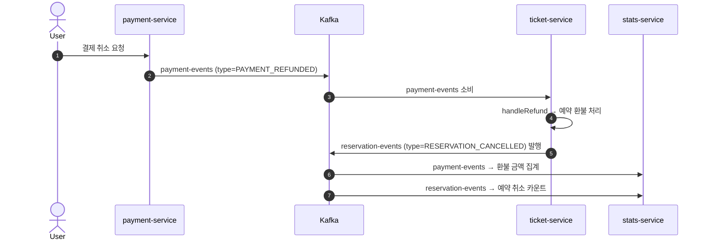

# Check8: SQS vs Kafka 완전 기초 + URR 프로젝트 적용 정리

## 0. 이 문서 목표
이 문서는 다음을 처음 접하는 사람도 이해할 수 있게 정리한다.

1. `Queue`가 무엇인지
2. `Topic`이 무엇인지
3. `SQS`와 `Kafka`가 어떻게 다른지
4. URR 프로젝트에서 각각 정확히 어디에 쓰이는지

---

## 1. 메시징이 왜 필요한가
서비스 A가 서비스 B를 HTTP로 직접 호출하는 동기 방식만 쓰면, B가 느리거나 죽었을 때 A도 같이 영향을 받는다.

메시징을 쓰면:

1. 요청을 "메시지"로 남기고 빠르게 다음 작업으로 넘어갈 수 있다.
2. 소비자(consumer)가 자기 속도로 처리한다.
3. 서비스끼리 느슨하게 연결되어 장애 전파가 줄어든다.

---

## 2. 완전 기초 용어

| 용어 | 쉬운 설명 | 핵심 포인트 |
|---|---|---|
| Producer | 메시지 보내는 쪽 | 예: 결제 완료 이벤트 발행 |
| Consumer | 메시지 읽어서 처리하는 쪽 | 예: 통계 집계 서비스 |
| Broker | 메시지를 보관/전달하는 시스템 | SQS, Kafka |
| Queue | 메시지를 "작업 대기열"로 처리 | 보통 한 메시지는 한 소비자가 처리 |
| Topic | 메시지를 "이벤트 게시판"처럼 처리 | 여러 소비자 그룹이 각각 소비 가능 |
| ACK | 처리 성공 신호 | 성공 시 재처리 방지 |
| Retry | 실패 시 재시도 | 일시 장애 복구에 중요 |
| DLQ | 계속 실패한 메시지 보관소 | 운영 시 원인 분석용 |
| Idempotency | 같은 메시지가 여러 번 와도 결과 1번만 반영 | 중복 처리 방어 |

---

## 3. Queue와 Topic 차이

### Queue
- 목적: "일감 분배"
- 성격: 한 메시지를 누군가 처리하면 끝
- 비유: 고객센터 대기열

### Topic
- 목적: "사건 공유"
- 성격: 같은 메시지를 여러 소비자 그룹이 각자 처리 가능
- 비유: 사내 공지 채널 (각 팀이 같은 공지를 읽고 각자 행동)

---

## 4. SQS 기초
SQS는 AWS가 제공하는 관리형 큐 서비스다.

### SQS 메시지 흐름
1. Producer가 메시지를 큐에 넣는다.
2. Consumer가 메시지를 가져가 처리한다.
3. 성공하면 삭제한다.
4. 실패하면 일정 시간 뒤 다시 보이게 되어 재시도된다.
5. 계속 실패하면 DLQ로 보낼 수 있다.

### Standard vs FIFO
- `Standard`: 매우 높은 처리량, 순서/중복 보장이 느슨함
- `FIFO`: 순서 보장 + 중복 억제

### FIFO에서 중요한 필드
- `MessageGroupId`: 같은 그룹 내 순서를 보장하는 키
- `MessageDeduplicationId`: 중복 메시지 억제 키

---

## 5. Kafka 기초
Kafka는 "분산 이벤트 로그"에 가깝다.

### Kafka 메시지 구조
- `Topic` 아래에 여러 `Partition`이 있다.
- 각 파티션 메시지는 `Offset`(순번)으로 저장된다.
- Consumer는 Offset을 기준으로 어디까지 읽었는지 관리한다.

### Consumer Group
- 같은 그룹 내부에서는 메시지를 나눠서 처리한다.
- 그룹이 다르면 같은 메시지를 각 그룹이 독립적으로 소비한다.

### Kafka가 강한 지점
- 다중 소비자 팬아웃
- 재처리(replay) 및 이벤트 히스토리 활용
- 서비스 간 비동기 이벤트 체인

---

## 6. SQS와 Kafka 한 번에 비교

| 구분 | SQS | Kafka |
|---|---|---|
| 기본 철학 | 작업 큐 | 이벤트 스트림 |
| 주 사용처 | 워커 처리, 비동기 작업 | 서비스 간 이벤트 파이프라인 |
| 순서 | FIFO 사용 시 group 단위 보장 | partition 단위 보장 |
| 다중 소비 | 가능하지만 큐 모델 중심 | consumer group 모델로 매우 자연스러움 |
| 재처리 모델 | 재수신/재시도 중심 | offset 기반 replay 가능 |
| 운영 난이도 | 상대적으로 단순 | 설계/운영 포인트 더 많음 |

---

## 7. URR 프로젝트에서 SQS가 하는 역할
핵심: `queue-service`가 "입장 허용(admitted)" 이벤트를 SQS FIFO로 발행한다.

### 발행 지점
- `queue-service`에서 active 응답을 만들 때 발행
- 코드: `services-spring/queue-service/src/main/java/guru/urr/queueservice/service/QueueService.java:210`

### 발행 구현
- 코드: `services-spring/queue-service/src/main/java/guru/urr/queueservice/service/SqsPublisher.java:38`
- 메시지 핵심 필드:
  - `action=admitted`
  - `eventId`
  - `userId`
  - `entryToken`
  - `timestamp` (System.currentTimeMillis())
- FIFO 제어:
  - `messageGroupId=eventId` — 같은 이벤트의 입장 메시지끼리 순서 보장
  - `messageDeduplicationId=userId:eventId` — 같은 사용자가 같은 이벤트에 중복 입장 메시지 전송 방지 (5분 내)

### 실패 시 동작 (Fire-and-Forget)
- SQS 전송 실패 시 예외를 올리지 않고 로그 후 계속 진행
- 즉, 대기열 핵심 기능은 Redis 기반으로 계속 동작하며, SQS는 보조 채널
- 이 패턴을 쓰는 이유: 사용자 응답 지연 없이 SQS가 죽어도 대기열이 정상 동작
- 코드: `services-spring/queue-service/src/main/java/guru/urr/queueservice/service/SqsPublisher.java:65`

### 소비 측
- Lambda 워커가 SQS를 소비
- `admitted` 액션은 현재 로그 처리만 수행
- 코드: `lambda/ticket-worker/index.js:85`

### 환경 설정
- 로컬(kind): `SQS_ENABLED=false`
  - `k8s/spring/overlays/kind/config.env:16`
- 프로덕션: `SQS_ENABLED=true`
  - `k8s/spring/overlays/prod/config.env:18`

---

## 8. URR 프로젝트에서 Kafka가 하는 역할
핵심: 결제/예매/통계를 연결하는 메인 이벤트 버스다.

### 1) 결제 서비스가 이벤트 발행
- 결제 확정/환불 이벤트를 `payment-events`로 발행
- 코드:
  - `services-spring/payment-service/src/main/java/guru/urr/paymentservice/service/PaymentService.java:373`
  - `services-spring/payment-service/src/main/java/guru/urr/paymentservice/service/PaymentService.java:223`
  - `services-spring/payment-service/src/main/java/guru/urr/paymentservice/messaging/PaymentEventProducer.java:14`

### 2) 티켓 서비스가 결제 이벤트 소비
- `payment-events`를 소비해서 `paymentType`에 따라 분기 처리
- Consumer Group: `ticket-service-group`
- 코드: `services-spring/ticket-service/src/main/java/guru/urr/ticketservice/messaging/PaymentEventConsumer.java:49`

**이벤트 라우팅 (paymentType 기반):**

| paymentType | 처리 메서드 | 동작 |
|---|---|---|
| `reservation` (기본) | `handleReservationPayment()` | 예약 확정 + ReservationConfirmedEvent 발행 |
| `transfer` | `handleTransferPayment()` | 양도 완료 + TransferCompletedEvent 발행 |
| `membership` | `handleMembershipPayment()` | 멤버십 활성화 + MembershipActivatedEvent 발행 |
| (환불) | `handleRefund()` | 예약 환불 처리 + ReservationCancelledEvent 발행 |

> **이벤트 타입 판별**: 먼저 명시적 `type` 필드 확인 (`PAYMENT_CONFIRMED`/`PAYMENT_REFUNDED`), 없으면 duck-typing으로 폴백 (하위 호환성)

### 3) 티켓 서비스가 후속 이벤트 발행
- 결제 이벤트 처리 후 도메인별 후속 이벤트를 각각의 토픽으로 발행
- 코드: `services-spring/ticket-service/src/main/java/guru/urr/ticketservice/messaging/TicketEventProducer.java`

| 메서드 | 토픽 | 메시지 키 |
|---|---|---|
| `publishReservationCreated()` (line 24) | `reservation-events` | reservationId |
| `publishReservationConfirmed()` (line 35) | `reservation-events` | reservationId |
| `publishReservationCancelled()` (line 46) | `reservation-events` | reservationId |
| `publishTransferCompleted()` (line 57) | `transfer-events` | transferId |
| `publishMembershipActivated()` (line 68) | `membership-events` | membershipId |

> **비동기 콜백**: 모든 publish는 `whenComplete()`로 성공/실패를 비동기 로깅. 실패 시 예외를 던지지 않는다.

### 4) 통계 서비스가 여러 토픽 소비
- Consumer Group: `stats-service-group` (ticket-service와 다른 그룹이므로 같은 메시지를 독립 소비)
- 코드: `services-spring/stats-service/src/main/java/guru/urr/statsservice/messaging/StatsEventConsumer.java`

| 리스너 | 토픽 | 처리 내용 |
|---|---|---|
| `handlePaymentEvent()` (line 25) | `payment-events` | 환불 금액, 양도 금액 집계 |
| `handleReservationEvent()` (line 70) | `reservation-events` | 예약 생성/확정/취소 카운트 |
| `handleMembershipEvent()` (line 116) | `membership-events` | 멤버십 활성화 카운트 |

> **Consumer Group 분리 핵심**: `payment-events` 토픽을 `ticket-service-group`(예약 확정)과 `stats-service-group`(통계 집계)이 각각 독립적으로 소비한다. Kafka의 다중 소비자 팬아웃이 여기서 동작한다.

### 5) 토픽 정의
- 토픽은 `ticket-service`의 Kafka 설정에서 자동 생성
- 코드: `services-spring/ticket-service/src/main/java/guru/urr/ticketservice/shared/config/KafkaConfig.java`

| 토픽 이름 | 파티션 수 | 복제 팩터 |
|---|---|---|
| `payment-events` (line 16) | 3 | 설정값 (기본 1) |
| `reservation-events` (line 21) | 3 | 설정값 (기본 1) |
| `transfer-events` (line 26) | 3 | 설정값 (기본 1) |
| `membership-events` (line 31) | 3 | 설정값 (기본 1) |

> **파티션 3개 설정 이유**: 같은 Consumer Group 내 최대 3개 인스턴스가 병렬 소비 가능. 파티션 키(reservationId, transferId 등)로 같은 엔티티의 이벤트는 같은 파티션에 들어가 순서가 보장된다.

---

## 8-1. Kafka 멱등성(Idempotency) 구현

2장에서 언급한 Idempotency가 실제 코드에서 어떻게 구현되었는지 정리한다.

### 문제
Kafka는 at-least-once 전달을 보장한다. 즉, 네트워크 문제나 컨슈머 재시작 시 같은 메시지가 두 번 이상 올 수 있다. 결제 확정이 두 번 처리되면 예약이 이중 확정되는 심각한 문제가 발생한다.

### 해결: processed_events 테이블

두 컨슈머 모두 DB 기반 중복 체크를 구현한다:

**1단계**: 메시지 수신 시 이벤트 키를 생성한다.
- ticket-service: `sagaId` 우선 사용, 없으면 `type` + (`reservationId` 또는 `referenceId`) 조합
- stats-service: `type:id:timestamp` 조합

**2단계**: 각 서비스의 DB에서 이미 처리했는지 확인한다. (조회 쿼리도 서비스별로 다르다)

ticket-service — consumer_group 조건 포함:
```sql
SELECT COUNT(*) FROM processed_events WHERE event_key = ? AND consumer_group = ?
```

stats-service — event_key만으로 조회:
```sql
SELECT COUNT(*) FROM processed_events WHERE event_key = ?
```

**3단계**: 처리 성공 후 해당 키를 각 서비스의 DB에 기록한다. (서비스별 스키마가 다르다)

ticket-service — consumer_group 컬럼으로 그룹 구분:
```sql
INSERT INTO processed_events (event_key, consumer_group) VALUES (?, ?)
```

stats-service — processed_at 타임스탬프만 기록, ON CONFLICT 무시:
```sql
INSERT INTO processed_events (event_key, processed_at) VALUES (?, NOW()) ON CONFLICT (event_key) DO NOTHING
```

**4단계**: 이미 처리된 메시지가 다시 오면 스킵한다.
```
"Skipping already-processed event: PAYMENT_CONFIRMED:abc-123"
```

### 관련 코드
- ticket-service: `PaymentEventConsumer.java:193-231` (buildEventKey, isAlreadyProcessed, markProcessed)
- stats-service: `StatsEventConsumer.java:138-170` (buildEventKey, isDuplicate, markProcessed)

---

## 9. 시퀀스 다이어그램

### 9.1 대기열 입장과 SQS


### 9.2 결제 이후 Kafka 체인 (예약 결제)


### 9.3 환불 Kafka 체인


---

## 10. 결론
이 프로젝트 기준으로 보면:

1. `SQS FIFO`는 대기열 입장 이벤트의 외부 전달 채널(보조)
2. `Kafka`는 결제-티켓-통계를 잇는 도메인 이벤트 메인 파이프라인

즉, 둘 다 메시징이지만 "역할 레이어"가 다르다.

### 핵심 설계 원칙 요약

| 원칙 | SQS (queue-service) | Kafka (payment/ticket/stats) |
|---|---|---|
| 앱 레벨 발행 전략 | Fire-and-Forget (SQS 자체는 at-least-once이나, 앱에서 실패 무시 + Redis 폴백) | At-Least-Once (멱등성으로 중복 방어) |
| 순서 보장 | FIFO MessageGroupId (이벤트 단위) | Partition Key (엔티티 ID 단위) |
| 중복 방어 | FIFO MessageDeduplicationId (SQS 레벨) | processed_events 테이블 (애플리케이션 레벨) |
| 장애 격리 | SQS 장애 → 대기열 기능 유지 (Redis 폴백) | Consumer 장애 → 미소비 메시지 쌓임 → 재시작 시 자동 재개 |
| 팬아웃 | 없음 (단일 Lambda 소비) | 있음 (ticket-service-group + stats-service-group 독립 소비) |
