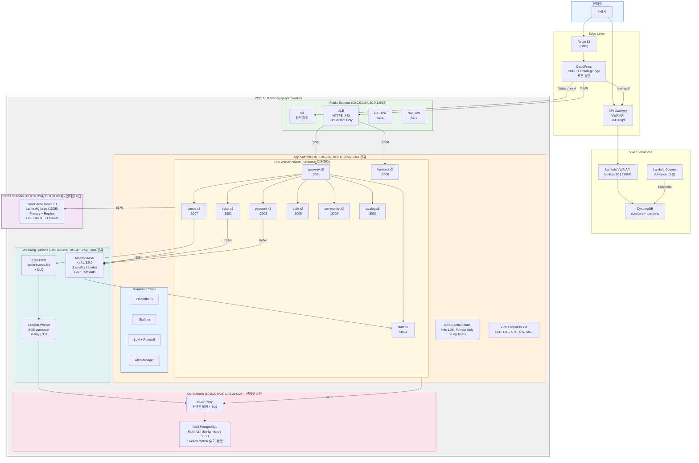
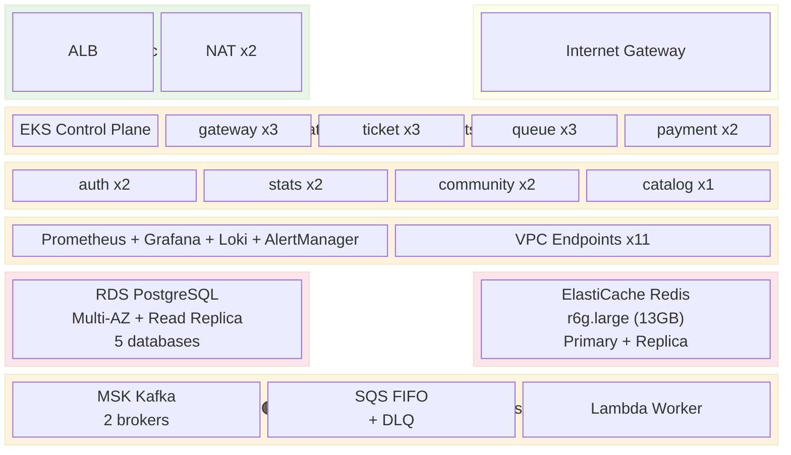
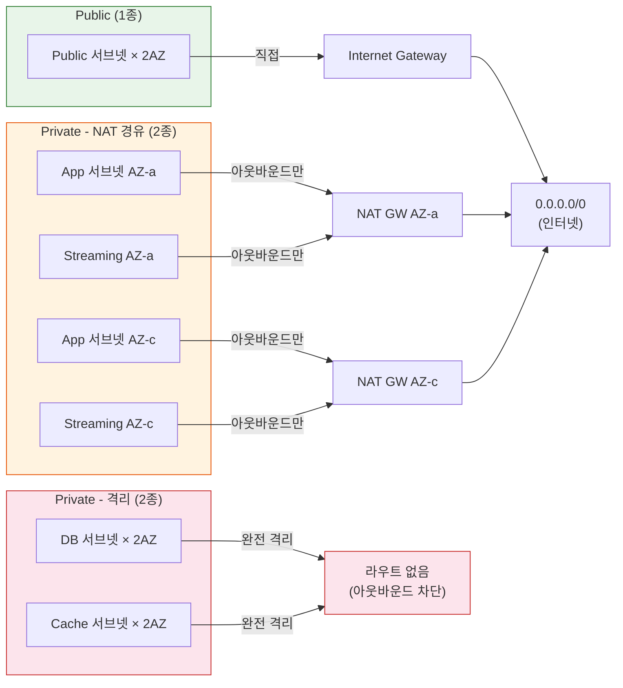
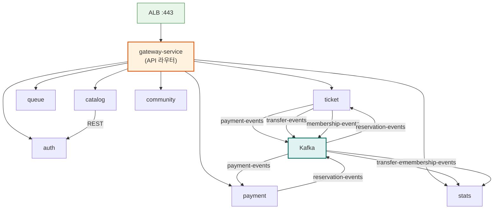
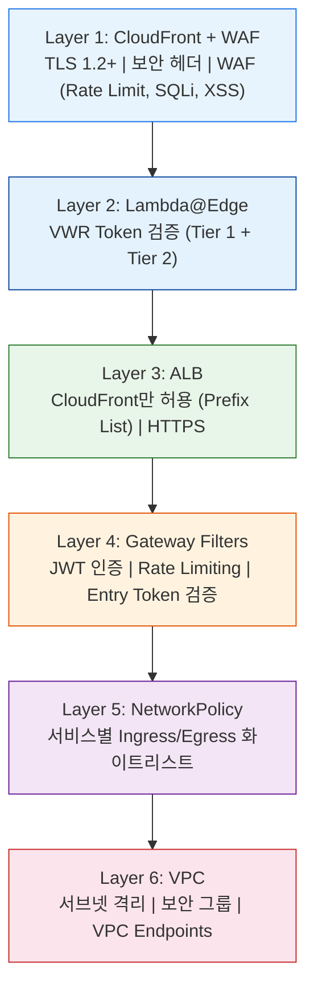
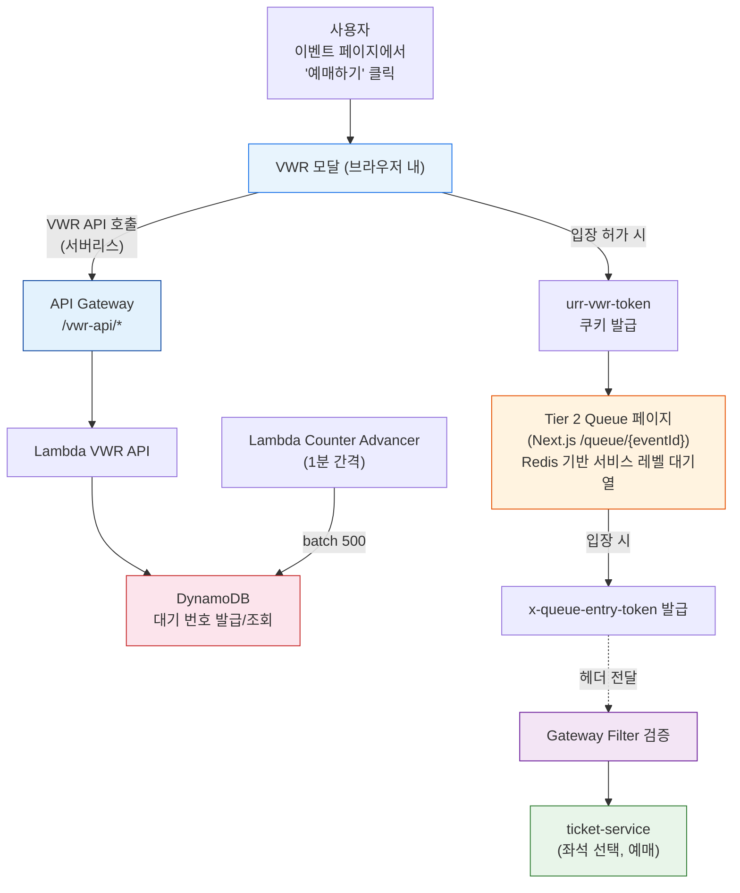
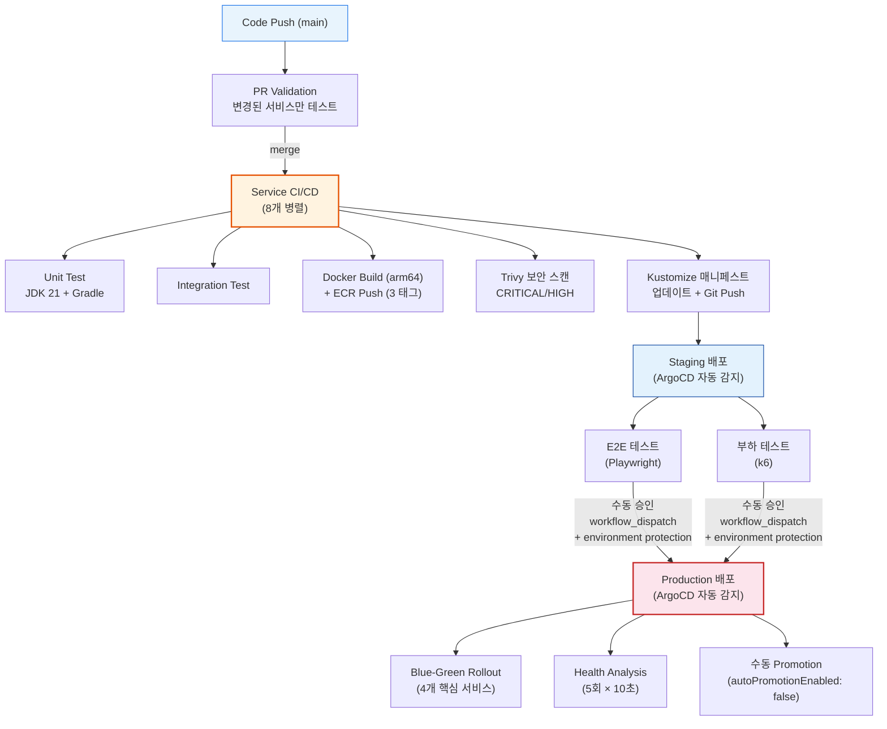
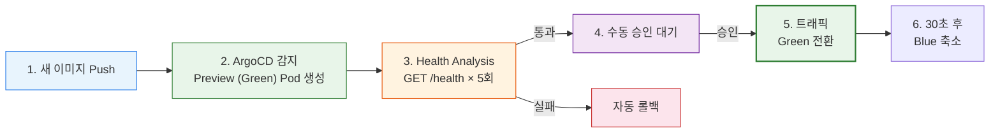
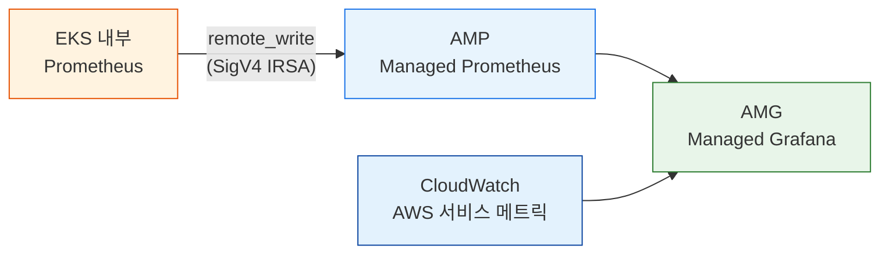

# URR AWS 인프라 아키텍처

---

## 전체 구성도



### VPC 서브넷 배치도



---

## 1. VPC 네트워크 설계

### 1.1 VPC 기본 정보

| 항목 | Prod | Staging |
|------|------|---------|
| VPC CIDR | `10.0.0.0/16` | `10.1.0.0/16` |
| 리전 | ap-northeast-2 (서울) | ap-northeast-2 |
| AZ 수 | 2 (a, c) | 2 (a, c) |
| 서브넷 총 수 | 10 (5종 × 2AZ) | 10 |
| NAT Gateway | 2 (AZ당 1개) | 2 |
| Internet Gateway | 1 | 1 |

### 1.2 서브넷 구성

모든 서브넷은 **Public 1종 + Private 4종**으로 분류되며, Private 서브넷은 보안 수준에 따라 두 가지로 나뉜다.

| 분류 | 서브넷 | AZ-a CIDR | AZ-c CIDR | 인터넷 | 용도 |
|------|--------|-----------|-----------|--------|------|
| **Public** | Public | 10.0.0.0/24 | 10.0.1.0/24 | IGW 직접 | ALB, NAT Gateway |
| **Private (NAT)** | App | 10.0.10.0/24 | 10.0.11.0/24 | NAT 경유 (아웃바운드만) | EKS Worker 노드 |
| **Private (NAT)** | Streaming | 10.0.40.0/24 | 10.0.41.0/24 | NAT 경유 (아웃바운드만) | MSK Kafka, Lambda Worker |
| **Private (격리)** | Database | 10.0.20.0/24 | 10.0.21.0/24 | 완전 차단 | RDS PostgreSQL |
| **Private (격리)** | Cache | 10.0.30.0/24 | 10.0.31.0/24 | 완전 차단 | ElastiCache Redis |

> **Private (NAT) vs Private (격리) 차이**
>
> - **Private (NAT)**: NAT Gateway를 통해 아웃바운드 인터넷 가능. ECR 이미지 pull, 외부 API 호출 등에 필요.
> - **Private (격리)**: NAT 연결 없이 인바운드만 허용. 아웃바운드 경로가 아예 없으므로 노드가 침해되더라도 데이터 유출 경로 차단. AWS 서비스 접근은 VPC Endpoint로만 가능.
>
> DB/Cache를 별도 격리 서브넷으로 분리한 이유는, EKS 노드가 침해되더라도 DB/Redis에서 외부로 데이터가 유출되는 네트워크 경로 자체를 제거하기 위함이다.

### 1.3 라우팅 정책



> **참고**: DB와 Cache 서브넷은 동일한 라우트 테이블을 공유한다 (`aws_route_table.db`). 이 라우트 테이블에는 `0.0.0.0/0` 경로가 없어서 VPC 외부로의 통신이 불가능하다.

### 1.4 VPC Endpoints (10개)

NAT Gateway 비용 절감 + 보안 강화를 위해 PrivateLink 사용.

**Gateway Endpoints (무료)**:
| 서비스 | 연결 대상 |
|--------|-----------|
| S3 | 모든 라우트 테이블 |

> DynamoDB는 VWR Lambda(VPC 밖)에서만 접근하므로 VPC Gateway Endpoint 불필요.

**Interface Endpoints (App 서브넷에 배치)**:
| 서비스 | 용도 |
|--------|------|
| ECR API | 컨테이너 이미지 pull |
| ECR DKR | Docker 레지스트리 |
| EC2 | EKS 노드 운영 |
| EKS | EKS API 통신 |
| STS | IRSA (IAM Roles for Service Accounts) |
| CloudWatch Logs | 컨테이너 로그 |
| Secrets Manager | RDS Proxy 인증, 시크릿 관리 |
| ELB | ALB 제어 |
| Auto Scaling | EKS 노드 그룹 스케일링 |

---

## 2. EKS 클러스터

### 2.1 컨트롤 플레인

| 항목 | 값 |
|------|-----|
| Kubernetes 버전 | 1.28 |
| 엔드포인트 접근 | **Private Only** (Public 비활성화) |
| KMS 암호화 | Secrets at-rest 암호화 |
| 컨트롤 플레인 로깅 | api, audit, authenticator, controllerManager, scheduler |
| 로그 보관 | CloudWatch 7일 |

### 2.2 Worker Node Group (초기 노드)

| 항목 | Prod | Staging |
|------|------|---------|
| 이름 | urr-spring-ng-initial | urr-staging-ng-initial |
| 인스턴스 타입 | t3.medium | t3.small |
| Desired / Min / Max | 3 / 2 / 5 | 2 / 1 / 3 |
| 용량 타입 | ON_DEMAND | SPOT |
| 디스크 | 20 GB | 20 GB |
| 서브넷 | App 서브넷 (2 AZ) | App 서브넷 (2 AZ) |
| 레이블 | `role: initial` | `role: initial` |

> 초기 노드 그룹은 Karpenter가 관리하기 전 기본 Pod (CoreDNS, Karpenter 자체 등)를 위한 것이다.
> `scaling_config.desired_size`에 `ignore_changes`가 설정되어 있어 Karpenter가 노드 수를 자유롭게 조정할 수 있다.

### 2.3 Karpenter (노드 자동확장)

| 항목 | 값 |
|------|-----|
| IRSA | `karpenter` SA (kube-system) → EC2/EKS 관리 정책 |
| NodePool | `default` |
| 허용 인스턴스 | t3.medium, t3.large, t3.xlarge, m5.large, m5.xlarge |
| 용량 타입 | on-demand + spot 혼합 |
| 리소스 상한 | CPU 32코어, 메모리 64Gi |
| 통합 정책 | 비어있거나 과소 활용 시 60초 후 통합 |
| AMI | Amazon Linux 2023 (최신) |
| 디스크 | 30Gi gp3 |
| 디스커버리 | `karpenter.sh/discovery` 태그로 서브넷/SG 자동 탐색 |

**동작 원리**: HPA가 Pod를 늘리려 하는데 노드 여유가 없으면, Karpenter가 워크로드 요구사항에 맞는 EC2 인스턴스를 자동 프로비저닝한다. 트래픽 감소 후 Pod가 줄어들면 빈 노드를 자동 정리(consolidation)한다.

**Helm 설치**:
```bash
helm install karpenter oci://public.ecr.aws/karpenter/karpenter \
  --namespace kube-system --version 1.1.1 \
  -f k8s/karpenter/karpenter-values.yaml
kubectl apply -f k8s/karpenter/nodepool.yaml
```

### 2.4 EKS Addons

| Addon | IRSA | 역할 |
|-------|------|------|
| vpc-cni | `aws-node` SA → AmazonEKS_CNI_Policy | Pod 네트워킹 |
| kube-proxy | - | 서비스 프록시 |
| coredns | - | 클러스터 DNS |
| aws-ebs-csi-driver | `ebs-csi-controller-sa` → EBSCSIDriverPolicy | EBS 볼륨 관리 |

### 2.5 서비스 메시

**Istio / Linkerd 미사용**. Spring Cloud Gateway가 API Gateway 역할, NetworkPolicy로 서비스 간 통신 제어.
현재 규모(서비스 9개)에서는 Istio의 mTLS/사이드카 오버헤드가 불필요하다.

---

## 3. 마이크로서비스 (Pod) 구성

### 3.1 서비스 목록

| 서비스 | 포트 | Prod 레플리카 | CPU Req/Limit | Mem Req/Limit | HPA | Rollout |
|--------|------|:---:|:---:|:---:|:---:|:---:|
| **gateway-service** | 3001 | 3 | 200m / 1 | 256Mi / 1Gi | 3~10 (70%) | Blue-Green |
| **ticket-service** | 3002 | 3 | 200m / 1 | 256Mi / 1Gi | 3~10 (70%) | Blue-Green |
| **payment-service** | 3003 | 2 | 200m / 1 | 256Mi / 1Gi | 2~6 (70%) | Blue-Green |
| **stats-service** | 3004 | 2 | 200m / 1 | 256Mi / 1Gi | - | - |
| **auth-service** | 3005 | 2 | 200m / 1 | 256Mi / 1Gi | - | - |
| **queue-service** | 3007 | 3 | 100m / 500m | 256Mi / 512Mi | 3~8 (70%) | Blue-Green |
| **community-service** | 3008 | 2 | 100m / 500m | 256Mi / 512Mi | - | - |
| **catalog-service** | 3009 | 1 | 100m / 500m | 256Mi / 512Mi | - | - |

> **Frontend (Next.js)**: EKS Pod로 실행 (standalone 모드). CloudFront → ALB → Frontend Pod (:3000).

**총 Prod Pod 수**: 20개 (최소) ~ 44개 (HPA max)

### 3.2 AZ 균등 배치 (topologySpreadConstraints)

모든 서비스에 `topologySpreadConstraints`를 적용하여 Pod가 AZ-a와 AZ-c에 균등 분산되도록 강제한다.
한쪽 AZ가 장애나도 반대쪽에서 서비스 유지.

```yaml
topologySpreadConstraints:
  - maxSkew: 1
    topologyKey: topology.kubernetes.io/zone
    whenUnsatisfiable: DoNotSchedule  # 레플리카 ≥ 2인 서비스
    labelSelector:
      matchLabels:
        app: <service-name>
```

| 정책 | 적용 서비스 (Prod) | 이유 |
|------|-------------------|------|
| **DoNotSchedule** | gateway, ticket, queue, payment, auth, stats, community | 레플리카 ≥ 2 → AZ 균등 분산 강제 |
| **ScheduleAnyway** | catalog | 레플리카 1개 → 분산 불가, 향후 스케일업 대비 |

> Staging도 동일 구조 적용. 레플리카 ≥ 2인 서비스(gateway, ticket, queue)는 DoNotSchedule, 나머지는 ScheduleAnyway.

### 3.3 서비스 간 호출 관계



### 3.4 서비스별 역할

| 서비스 | 역할 | 의존 서비스 |
|--------|------|-------------|
| **gateway** | API 라우팅, JWT 인증, Rate Limiting, Entry Token 검증 | Redis, 모든 backend |
| **auth** | 회원가입/로그인, OAuth, JWT 발급 | PostgreSQL (auth_db) |
| **ticket** | 이벤트/공연 관리, 예매, 좌석 잠금, 양도 | PostgreSQL (ticket_db), Redis, Kafka |
| **payment** | 결제 처리, 결제 조정 | PostgreSQL (payment_db), Kafka |
| **stats** | 통계 집계, 이벤트 소비 | PostgreSQL (stats_db), Kafka |
| **queue** | Tier 2 대기열 (입장/퇴장/상태), SQS 연동 | Redis, SQS |
| **catalog** | 읽기 전용 이벤트/아티스트 조회 | PostgreSQL (ticket_db 공유), auth |
| **community** | 커뮤니티/리뷰 | PostgreSQL (community_db) |

> **Frontend (Next.js)**: EKS Pod로 실행 (`output: "standalone"`). ALB가 :3000 포트로 라우팅. SSR + CSR 혼합.

### 3.5 Pod 보안

모든 서비스 공통:
```yaml
securityContext:
  runAsNonRoot: true
  runAsUser: 1000
  fsGroup: 1000
  capabilities:
    drop: [ALL]
```

### 3.6 프로브 설정

모든 Spring 서비스:
```yaml
startupProbe:      /actuator/health/liveness   (30회 × 5초 = 최대 150초 대기)
readinessProbe:    /actuator/health/readiness   (10초 간격)
livenessProbe:     /actuator/health/liveness    (20초 간격)
```

### 3.7 PodDisruptionBudget (Prod)

모든 8개 백엔드 서비스: `minAvailable: 1`

---

## 4. NetworkPolicy (서비스 간 통신 제어)

### 4.1 기본 정책

```yaml
# 모든 Pod: Ingress + Egress 전부 차단 (화이트리스트 방식)
default-deny-all:
  podSelector: {}
  policyTypes: [Ingress, Egress]
```

### 4.2 Ingress 허용 규칙

| 대상 서비스 | 포트 | 허용 출발지 |
|------------|------|-------------|
| gateway-service | 3001 | 모든 소스 (ALB) |
| auth-service | 3005 | gateway, catalog |
| ticket-service | 3002 | gateway, payment, catalog |
| payment-service | 3003 | gateway |
| stats-service | 3004 | gateway |
| queue-service | 3007 | gateway |
| catalog-service | 3009 | gateway, queue |
| community-service | 3008 | gateway |

### 4.3 Egress 허용 규칙

| 출발 서비스 | 허용 목적지 |
|------------|-------------|
| gateway | tier:backend 모든 Pod + DNS(53) |
| auth | DNS(53) only |
| ticket | payment-service + tier:data + DNS |
| payment | ticket-service + tier:data + DNS |
| queue | catalog-service + tier:data + DNS |
| stats | tier:data + DNS |
| catalog | auth-service + tier:data + DNS |
| community | tier:data + DNS |

### 4.4 Prod 외부 서비스 Egress

tier:backend Pod → AWS Managed Service 접근:
```
10.0.20.0/23 (DB 서브넷)       → TCP 5432 (PostgreSQL)
10.0.30.0/23 (Cache 서브넷)    → TCP 6379 (Redis)
10.0.40.0/23 (Streaming 서브넷) → TCP 9092, 9094 (Kafka)
```

---

## 5. AWS Managed Services 상세

### 5.1 RDS PostgreSQL

| 항목 | Prod | Staging |
|------|------|---------|
| 엔진 | PostgreSQL 16.4 | PostgreSQL 16.4 |
| 인스턴스 | db.t4g.micro | db.t4g.micro |
| 스토리지 | 50 GB gp3 (최대 100GB) | 20 GB gp3 |
| Multi-AZ | 활성화 | 비활성화 |
| Read Replica | 1개 (읽기 분산) | 없음 |
| 삭제 보호 | 활성화 | 비활성화 |
| 백업 보관 | 7일 | 7일 |
| 서브넷 | DB 서브넷 (격리) | DB 서브넷 |

**데이터베이스 5개** (단일 RDS 인스턴스):
- `ticket_db` — 이벤트, 공연, 좌석, 예매
- `auth_db` — 사용자, 인증
- `payment_db` — 결제
- `stats_db` — 통계
- `community_db` — 커뮤니티, 리뷰

**Read Replica** (Prod만):
- Primary와 동일 인스턴스 클래스 (기본값, 별도 지정 가능)
- 읽기 전용 쿼리 분산 (stats-service, catalog-service 등)
- Primary의 서브넷 그룹/엔진 설정 자동 상속
- Performance Insights, Enhanced Monitoring 동일 적용

**RDS Proxy**:
- App 서브넷에 위치 (EKS 노드와 같은 서브넷)
- 커넥션 풀링: max 100%, idle 50%
- 인증: Secrets Manager
- TLS 필수

**모니터링**:
- Performance Insights 활성화 (7일)
- Enhanced Monitoring 60초 간격
- Slow Query Log (1초 이상 쿼리 기록)
- CloudWatch Logs Export (postgresql, upgrade)

### 5.2 ElastiCache Redis

| 항목 | Prod | Staging |
|------|------|---------|
| 엔진 | Redis 7.1 | Redis 7.1 |
| 노드 타입 | cache.r6g.large (13GB) | cache.t4g.small (1.5GB) |
| 노드 수 | 2 (Primary + Replica) | 1 |
| Auto-Failover | 활성화 | 비활성화 |
| Multi-AZ | 활성화 | 비활성화 |
| 서브넷 | Cache 서브넷 (격리) | Cache 서브넷 |

**보안**: At-Rest 암호화 + Transit 암호화(TLS) + AUTH Token

**용도**:
- 대기열 관리 ({eventId}:queue, {eventId}:active, {eventId}:seen)
- Rate Limiting (sliding window)
- 좌석 잠금 (seat-lock:{seatId})
- 세션 데이터

**로깅**: slow-log + engine-log → CloudWatch

### 5.3 Amazon MSK (Kafka)

| 항목 | Prod | Staging |
|------|------|---------|
| Kafka 버전 | 3.6.0 | 3.6.0 |
| 브로커 수 | 2 | 2 |
| 인스턴스 | kafka.t3.small | kafka.t3.small |
| EBS/브로커 | 50 GB | 20 GB |
| 서브넷 | Streaming 서브넷 | Streaming 서브넷 |

**보안**: TLS + IAM Auth (Plaintext 비활성화)

**토픽 4개**:
| 토픽 | Publisher | Consumer | 용도 |
|------|-----------|----------|------|
| payment-events | ticket-service | payment-service | 결제 요청/완료 |
| reservation-events | payment-service | ticket-service | 예매 확정/취소 |
| transfer-events | ticket-service | stats-service | 양도 이벤트 |
| membership-events | ticket-service | stats-service | 멤버십 이벤트 |

**설정**: 파티션 3, ISR 2, 복제 팩터 2, 보관 7일

**모니터링**: PER_TOPIC_PER_BROKER (Enhanced), CloudWatch 알람 (ActiveController, OfflinePartitions)

### 5.4 Application Load Balancer

| 항목 | 값 |
|------|-----|
| 타입 | Application (L7) |
| 스킴 | Internet-facing |
| 서브넷 | Public 서브넷 (2 AZ) |
| 삭제 보호 | 활성화 (Prod) |

**리스너**:
- HTTPS :443 → 경로 기반 라우팅 (2개 Target Group)
- HTTP :80 → HTTPS 리다이렉트 (301)
- SSL Policy: TLS 1.3

**Target Group (2개)**:

| Target Group | 포트 | 경로 | 용도 |
|-------------|------|------|------|
| gateway-service | :3001 | `/api/*` | API 라우팅 |
| frontend | :3000 | `/*` (기본) | Next.js 페이지 서빙 |

- 타입: IP (EKS Pod IP)
- Health Check: GET /health (2회 성공, 3회 실패)
- Stickiness: Cookie 기반 (24시간)
- Deregistration Delay: 30초

**보안**: CloudFront Prefix List로 제한 (CloudFront에서만 접근 가능)

### 5.5 CloudFront

| 항목 | 값 |
|------|-----|
| Price Class | PriceClass_200 (북미+유럽+아시아) |
| TLS | TLSv1.2_2021 |
| IPv6 | 활성화 |
| HTTP/2 | 활성화 |

**Origin 3개**:

| Origin | 대상 | 프로토콜 |
|--------|------|----------|
| ALB | API 트래픽 | HTTPS (X-Custom-Header 검증) |
| S3 | 정적 파일 | OAC (SigV4 서명) |
| API Gateway | VWR API | HTTPS |

**Cache Behavior 5개**:

| 경로 | Origin | 캐시 TTL | Lambda@Edge |
|------|--------|---------|-------------|
| `/*` (기본) | ALB | 0초 (no-cache) | viewer-request (토큰 검증) |
| `/static/*` | S3 | 1시간 | - |
| `/_next/static/*` | S3 | 1년 (immutable) | - |
| `/vwr/*` | S3 | 5분 | CF Function (rewrite) |
| `/vwr-api/*` | API GW | 0초 | CF Function (prefix strip) |

**보안 헤더**: HSTS, X-Content-Type-Options, X-Frame-Options, X-XSS-Protection, Referrer-Policy

**WAF (Web Application Firewall)**:

| 항목 | 값 |
|------|-----|
| Scope | CLOUDFRONT (us-east-1) |
| 연결 | CloudFront Distribution에 `web_acl_id`로 부착 |
| Terraform | `terraform/modules/waf/` |

| 우선순위 | 규칙 | 설명 |
|----------|------|------|
| 1 | **Rate Limit** | IP당 5분 2,000건 초과 시 BLOCK |
| 2 | **AWSManagedRulesCommonRuleSet** | OWASP Top 10 공통 공격 패턴 차단 |
| 3 | **AWSManagedRulesKnownBadInputsRuleSet** | 알려진 악성 입력 (Log4j 등) 차단 |
| 4 | **AWSManagedRulesSQLiRuleSet** | SQL Injection 탐지 및 차단 |

- Default Action: **Allow** (규칙에 매칭되지 않으면 통과)
- CloudWatch 메트릭: 모든 규칙별 개별 메트릭 활성화
- Sampled Requests: 활성화 (디버깅/분석용)

### 5.6 SQS FIFO

| 항목 | 값 |
|------|-----|
| 큐 이름 | urr-prod-ticket-events.fifo |
| 타입 | FIFO (순서 보장) |
| 메시지 보관 | 4일 |
| Visibility Timeout | 5분 |
| Long Polling | 10초 |
| 암호화 | SSE 활성화 |

**DLQ** (Dead Letter Queue):
- 이름: urr-prod-ticket-events-dlq.fifo
- 보관: 14일
- 재시도 3회 후 DLQ 이동

**연결**: ticket-service → SQS → Lambda Worker → RDS

### 5.7 Lambda 함수

#### VWR API Lambda
| 항목 | 값 |
|------|-----|
| 런타임 | Node.js 20.x |
| 메모리 | 256 MB |
| 타임아웃 | 10초 |
| 동시 실행 | 100 (Reserved) |
| 트리거 | API Gateway |
| 연결 | DynamoDB |

#### VWR Counter Advancer Lambda
| 항목 | 값 |
|------|-----|
| 런타임 | Node.js 20.x |
| 메모리 | 128 MB |
| 타임아웃 | 70초 |
| 트리거 | EventBridge (1분 간격) |
| Batch Size | 500명/cycle |

#### Lambda@Edge (토큰 검증)
| 항목 | 값 |
|------|-----|
| 런타임 | Node.js 20.x |
| 메모리 | 128 MB |
| 타임아웃 | 5초 |
| 배포 리전 | us-east-1 |
| 트리거 | CloudFront viewer-request |

#### Ticket Worker Lambda
| 항목 | Prod | Staging |
|------|------|---------|
| 런타임 | Node.js 20.x | Node.js 20.x |
| 메모리 | 256 MB | 256 MB |
| 타임아웃 | 30초 | 30초|
| 동시 실행 | 10 | 5 |
| SQS Batch | 10건 / 5초 | 10건 / 5초 |
| 서브넷 | Streaming 서브넷 | Streaming 서브넷 |
| X-Ray | 활성화 | 비활성화 |

### 5.8 DynamoDB (VWR Tier 1)

**Counters 테이블**:
| 항목 | 값 |
|------|-----|
| 파티션 키 | eventId (String) |
| 과금 | PAY_PER_REQUEST (온디맨드) |
| PITR | 활성화 (35일) |
| 속성 | nextPosition, servingCounter, isActive, updatedAt |

**Positions 테이블**:
| 항목 | 값 |
|------|-----|
| 파티션 키 | eventId (String) |
| 정렬 키 | requestId (String) |
| GSI | eventId-position-index (eventId + position) |
| TTL | 24시간 자동 삭제 |
| PITR | 활성화 |

### 5.9 S3 버킷

**Frontend 버킷**:
- 버전 관리 활성화
- SSE-S3 암호화
- Public Access 전면 차단 (CloudFront OAC만 허용)
- CORS: GET, HEAD

**Logs 버킷** (선택적):
- ALB Access Log 저장
- Lifecycle: 30일 → Standard-IA, 90일 → Glacier, 90일 후 삭제

### 5.10 API Gateway (VWR)

| 항목 | Prod | Staging |
|------|------|---------|
| Rate Limit | 5,000 req/s | 1,000 req/s |
| Burst Limit | 10,000 req/s | 2,000 req/s |

**엔드포인트**:
- `POST /vwr/assign/{eventId}` — 대기열 위치 할당
- `GET /vwr/check/{eventId}/{requestId}` — 입장 여부 확인
- `GET /vwr/status/{eventId}` — 공개 상태 조회

---

## 6. 보안 계층 (6단계)



### 6.1 Gateway 필터 체인 (실행 순서)

| 순서 | 필터 | 역할 |
|------|------|------|
| -2 | CookieAuthFilter | Cookie에서 access_token 추출 → Bearer 변환 |
| -1 | JwtAuthFilter | JWT 검증, X-User-Id/Email/Role 헤더 주입 |
| 0 | RateLimitFilter | IP/유저별 요청 제한 (Redis 기반) |
| 1 | VwrEntryTokenFilter | Tier 2 Entry Token 검증, 좌석/예매 API 보호 |

**Rate Limit 카테고리**:
| 카테고리 | 제한 | 적용 경로 |
|----------|------|-----------|
| AUTH | 20 RPM | /api/v1/auth/* |
| QUEUE | 60 RPM | /api/v1/queue/* |
| BOOKING | 10 RPM | /api/v1/reservations/*, /api/v1/seats/* |
| GENERAL | 100 RPM | 그 외 전부 |

### 6.2 2-Tier 대기열 토큰



### 6.3 보안 그룹 매트릭스

| 출발 → 대상 | 포트 | 프로토콜 |
|-------------|------|----------|
| CloudFront → ALB | 443, 80 | HTTPS, HTTP |
| ALB → EKS Nodes | 0-65535 | TCP |
| EKS Nodes → EKS Nodes | 모든 포트 | 모든 트래픽 (self) |
| EKS Control Plane → Nodes | 443 | HTTPS |
| EKS Nodes → RDS Proxy | 5432 | TCP |
| RDS Proxy → RDS | 5432 | TCP |
| EKS Nodes → ElastiCache | 6379 | TCP |
| EKS Nodes → MSK | 9094, 9098 | TLS, IAM |
| Lambda Worker → RDS Proxy | 5432 | TCP |
| Lambda Worker → ElastiCache | 6379 | TCP |
| MSK Brokers → MSK Brokers | 2181 | ZooKeeper (self) |

---

## 7. IAM 역할

| 역할 | 연결 서비스 | 주요 정책 |
|------|-------------|-----------|
| EKS Cluster Role | EKS | AmazonEKSClusterPolicy, VPCResourceController |
| EKS Node Role | EC2 (Worker) | EKSWorkerNodePolicy, CNI, ECR ReadOnly, SSM |
| VPC CNI IRSA | aws-node SA | AmazonEKS_CNI_Policy |
| EBS CSI IRSA | ebs-csi SA | AmazonEBSCSIDriverPolicy |
| Karpenter IRSA | karpenter SA (kube-system) | EC2 Fleet/Instance 관리, iam:PassRole, eks:DescribeCluster |
| RDS Proxy Role | RDS Proxy | SecretsManager GetSecretValue |
| RDS Monitoring Role | RDS | EnhancedMonitoringRole |
| Lambda Worker Role | Lambda | LambdaBasicExecution, VPCAccess, SQS |
| Lambda@Edge Role | Lambda@Edge | LambdaBasicExecution (+ edgelambda principal) |

---

## 8. 배포 전략

### 8.1 CI/CD 파이프라인



### 8.2 Argo Rollouts (Blue-Green)

적용 서비스: gateway, ticket, payment, queue



**Preview Service (Green 테스트용)**:
- gateway-service-preview :3001
- ticket-service-preview :3002
- payment-service-preview :3003
- queue-service-preview :3007

### 8.3 ArgoCD

| 항목 | Staging | Prod |
|------|---------|------|
| 소스 경로 | k8s/spring/overlays/staging | k8s/spring/overlays/prod |
| 브랜치 | main | main |
| Auto Sync | 활성화 | 활성화 |
| Prune | 활성화 | 활성화 |
| Self-Heal | 활성화 | 활성화 |

### 8.4 수동 롤백

GitHub Actions `rollback.yml`:
```
서비스 선택 → 이미지 태그 입력 → 환경 선택 (prod)
→ Kustomize 이미지 태그 롤백 → Git Push → ArgoCD 동기화
```

---

## 9. 환경별 차이 비교

| 항목 | Kind (로컬) | Staging | Prod |
|------|------------|---------|------|
| **네임스페이스** | urr-spring | urr-staging | urr-spring |
| **노드** | Kind 2노드 | EKS t3.small × 1~3 (SPOT) | EKS t3.medium × 2~5 (ON_DEMAND) + Karpenter 자동확장 |
| **DB** | 단일 PostgreSQL Pod | RDS Single-AZ (20GB) | RDS Multi-AZ (50GB) + Proxy + Read Replica |
| **Redis** | Dragonfly Pod | ElastiCache t4g.small (1.5GB) 1노드 | ElastiCache r6g.large (13GB) 2노드 (Failover) |
| **Kafka** | 3-broker StatefulSet | MSK 2-broker (20GB) | MSK 2-broker (50GB) |
| **총 레플리카** | 각 1개 (9 Pod) | 각 1~2개 (~12 Pod) | 최소 20 Pod (HPA: ~44) |
| **Rollout** | 없음 | 없음 | Blue-Green (4개 서비스) |
| **HPA** | 없음 | 없음 | 4개 서비스 (70% CPU) |
| **PDB** | 없음 | 없음 | 8개 서비스 (minAvailable: 1) |
| **AZ 분산** | 없음 | topologySpread (3서비스 강제) | topologySpread (8서비스 강제) |
| **모니터링** | K8s 내부 Prometheus | K8s Prometheus + AMP/AMG | kube-prometheus-stack + AMP/AMG + CloudWatch |
| **추적** | Zipkin (메모리) | Zipkin (메모리) | Zipkin (ES) + X-Ray (Lambda) |
| **샘플링** | 100% | 100% | 10% |
| **CDN** | 없음 | 없음 | CloudFront + Lambda@Edge |
| **VWR Tier 1** | 없음 | 없음 | DynamoDB + API GW + Lambda |

---

## 10. CloudWatch 알람 (자동 설정)

Terraform 배포 시 자동 생성:

| 대상 | 알람 | 조건 | 심각도 |
|------|------|------|--------|
| MSK | ActiveControllerCount | < 1 | CRITICAL |
| MSK | OfflinePartitionsCount | > 0 | CRITICAL |
| Lambda Worker | Errors | > 5 (10분) | HIGH |
| Lambda Worker | Duration | > 24초 (타임아웃 80%) | WARNING |
| Lambda Worker | Throttles | > 0 | HIGH |
| SQS DLQ | Messages | > 0 | HIGH |
| SQS Queue | MessageAge | > 10분 | WARNING |

**알림 경로**: CloudWatch Alarm → SNS Topic → 이메일/Slack

### 10.1 AMP + AMG (외부 모니터링)

EKS 장애 시에도 메트릭을 보존하기 위해 **Amazon Managed Prometheus (AMP)** + **Amazon Managed Grafana (AMG)**를 외부 모니터링으로 운영한다.



| 항목 | 값 |
|------|-----|
| AMP | Prometheus 호환 TSDB (서버리스) |
| AMG | Grafana 호환 대시보드 (AWS SSO 인증) |
| 연동 방식 | Prometheus `remoteWrite` → AMP (SigV4) |
| IRSA | `kube-prometheus-stack-prometheus` SA → `aps:RemoteWrite` |
| 데이터 흐름 | EKS Prometheus 수집 → AMP 전송 → AMG 조회 |

**EKS 장애 시**: EKS 내부 Prometheus/Grafana는 중단되지만, AMP에 이미 전송된 메트릭 데이터는 보존되고 AMG에서 계속 조회 가능.

---

## 11. Terraform 모듈 구조

```
terraform/
├── modules/
│   ├── vpc/              # VPC, 서브넷, NAT, IGW, 라우트 테이블
│   ├── vpc-endpoints/    # 11개 VPC 엔드포인트
│   ├── eks/              # EKS 클러스터, 노드 그룹, Addon, IRSA (Karpenter 포함)
│   ├── rds/              # RDS PostgreSQL, Proxy, Read Replica, 파라미터 그룹
│   ├── elasticache/      # ElastiCache Redis, 서브넷 그룹 (노드 타입 환경별 분리)
│   ├── msk/              # MSK Kafka, 구성, CloudWatch
│   ├── alb/              # ALB, 리스너, 타겟 그룹
│   ├── cloudfront/       # CloudFront, Lambda@Edge, CF Functions
│   ├── waf/              # WAFv2 Web ACL (CLOUDFRONT scope, us-east-1)
│   ├── route53/          # Route53 Hosted Zone, A Record → CloudFront
│   ├── ecr/              # ECR 리포지토리 9개 (서비스별), Lifecycle Policy
│   ├── s3/               # S3 버킷, 정책, 수명 주기
│   ├── sqs/              # SQS FIFO, DLQ, CloudWatch 알람
│   ├── lambda-vwr/       # VWR API Lambda, Counter Advancer
│   ├── lambda-worker/    # SQS Consumer Lambda, VPC 배치
│   ├── dynamodb-vwr/     # VWR DynamoDB 테이블, GSI, TTL
│   └── monitoring/       # AMP + AMG + Prometheus IRSA
│
├── environments/
│   ├── prod/
│   │   ├── main.tf           # 20개 모듈 호출
│   │   ├── variables.tf      # 환경 변수 정의
│   │   └── terraform.tfvars.example
│   └── staging/
│       ├── main.tf
│       ├── variables.tf
│       └── terraform.tfvars.example
```

**Karpenter 매니페스트**:
```
k8s/karpenter/
├── karpenter-values.yaml   # Helm chart values (IRSA, 클러스터 설정)
└── nodepool.yaml           # NodePool + EC2NodeClass (인스턴스/리소스 정책)
```

**State 관리**: S3 Backend + DynamoDB Lock (환경별 분리)
