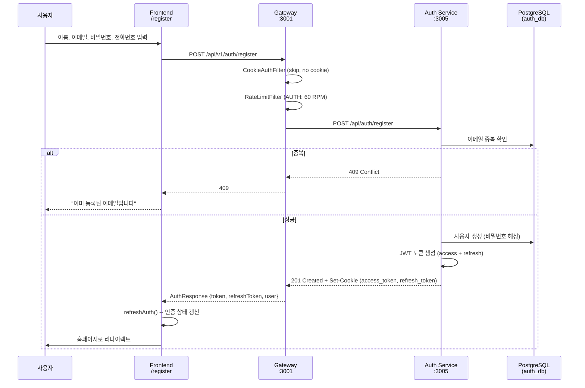
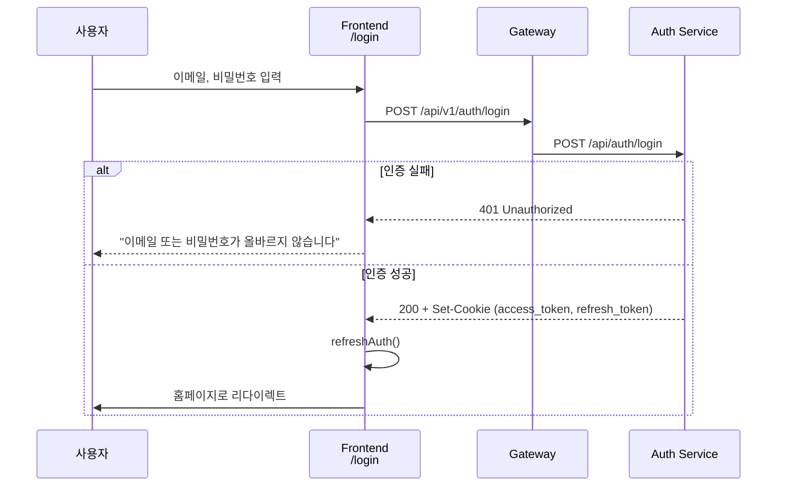
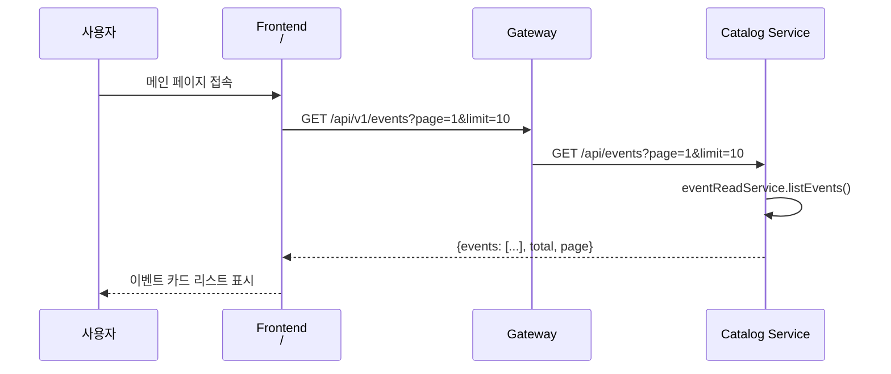
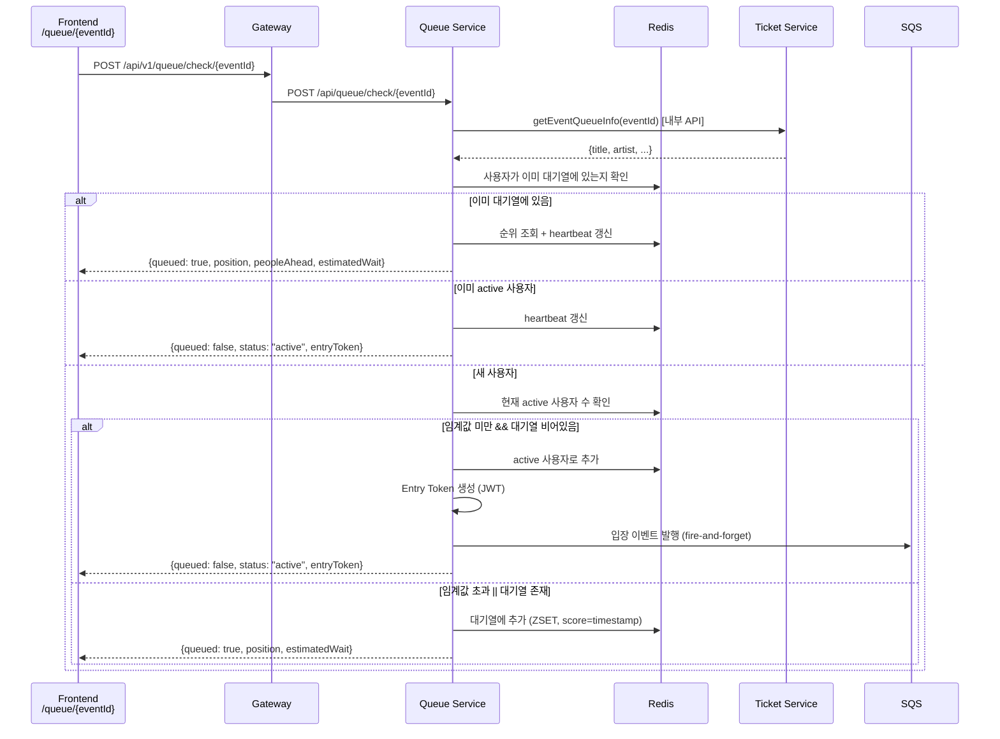
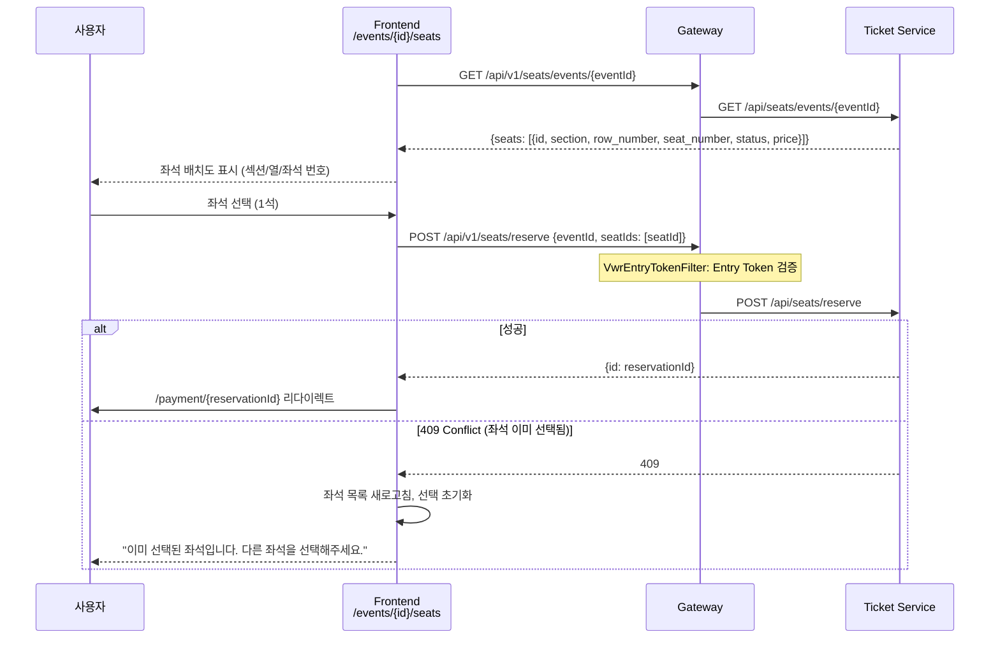
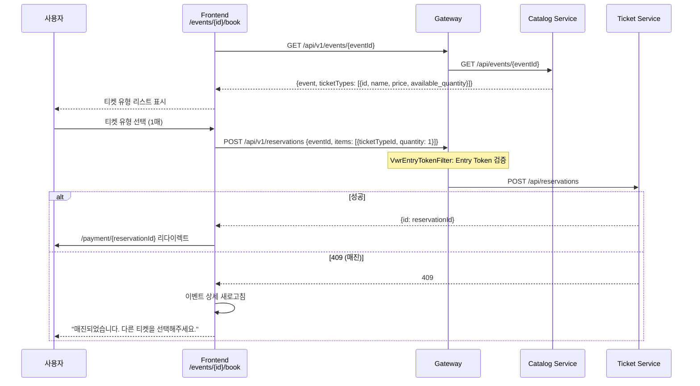
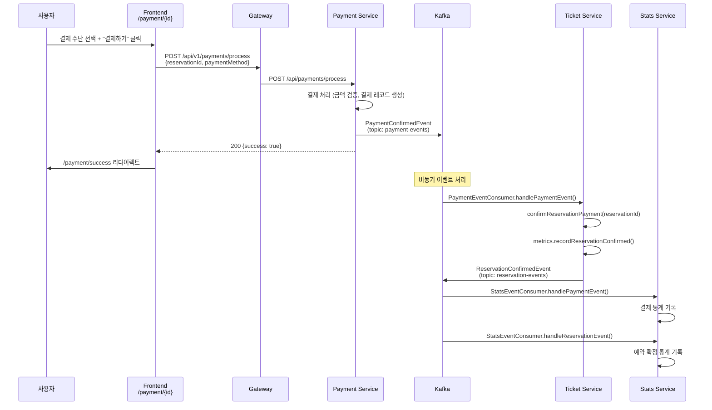
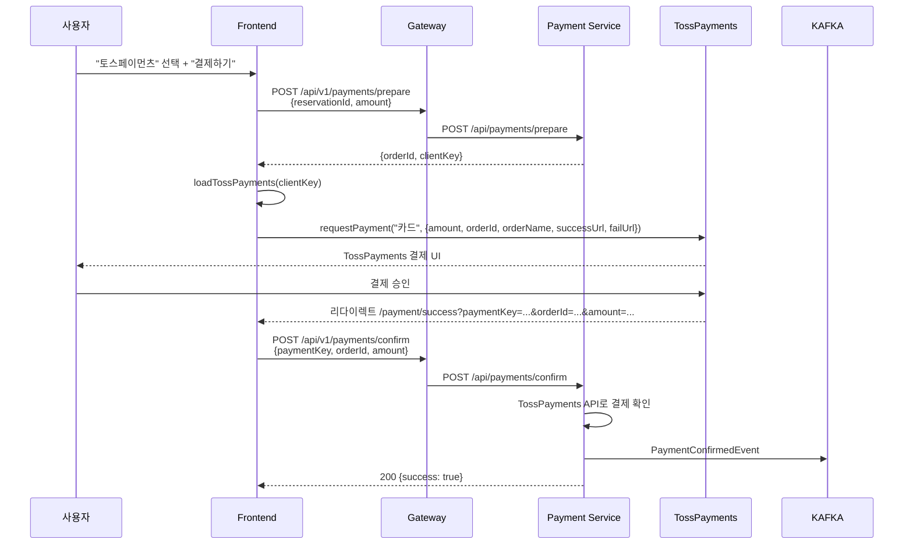
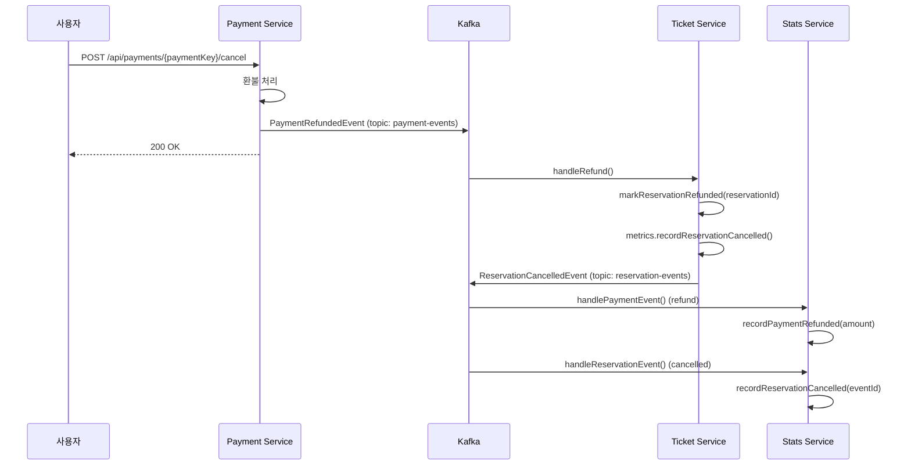

# URR 사용자 플로우 분석

## 1. 개요

URR은 티켓 예매 시스템으로, 사용자는 회원가입/로그인 후 이벤트를 탐색하고, 대기열을 거쳐 좌석을 선택하고, 결제하여 티켓을 확보한다. 시스템은 2-tier 대기열(VWR Tier 1 + Redis Tier 2)과 Kafka 기반 비동기 이벤트 처리를 채택하고 있다.

### 서비스 라우팅 맵

| Gateway 경로 | 대상 서비스 | 포트 |
|-------------|------------|------|
| `/api/v1/auth/**` | auth-service | 3005 |
| `/api/v1/events/**` | catalog-service | 3009 |
| `/api/v1/tickets/**` | ticket-service | 3002 |
| `/api/v1/seats/**` | ticket-service | 3002 |
| `/api/v1/reservations/**` | ticket-service | 3002 |
| `/api/v1/queue/**` | queue-service | 3007 |
| `/api/v1/payments/**` | payment-service | 3003 |
| `/api/v1/stats/**` | stats-service | 3004 |
| `/api/v1/admin/**` | catalog-service | 3009 |
| `/api/v1/community/**` | community-service | 3008 |
| `/api/v1/news/**` | community-service | 3008 |
| `/api/v1/artists/**` | catalog-service | 3009 |
| `/api/v1/memberships/**` | ticket-service | 3002 |
| `/api/v1/transfers/**` | ticket-service | 3002 |

**파일 경로**: `C:\Users\USER\URR\services-spring\gateway-service\src\main\resources\application.yml:8-75`

### Gateway 필터 체인 (실행 순서)

```
Request
  |
  v
[Order -2] CookieAuthFilter      -- 쿠키에서 access_token을 Authorization 헤더로 변환
  |
  v
[Order -1] JwtAuthFilter         -- JWT 검증, X-User-Id 헤더 주입
  |
  v
[Order  0] RateLimitFilter       -- Redis 기반 Rate Limiting (경로별 RPM 제한)
  |
  v
[Order  1] VwrEntryTokenFilter   -- 좌석/예약 API에 대기열 Entry Token 검증
  |
  v
[자동]    ApiVersionFilter        -- /api/v1/ 경로를 /api/ 로 리매핑
  |
  v
[Spring Cloud Gateway MVC]       -- 백엔드 서비스로 라우팅
```

**파일 경로**:
- `C:\Users\USER\URR\services-spring\gateway-service\src\main\java\guru\urr\gatewayservice\filter\CookieAuthFilter.java`
- `C:\Users\USER\URR\services-spring\gateway-service\src\main\java\guru\urr\gatewayservice\filter\RateLimitFilter.java`
- `C:\Users\USER\URR\services-spring\gateway-service\src\main\java\guru\urr\gatewayservice\filter\VwrEntryTokenFilter.java`

### Rate Limit 설정

| 카테고리 | 경로 패턴 | RPM 제한 | 파일:라인 |
|----------|----------|----------|-----------|
| AUTH | `/api/v1/auth/**` | 60 | `application.yml:116` |
| QUEUE | `/api/v1/queue/**` | 120 | `application.yml:117` |
| BOOKING | `/api/v1/seats/reserve`, `/api/v1/reservations` | 30 | `application.yml:118` |
| GENERAL | 나머지 모든 경로 | 3000 | `application.yml:119` |

---

## 2. 회원가입/로그인 플로우

### 2.1 회원가입



**프론트엔드**: `C:\Users\USER\URR\apps\web\src\app\register\page.tsx`
- 필수 입력: 이름, 이메일, 비밀번호 (8자 이상)
- 선택 입력: 전화번호
- 에러 처리: 409(중복), 400(유효성), 기타

**백엔드**: `C:\Users\USER\URR\services-spring\auth-service\src\main\java\guru\urr\authservice\controller\AuthController.java:39-46`
- `@PostMapping("/register")` -> `AuthService.register()` -> JWT 생성
- Set-Cookie: `access_token`, `refresh_token` (HttpOnly)

### 2.2 로그인



**프론트엔드**: `C:\Users\USER\URR\apps\web\src\app\login\page.tsx:19-38`
**백엔드**: `C:\Users\USER\URR\services-spring\auth-service\src\main\java\guru\urr\authservice\controller\AuthController.java:48-55`

### 2.3 Google 로그인

**프론트엔드**: `C:\Users\USER\URR\apps\web\src\app\login\page.tsx:41-91`
- Google GSI SDK 로드 (`accounts.google.com/gsi/client`)
- `NEXT_PUBLIC_GOOGLE_CLIENT_ID` 환경 변수가 있을 때만 Google 버튼 렌더링
- credential -> `POST /api/v1/auth/google`

**백엔드**: `C:\Users\USER\URR\services-spring\auth-service\src\main\java\guru\urr\authservice\controller\AuthController.java:85-101`
- Google credential 검증 -> 사용자 생성 또는 매칭 -> JWT 발급

### 2.4 JWT 갱신 (Silent Refresh)

**프론트엔드 인터셉터**: `C:\Users\USER\URR\apps\web\src\lib\api-client.ts:79-131`

```
401 응답 수신
  |
  ├─ 인증 엔드포인트? (login/register/refresh) -> 에러 전파
  |
  ├─ 이미 갱신 중? -> 대기열에 추가, 갱신 완료 후 재시도
  |
  └─ 갱신 시도: POST /api/v1/auth/refresh
       |
       ├─ 성공: 원래 요청 + 대기열 모두 재시도
       |
       └─ 실패: clearAuth(), 대기열 모두 거부
```

특징:
- 동시 다중 요청의 401에 대해 단일 refresh 요청만 발행 (failedQueue 패턴)
- 429 (Rate Limit) 응답에 대해 최대 2회 지수 백오프 재시도 (`api-client.ts:118-127`)

### 2.5 인증 토큰 설정

| 항목 | 값 | 파일:라인 |
|------|-----|-----------|
| Access Token 만료 | 1800초 (30분) | `application.yml:51` |
| Refresh Token 만료 | 604800초 (7일) | `application.yml:52` |
| JWT Secret | `${JWT_SECRET}` 환경변수 | `application.yml:50` |

---

## 3. 이벤트 탐색 플로우

### 3.1 이벤트 목록



**프론트엔드 API**: `C:\Users\USER\URR\apps\web\src\lib\api-client.ts:143-146`
```typescript
export const eventsApi = {
  list: (params?) => http.get("/events", { params }),
  detail: (id) => http.get(`/events/${id}`),
};
```

**백엔드**: `C:\Users\USER\URR\services-spring\catalog-service\src\main\java\guru\urr\catalogservice\domain\event\controller\EventController.java`
- `GET /api/events` -- 상태, 검색어, 페이지, 제한 파라미터
- `GET /api/events/{id}` -- 이벤트 상세 (인증 불필요)

### 3.2 이벤트 상세

**프론트엔드**: `C:\Users\USER\URR\apps\web\src\app\events\[id]\page.tsx`
- `useEventDetail(id)` 훅으로 상세 정보 로드
- `EventDetailClient` 컴포넌트에서 렌더링
- 예매 가능 시 "예매하기" 버튼 -> 대기열 페이지로 이동

### 3.3 검색

**프론트엔드**: `C:\Users\USER\URR\apps\web\src\app\search\page.tsx`
- 검색 쿼리 -> `GET /api/v1/events?q=검색어`

---

## 4. 티켓 예매 플로우 (전체)

이것이 URR 시스템의 핵심 플로우이다. 대기열에서 시작하여 결제 완료까지의 전체 과정을 설명한다.

### 4.1 전체 플로우 다이어그램

```
사용자가 "예매하기" 클릭
     |
     v
+--[VWR Tier 1 활성?]--+
|                       |
| Yes                   | No
v                       v
CloudFront              |
Lambda@Edge             |
대기열 페이지            |
(정적)                  |
     |                  |
     | position <=       |
     | servingCounter    |
     v                  |
+----[대기열 통과]-------+
     |
     v
[Queue Service: Redis Tier 2 대기열]
     |
     | 임계값 미만이면 즉시 입장
     | 초과하면 대기
     |
     v
[입장 허가 + Entry Token 발급]
     |
     v
+--[좌석 지정 이벤트?]--+
|                        |
| Yes                    | No
v                        v
/events/{id}/seats       /events/{id}/book
좌석 선택 페이지         티켓 유형 선택 페이지
     |                        |
     v                        v
POST /api/v1/seats/reserve   POST /api/v1/reservations
     |                        |
     +----------+-------------+
                |
                v
        예약 생성 (15분 TTL)
                |
                v
        /payment/{reservationId}
        결제 페이지
                |
                v
        결제 수단 선택
        (NaverPay/KakaoPay/계좌이체/TossPayments)
                |
                v
        결제 처리
                |
                v
        Kafka: payment-events 발행
                |
        +-------+--------+
        |                 |
        v                 v
  ticket-service     stats-service
  예약 확정           통계 기록
        |
        v
  Kafka: reservation-events 발행
        |
        v
  stats-service
  예약 확정 통계 기록
```

### 4.2 VWR Tier 1 (CloudFront Lambda@Edge)

VWR(Virtual Waiting Room) Tier 1은 CloudFront에서 동작하는 엣지 레벨 대기열이다.

**관리 API**: `C:\Users\USER\URR\services-spring\queue-service\src\main\java\guru\urr\queueservice\controller\VwrAdminController.java`

| 엔드포인트 | 메서드 | 설명 | 파일:라인 |
|-----------|--------|------|-----------|
| `/api/admin/vwr/activate/{eventId}` | POST | VWR 활성화 (DynamoDB 초기화) | `VwrAdminController.java:49-75` |
| `/api/admin/vwr/deactivate/{eventId}` | POST | VWR 비활성화 | `VwrAdminController.java:80-104` |
| `/api/admin/vwr/status/{eventId}` | GET | VWR 상태 조회 | `VwrAdminController.java:109-138` |
| `/api/admin/vwr/advance/{eventId}` | POST | 서빙 카운터 수동 진행 | `VwrAdminController.java:143-184` |

DynamoDB 카운터 테이블 구조:
```
eventId: String (PK)
nextPosition: Number     -- 다음 발급할 번호표
servingCounter: Number   -- 현재 서비스 중인 번호
isActive: Boolean        -- VWR 활성 여부
updatedAt: Number        -- 업데이트 시각
```

VWR은 `@ConditionalOnProperty(name = "vwr.dynamodb.enabled", havingValue = "true")` 조건부로 활성화된다.

**파일 경로**: `C:\Users\USER\URR\services-spring\queue-service\src\main\resources\application.yml:58-63`

### 4.3 Redis Tier 2 대기열 (Queue Service)

**파일 경로**: `C:\Users\USER\URR\services-spring\queue-service\src\main\java\guru\urr\queueservice\service\QueueService.java`

#### 대기열 진입 (check)



**QueueService.check()**: `QueueService.java:60-91`

Redis 키 구조:
| 키 패턴 | 타입 | 용도 |
|---------|------|------|
| `queue:{eventId}` | ZSET | 대기열 (score = 참여 시각) |
| `active:{eventId}` | ZSET | 활성 사용자 (score = 만료 시각) |
| `queue:seen:{eventId}` | ZSET | 대기열 heartbeat 추적 |
| `active:seen:{eventId}` | ZSET | 활성 사용자 heartbeat 추적 |
| `queue:active-events` | SET | 활성 이벤트 ID 추적 |

대기열 설정:

| 설정 | 기본값 | 환경 변수 | 파일:라인 |
|------|--------|-----------|-----------|
| 임계값 (최대 동시 접속자) | 1000 | `QUEUE_THRESHOLD` | `QueueService.java:45` |
| Active 사용자 TTL | 600초 (10분) | `QUEUE_ACTIVE_TTL_SECONDS` | `QueueService.java:46` |
| Entry Token TTL | 600초 (10분) | `QUEUE_ENTRY_TOKEN_TTL_SECONDS` | `application.yml:45` |
| 입장 배치 크기 | 100 | `QUEUE_ADMISSION_BATCH_SIZE` | `application.yml:40` |
| 입장 간격 | 1000ms (1초) | `QUEUE_ADMISSION_INTERVAL_MS` | `application.yml:39` |
| Stale 정리 간격 | 30000ms (30초) | `QUEUE_STALE_CLEANUP_INTERVAL_MS` | `application.yml:42` |

#### 동적 폴링 간격

**파일 경로**: `C:\Users\USER\URR\services-spring\queue-service\src\main\java\guru\urr\queueservice\service\QueueService.java:231-238`

| 대기 순번 | 폴링 간격 |
|-----------|-----------|
| 0 이하 | 3초 |
| 1 ~ 1,000 | 1초 |
| 1,001 ~ 5,000 | 5초 |
| 5,001 ~ 10,000 | 10초 |
| 10,001 ~ 100,000 | 30초 |
| 100,001+ | 60초 |

#### 대기 시간 추정

`QueueService.estimateWait()` (`QueueService.java:242-258`):
- 1분 슬라이딩 윈도우에서 실제 입장 처리량(throughput) 기반 추정
- 처리량 데이터가 충분하지 않으면 `position * 30초`로 폴백

#### Entry Token 구조

```
JWT:
  subject: eventId
  claim "uid": userId
  issuedAt: 현재 시각
  expiration: 현재 시각 + entryTokenTtlSeconds (기본 600초)
  서명 키: HMAC-SHA256 (QUEUE_ENTRY_TOKEN_SECRET)
```

**파일 경로**: `C:\Users\USER\URR\services-spring\queue-service\src\main\java\guru\urr\queueservice\service\QueueService.java:215-227`

#### 프론트엔드 대기열 페이지

**파일 경로**: `C:\Users\USER\URR\apps\web\src\app\queue\[eventId]\page.tsx`

기능:
1. 페이지 마운트 시 `queueApi.check(eventId)` 호출 (`page.tsx:52-67`)
2. `entryToken` 수신 시 쿠키에 저장 (`urr-entry-token`, max-age 600초) (`page.tsx:54-56`)
3. 대기열에 있으면 `useQueuePolling` 훅으로 주기적 폴링 (`page.tsx:70`)
4. 입장 허가 시 이벤트 유형에 따라 자동 리다이렉트:
   - 좌석 지정 이벤트: `/events/{eventId}/seats` (`page.tsx:81`)
   - 스탠딩 이벤트: `/events/{eventId}/book` (`page.tsx:83`)
5. "대기열 나가기" 버튼으로 `queueApi.leave()` 호출 가능 (`page.tsx:166-169`)

표시 정보:
- 현재 대기 순번
- 내 앞 / 내 뒤 인원수
- 예상 대기 시간
- 현재 접속자 수 / 최대 접속자 수

### 4.4 좌석 선택 (Seated 이벤트)



**프론트엔드**: `C:\Users\USER\URR\apps\web\src\app\events\[id]\seats\page.tsx`
- 좌석 상태: `available`, `reserved`, `locked` (`seats/page.tsx:59-68`)
- 1석만 선택 가능 (단일 선택 모드) (`seats/page.tsx:107-118`)
- idempotencyKey 자동 생성 (`api-client.ts:172-176`)

**백엔드 (좌석 조회)**: `C:\Users\USER\URR\services-spring\ticket-service\src\main\java\guru\urr\ticketservice\domain\seat\controller\SeatController.java:38-41`
**백엔드 (좌석 예약)**: `C:\Users\USER\URR\services-spring\ticket-service\src\main\java\guru\urr\ticketservice\domain\seat\controller\SeatController.java:43-50`

### 4.5 티켓 유형 선택 (Standing 이벤트)



**프론트엔드**: `C:\Users\USER\URR\apps\web\src\app\events\[id]\book\page.tsx`
- 매진된 티켓은 비활성화 + "매진" 배지 표시 (`book/page.tsx:129-134`)
- idempotencyKey 자동 생성 (`api-client.ts:161-164`)

**백엔드**: `C:\Users\USER\URR\services-spring\ticket-service\src\main\java\guru\urr\ticketservice\domain\reservation\controller\ReservationController.java:30-37`

### 4.6 VWR Entry Token 검증

좌석 예약(`POST /api/seats/reserve`)과 예약 생성(`POST /api/reservations`)은 Gateway의 `VwrEntryTokenFilter`에 의해 보호된다.

**파일 경로**: `C:\Users\USER\URR\services-spring\gateway-service\src\main\java\guru\urr\gatewayservice\filter\VwrEntryTokenFilter.java`

검증 흐름:
```
POST 요청 수신 (seats/reserve 또는 reservations)
  |
  ├─ CloudFront 우회 검사: X-CloudFront-Verified 헤더 == cloudfront.secret?
  |   └─ 일치: 필터 통과 (CDN 엣지에서 이미 검증됨)
  |
  ├─ x-queue-entry-token 헤더 확인
  |   └─ 없음: 403 {"error": "Queue entry token required", "redirectTo": "/queue"}
  |
  └─ JWT 검증 (HMAC-SHA256)
      |
      ├─ 만료 확인
      ├─ VWR userId == Auth JWT userId 일치 확인
      └─ eventId를 request attribute에 저장 (백엔드 검증용)
```

보호 경로: `/api/seats/` 또는 `/api/reservations`로 시작하는 POST/PUT/PATCH 요청
**파일 경로**: `VwrEntryTokenFilter.java:113-114`

프론트엔드에서의 토큰 전달:
```typescript
// api-client.ts:70-77
http.interceptors.request.use((config) => {
  const entryToken = getCookie("urr-entry-token");
  if (entryToken) {
    config.headers["x-queue-entry-token"] = entryToken;
  }
  return config;
});
```

---

## 5. 결제 플로우

### 5.1 결제 페이지

**프론트엔드**: `C:\Users\USER\URR\apps\web\src\app\payment\[reservationId]\page.tsx`

결제 수단:

| ID | 이름 | 처리 방식 | 파일:라인 |
|----|------|-----------|-----------|
| `naver_pay` | 네이버페이 | Mock 즉시 결제 | `page.tsx:82-88` |
| `kakao_pay` | 카카오페이 | Mock 즉시 결제 | `page.tsx:82-88` |
| `bank_transfer` | 계좌이체 | Mock 즉시 결제 | `page.tsx:82-88` |
| `toss` | 토스페이먼츠 | TossPayments SDK | `page.tsx:64-80` |

### 5.2 결제 시퀀스 (Mock: NaverPay/KakaoPay/계좌이체)



### 5.3 결제 시퀀스 (TossPayments SDK)



### 5.4 예약 만료 카운트다운

**프론트엔드**: `C:\Users\USER\URR\apps\web\src\app\payment\[reservationId]\page.tsx:53-55,96-101`
- `useCountdown(info.expires_at)` 훅으로 만료 시간까지 카운트다운
- 만료 시 자동으로 `/my-reservations`로 리다이렉트
- 남은 시간 1분 미만: 빨간색 경고 + 깜빡임 애니메이션

### 5.5 Kafka 이벤트 흐름

```
                    payment-events (topic)
                         |
        +----------------+-----------------+
        |                                  |
        v                                  v
  ticket-service                     stats-service
  (ticket-service-group)             (stats-service-group)
        |                                  |
        |-- handleReservationPayment()     |-- 결제 통계 기록
        |-- handleTransferPayment()        |   (recordTransferCompleted)
        |-- handleMembershipPayment()      |-- 환불 통계 기록
        |-- handleRefund()                 |   (recordPaymentRefunded)
        |
        v
  reservation-events (topic)
        |
        v
  stats-service
  (stats-service-group)
        |
        |-- handleReservationEvent()
            |-- RESERVATION_CONFIRMED: 매출 기록
            |-- RESERVATION_CANCELLED: 취소 기록
            |-- RESERVATION_CREATED: 생성 기록

  membership-events (topic)
        |
        v
  stats-service
  (stats-service-group)
        |
        |-- handleMembershipEvent()
            |-- 멤버십 활성화 기록

  transfer-events (topic)
        |
        (현재 stats-service에서 구독하지 않음)
```

**Kafka 토픽 목록**:

| 토픽 | 프로듀서 | 컨슈머 | 파일 경로 |
|------|---------|--------|-----------|
| `payment-events` | payment-service | ticket-service, stats-service | `PaymentEventProducer.java:14` |
| `reservation-events` | ticket-service | stats-service | `TicketEventProducer.java:25,36,47` |
| `transfer-events` | ticket-service | (없음) | `TicketEventProducer.java:58` |
| `membership-events` | ticket-service | stats-service | `TicketEventProducer.java:69` |

#### 이벤트 멱등성 (Idempotency)

ticket-service와 stats-service 모두 `processed_events` 테이블을 사용한 이벤트 중복 처리 방지를 구현한다.

**ticket-service**: `C:\Users\USER\URR\services-spring\ticket-service\src\main\java\guru\urr\ticketservice\messaging\PaymentEventConsumer.java:192-231`
- 키 구성: `sagaId` 우선, 없으면 `type:referenceId`
- `consumer_group` 컬럼으로 서비스별 독립 추적

**stats-service**: `C:\Users\USER\URR\services-spring\stats-service\src\main\java\guru\urr\statsservice\messaging\StatsEventConsumer.java:138-171`
- 키 구성: `type:id:timestamp`
- `ON CONFLICT DO NOTHING` 사용

---

## 6. 관리자 플로우

### 6.1 관리자 인증

모든 관리자 API는 `jwtTokenParser.requireAdmin(request)`로 보호된다.

```
[관리자 요청]
     |
     v
JwtAuthFilter: JWT 검증, X-User-Id 주입
     |
     v
백엔드 Controller: requireAdmin()
  -- JWT에서 role 확인
  -- role != "admin" -> 403 Forbidden
```

### 6.2 이벤트 관리

**백엔드**: `C:\Users\USER\URR\services-spring\catalog-service\src\main\java\guru\urr\catalogservice\domain\admin\controller\AdminController.java`

| 엔드포인트 | 메서드 | 설명 | 감사 로그 | 파일:라인 |
|-----------|--------|------|-----------|-----------|
| `/api/admin/dashboard` | GET | 대시보드 통계 | - | `AdminController.java:40-44` |
| `/api/admin/events` | POST | 이벤트 생성 | `@AuditLog(action="CREATE_EVENT")` | `AdminController.java:52-60` |
| `/api/admin/events/{id}` | PUT | 이벤트 수정 | `@AuditLog(action="UPDATE_EVENT")` | `AdminController.java:62-71` |
| `/api/admin/events/{id}/cancel` | POST | 이벤트 취소 | `@AuditLog(action="CANCEL_EVENT")` | `AdminController.java:73-81` |
| `/api/admin/events/{id}` | DELETE | 이벤트 삭제 | `@AuditLog(action="DELETE_EVENT")` | `AdminController.java:83-91` |
| `/api/admin/events/{id}/generate-seats` | POST | 좌석 자동 생성 | `@AuditLog(action="GENERATE_SEATS")` | `AdminController.java:93-101` |
| `/api/admin/events/{id}/seats` | DELETE | 좌석 삭제 | `@AuditLog(action="DELETE_SEATS")` | `AdminController.java:103-111` |
| `/api/admin/events/{eventId}/tickets` | POST | 티켓 유형 생성 | `@AuditLog(action="CREATE_TICKET_TYPE")` | `AdminController.java:113-122` |
| `/api/admin/tickets/{id}` | PUT | 티켓 유형 수정 | `@AuditLog(action="UPDATE_TICKET_TYPE")` | `AdminController.java:124-133` |
| `/api/admin/reservations` | GET | 예약 목록 | - | `AdminController.java:135-144` |
| `/api/admin/reservations/{id}/status` | PATCH | 예약 상태 변경 | `@AuditLog(action="UPDATE_RESERVATION_STATUS")` | `AdminController.java:146-155` |

### 6.3 VWR 관리

**백엔드**: `C:\Users\USER\URR\services-spring\queue-service\src\main\java\guru\urr\queueservice\controller\VwrAdminController.java`

활성화 -> 비활성화 플로우:
```
1. POST /api/admin/vwr/activate/{eventId}
   -> DynamoDB에 초기 카운터 생성 (nextPosition=0, servingCounter=0, isActive=true)

2. Lambda@Edge (자동 진행) 또는 POST /api/admin/vwr/advance/{eventId}
   -> servingCounter를 batchSize만큼 증가 (기본 500명)

3. GET /api/admin/vwr/status/{eventId}
   -> 현재 상태 확인 (waiting = nextPosition - servingCounter)

4. POST /api/admin/vwr/deactivate/{eventId}
   -> isActive = false
```

### 6.4 대기열 관리

**백엔드**: `C:\Users\USER\URR\services-spring\queue-service\src\main\java\guru\urr\queueservice\controller\QueueController.java:63-79`

| 엔드포인트 | 설명 |
|-----------|------|
| `GET /api/queue/admin/{eventId}` | 대기열 상태 조회 (queueSize, currentUsers, threshold) |
| `POST /api/queue/admin/clear/{eventId}` | 대기열 초기화 |

### 6.5 통계 대시보드

**백엔드**: `C:\Users\USER\URR\services-spring\stats-service\src\main\java\guru\urr\statsservice\controller\StatsController.java`

| 엔드포인트 | 설명 | 파일:라인 |
|-----------|------|-----------|
| `GET /api/stats/overview` | 전체 개요 | `StatsController.java:27-30` |
| `GET /api/stats/daily` | 일별 통계 | `StatsController.java:32-39` |
| `GET /api/stats/events` | 이벤트별 통계 | `StatsController.java:41-49` |
| `GET /api/stats/events/{id}` | 특정 이벤트 통계 | `StatsController.java:51-58` |
| `GET /api/stats/payments` | 결제 통계 | `StatsController.java:60-64` |
| `GET /api/stats/revenue` | 매출 통계 (일별/주별/월별) | `StatsController.java:66-74` |
| `GET /api/stats/users` | 사용자 통계 | `StatsController.java:76-83` |
| `GET /api/stats/hourly-traffic` | 시간대별 트래픽 | `StatsController.java:85-92` |
| `GET /api/stats/conversion` | 전환율 | `StatsController.java:94-101` |
| `GET /api/stats/cancellations` | 취소 통계 | `StatsController.java:103-110` |
| `GET /api/stats/realtime` | 실시간 통계 | `StatsController.java:112-116` |
| `GET /api/stats/seat-preferences` | 좌석 선호도 | `StatsController.java:118-125` |
| `GET /api/stats/user-behavior` | 사용자 행동 분석 | `StatsController.java:127-134` |
| `GET /api/stats/performance` | 성능 지표 | `StatsController.java:136-140` |

**프론트엔드**: `C:\Users\USER\URR\apps\web\src\app\admin\statistics\page.tsx`

---

## 7. 에러/예외 플로우

### 7.1 결제 실패

```
결제 실패 시:
  |
  ├─ TossPayments: failUrl로 리다이렉트 (/payment/fail)
  |   프론트엔드: apps/web/src/app/payment/fail/page.tsx
  |
  └─ Mock 결제 (NaverPay 등): catch 블록에서 에러 메시지 표시
      "결제에 실패했습니다. 다시 시도해주세요."
      payment/[reservationId]/page.tsx:90-92
```

### 7.2 좌석 이미 선택됨 (409 Conflict)

```
POST /api/seats/reserve 실패 (409)
  |
  v
프론트엔드:
  1. "이미 선택된 좌석입니다. 다른 좌석을 선택해주세요." 에러 표시
  2. seatsApi.byEvent(eventId)로 좌석 상태 새로고침
  3. 선택 초기화 (setSelected(null))

파일: apps/web/src/app/events/[id]/seats/page.tsx:141-147
```

### 7.3 Entry Token 만료/부재

```
POST 요청 (seats/reserve 또는 reservations)
  |
  v
VwrEntryTokenFilter:
  ├─ 토큰 없음: 403 {"error": "Queue entry token required", "redirectTo": "/queue"}
  └─ 토큰 만료: 403 (JWT 검증 실패)

프론트엔드: 사용자가 /queue/{eventId}로 돌아가 재진입 필요
```

### 7.4 예약 시간 만료

```
예약 생성 후 15분 이내 미결제:
  |
  v
ticket-service: 주기적 정리 작업 (RESERVATION_CLEANUP_INTERVAL_MS: 30000)
  1. 만료된 예약 상태를 "expired"로 변경
  2. 좌석 잠금 해제
  3. metrics.recordReservationExpired()

프론트엔드:
  - useCountdown() 훅이 만료 감지 -> /my-reservations 리다이렉트
  - 결제 버튼 비활성화 (expiryCountdown.isExpired)
  - "예매 시간이 만료되었습니다" 메시지 표시

파일:
  - 백엔드: application.yml:68-69 (reservation.cleanup.interval-ms)
  - 프론트엔드: payment/[reservationId]/page.tsx:53-55, 149-165
```

### 7.5 환불 처리



**백엔드**: `C:\Users\USER\URR\services-spring\payment-service\src\main\java\guru\urr\paymentservice\controller\PaymentController.java:60-68`

### 7.6 네트워크 에러

프론트엔드에서의 처리:
- 401: Silent refresh 시도 -> 실패 시 clearAuth() (`api-client.ts:85-116`)
- 429: 지수 백오프로 최대 2회 재시도 (`api-client.ts:118-127`)
- 그 외: "네트워크 오류가 발생했습니다. 다시 시도해주세요." 메시지

### 7.7 Resilience4j Circuit Breaker

서비스 간 내부 호출에 Circuit Breaker가 적용되어 있다.

| 설정 | 값 | 적용 서비스 |
|------|-----|-----------|
| `sliding-window-size` | 10 | catalog, payment, queue, ticket, community |
| `failure-rate-threshold` | 50% | 전체 |
| `wait-duration-in-open-state` | 10초 | 전체 |
| `permitted-number-of-calls-in-half-open-state` | 3 | 전체 |
| `slow-call-duration-threshold` | 3초 | 전체 |
| `slow-call-rate-threshold` | 80% | 전체 |
| Retry `max-attempts` | 3 | 전체 |
| Retry `wait-duration` | 500ms (지수 백오프 x2) | 전체 |

**파일 경로 예시**: `C:\Users\USER\URR\services-spring\catalog-service\src\main\resources\application.yml:49-67`

queue-service는 Redis 전용 Circuit Breaker도 추가:
```yaml
redisQueue:
  sliding-window-size: 10
  failure-rate-threshold: 50
  wait-duration-in-open-state: 30s  # Redis 복구에 더 긴 시간
  record-exceptions:
    - org.springframework.data.redis.RedisConnectionFailureException
```

**파일 경로**: `C:\Users\USER\URR\services-spring\queue-service\src\main\resources\application.yml:74-80`

---

## 8. 보조 플로우

### 8.1 양도 (Transfer)

```
판매자: POST /api/v1/transfers {reservationId}
  -> 양도 등록 (status: pending)

구매자: 양도 목록에서 선택
  -> /transfer-payment/{transferId} 결제 페이지
  -> POST /api/v1/payments/process {paymentType: "transfer", referenceId: transferId}
  -> Kafka: PaymentConfirmedEvent {paymentType: "transfer"}
  -> ticket-service: handleTransferPayment() -> transferService.completePurchase()
```

**프론트엔드**: `C:\Users\USER\URR\apps\web\src\app\transfers\page.tsx`, `transfer-payment\[transferId]\page.tsx`
**API**: `C:\Users\USER\URR\apps\web\src\lib\api-client.ts:241-246`

### 8.2 멤버십

```
사용자: POST /api/v1/memberships/subscribe {artistId}
  -> 멤버십 등록 (status: pending)
  -> /membership-payment/{membershipId} 결제 페이지
  -> POST /api/v1/payments/process {paymentType: "membership", referenceId: membershipId}
  -> Kafka: PaymentConfirmedEvent {paymentType: "membership"}
  -> ticket-service: handleMembershipPayment() -> membershipService.activateMembership()
```

**프론트엔드**: `C:\Users\USER\URR\apps\web\src\app\my-memberships\page.tsx`, `membership-payment\[membershipId]\page.tsx`
**API**: `C:\Users\USER\URR\apps\web\src\lib\api-client.ts:233-238`

### 8.3 커뮤니티 / 뉴스

| 기능 | 프론트엔드 | API 엔드포인트 |
|------|-----------|---------------|
| 게시글 목록 | `/community` | `GET /api/v1/community/posts` |
| 게시글 작성 | `/community/write` | `POST /api/v1/community/posts` |
| 게시글 상세 | `/community/[postId]` | `GET /api/v1/community/posts/{id}` |
| 댓글 | 게시글 상세 내 | `POST /api/v1/community/posts/{id}/comments` |
| 뉴스 목록 | `/news` | `GET /api/v1/news` |
| 뉴스 작성 | `/news/create` | `POST /api/v1/news` |

---

## 9. 프론트엔드 페이지 맵

| 경로 | 페이지 | 인증 필요 | 관리자 전용 |
|------|--------|----------|------------|
| `/` | 메인 (이벤트 목록) | X | X |
| `/login` | 로그인 | X | X |
| `/register` | 회원가입 | X | X |
| `/events/[id]` | 이벤트 상세 | X | X |
| `/events/[id]/seats` | 좌석 선택 | O (AuthGuard) | X |
| `/events/[id]/book` | 티켓 선택 (스탠딩) | O (AuthGuard) | X |
| `/queue/[eventId]` | 대기열 | O (AuthGuard) | X |
| `/payment/[reservationId]` | 결제 | O (AuthGuard) | X |
| `/payment/success` | 결제 성공 | X | X |
| `/payment/fail` | 결제 실패 | X | X |
| `/payment-success/[reservationId]` | 결제 성공 상세 | X | X |
| `/my-reservations` | 내 예매 목록 | O | X |
| `/reservations/[id]` | 예매 상세 | O | X |
| `/transfers` | 양도 목록 | X | X |
| `/transfers/my` | 내 양도 목록 | O | X |
| `/transfer-payment/[transferId]` | 양도 결제 | O | X |
| `/my-memberships` | 내 멤버십 | O | X |
| `/membership-payment/[membershipId]` | 멤버십 결제 | O | X |
| `/artists` | 아티스트 목록 | X | X |
| `/artists/[id]` | 아티스트 상세 | X | X |
| `/community` | 커뮤니티 | X | X |
| `/community/write` | 글쓰기 | O | X |
| `/community/[postId]` | 게시글 상세 | X | X |
| `/news` | 뉴스 목록 | X | X |
| `/news/create` | 뉴스 작성 | O | O |
| `/search` | 검색 | X | X |
| `/admin` | 관리자 대시보드 | O | O |
| `/admin/events` | 이벤트 관리 | O | O |
| `/admin/events/new` | 이벤트 생성 | O | O |
| `/admin/events/edit/[id]` | 이벤트 수정 | O | O |
| `/admin/reservations` | 예약 관리 | O | O |
| `/admin/statistics` | 통계 대시보드 | O | O |

---

## 10. 강점과 약점

### 강점

1. **2-Tier 대기열 아키텍처**: CloudFront Lambda@Edge(VWR Tier 1)와 Redis(Tier 2)의 이중 대기열로, CDN 엣지에서 트래픽을 차단하여 백엔드 부하를 크게 줄일 수 있다.
2. **Entry Token 검증**: 대기열을 통과하지 않은 사용자가 직접 좌석 예약 API에 접근하는 것을 Gateway 필터에서 차단한다. JWT 기반으로 userId 바인딩까지 수행하여 토큰 공유를 방지한다.
3. **Kafka 기반 비동기 이벤트 처리**: 결제 완료 후 예약 확정, 통계 기록이 비동기로 처리되어 결제 응답 시간에 영향을 주지 않는다.
4. **이벤트 멱등성**: ticket-service와 stats-service 모두 `processed_events` 테이블을 통한 중복 처리 방지를 구현하여, Kafka 재전송 시에도 데이터 정합성을 보장한다.
5. **동적 폴링**: 대기 순번에 따라 폴링 간격을 1초~60초로 조절하여, 앞순위 사용자에게 빠른 응답을 제공하면서도 서버 부하를 분산한다.
6. **처리량 기반 대기 시간 추정**: 실제 입장 처리량(throughput)을 기반으로 대기 시간을 추정하여, 단순한 고정 계수 추정보다 정확하다.
7. **Redis Rate Limiting**: Lua 스크립트를 활용한 원자적 Rate Limiting으로, 경로별(AUTH/QUEUE/BOOKING/GENERAL) 차등 제한을 적용한다.
8. **idempotencyKey 자동 생성**: 프론트엔드에서 `crypto.randomUUID()`로 자동 생성하여 중복 예약을 방지한다.
9. **Circuit Breaker**: 서비스 간 호출에 Resilience4j Circuit Breaker + Retry가 적용되어, 장애 전파를 차단한다.
10. **감사 로그**: 관리자 액션에 `@AuditLog` 어노테이션으로 감사 추적이 가능하다.

### 약점

1. **좌석 선택 1석 제한**: 현재 프론트엔드에서 좌석 선택을 1석으로 제한하고 있다 (`seats/page.tsx:112-115`). 다수 좌석 동시 선택은 백엔드 API(`seatIds: string[]`)에서 지원하지만 프론트엔드에서 활용하지 않는다.
2. **Mock 결제 수단**: NaverPay, KakaoPay, 계좌이체가 실제 PG 연동 없이 즉시 성공으로 처리된다 (`payment/[reservationId]/page.tsx:82-88`). 프로덕션 전에 실제 PG 연동이 필요하다.
3. **transfer-events 토픽 미소비**: ticket-service가 `transfer-events` 토픽에 메시지를 발행하지만, 소비하는 서비스가 없다.
4. **프론트엔드 Entry Token 쿠키 보안**: Entry Token이 JavaScript에서 `document.cookie`로 저장되어, XSS 공격에 취약하다. HttpOnly 쿠키가 아니라 JavaScript로 접근 가능하다 (`queue/[eventId]/page.tsx:54-56`). 그러나 이것은 의도적인 설계로, 프론트엔드 API 클라이언트가 `x-queue-entry-token` 헤더에 값을 설정해야 하기 때문이다.
5. **대기열 이탈 감지**: heartbeat 기반의 stale 정리(30초 간격)가 있지만, 사용자가 브라우저를 닫으면 `leave()` 호출 없이 이탈하여 stale 정리까지 대기열 자리를 점유한다. `beforeunload` 이벤트 핸들러가 없다.
6. **이벤트 상세에서 대기열로의 직접 진입**: 이벤트 상세 페이지에서 "예매하기" 클릭 시 `/queue/{eventId}`로 이동하는 로직이 `EventDetailClient` 컴포넌트에 있을 것으로 보이나, 대기열 존재 여부를 사전에 확인하지 않고 항상 대기열 페이지로 이동시키는 것으로 추정된다.
7. **stats-service에서 payment-events 중 일반 reservation 결제의 통계 누락**: `StatsEventConsumer.handlePaymentEvent()`는 `transfer` 유형만 기록하고 일반 reservation 결제는 기록하지 않는다 (`StatsEventConsumer.java:42-44`). 일반 결제 통계는 `reservation-events`의 `RESERVATION_CONFIRMED` 이벤트로 별도 추적된다.
8. **프로덕션 VWR 미완성**: VWR Tier 1은 DynamoDB 카운터와 Admin API만 존재하며, 실제 Lambda@Edge 함수 코드와 CloudFront 정적 대기 페이지는 terraform 모듈(`lambda-vwr`, `cloudfront`)에서 구조만 정의되어 있다.
